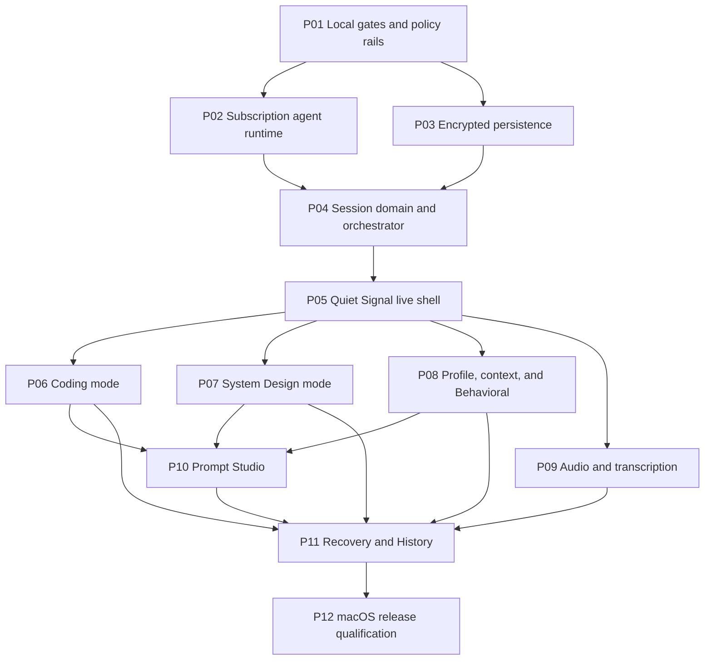

# InterviewCopilot phase-execution packet

Packet revision: **P00-R8**

Planning base: `main@9dcb4b2d39607273a8528a24657cdb4f5bfc3412`

Canonical planning branch: `phase/P00-execution-packet`

Product specification: [`design.md`](../../design.md)

Launch platform: **macOS only**

Execution phases: **12 product PRs, P01–P12**

## 1. Authority and non-negotiable boundaries

This packet is the implementation and independent-review contract. If it and
`design.md` differ, stop and amend both in a new planning revision before code
is merged. An implementer may add stronger tests but may not reinterpret,
rename, weaken, delete, or skip a listed gate or any pre-existing test.

- Every phase is one standalone PR. Its branch starts from refreshed upstream
  `main` containing all listed dependencies and no prototype commit.
- The inherited dirty prototype on `feat/subscription-cli-providers` is
  planning evidence only. No phase may merge, cherry-pick, or claim it as
  complete. Code may be reimplemented after review against the phase contract.
- Only Claude Code and Codex subscription-authenticated providers may perform
  answer intelligence. The selected provider/model/response mode is fixed for
  a session. There is no automatic fallback, routing, or downgrade.
- InterviewCopilot remains AGPL-3.0-or-later, has no product entitlements,
  credits, quotas, analytics, device identifiers, or automatic crash upload.
- Capture privacy means documented ordinary capture behavior on explicitly
  qualified configurations. It never means anti-proctoring, process hiding,
  monitoring evasion, telemetry tampering, or universal undetectability.
- `setContentProtection(true)` is a release-critical invariant. It is necessary
  but not sufficient; external Google Meet qualification remains mandatory.
- Windows and Linux runtime, packaging, documentation promises, and capture
  qualification are deferred. Cross-platform abstractions are allowed only
  when they do not enlarge the launch surface.
- Local verification is authoritative. GitHub CI may inform a review but may
  not waive or replace any local gate in this packet.
- From P01 onward the acceptance trust root is the fixed, controller-owned
  verification entrypoint defined in section 6. Its first instruction executes
  before npm lifecycle dispatch; a package script, candidate checkout,
  candidate-supplied path, artifact, environment value, or author report can
  neither select the accepted candidate nor produce authoritative gate
  evidence. Root/controller credential compromise remains outside the existing
  threat model. Candidate, invoking-user, lifecycle, same-user filesystem,
  runner/hash, result-channel, and race/restore mutation remain in scope and
  fail closed.

## 2. Current-state preflight evidence (not the Stage 2 baseline)

These commands were run during P00 planning against a temporary clean worktree
at the planning base. Per controller direction, they are **preflight evidence
only**. The controller captures the formal Stage 2 baseline after packet
approval at the frozen SHA. Raw exits and counts must be recorded again then.

| Command | Raw exit | Result/count |
|---|---:|---|
| `npm ci` | 0 | 855 packages installed; audit reported 50 vulnerabilities (9 low, 10 moderate, 27 high, 4 critical). |
| `npm test` | 0 | Placeholder only: 0 passed, 0 failed, 0 skipped, 0 tests executed. |
| `npm run lint` | 1 | 105 errors, 0 warnings. |
| `npx tsc --noEmit` | 2 | 48 TypeScript errors. |
| `npm run build` | 0 | Renderer, Electron main, and preload production bundles emitted. |
| Dirty-prototype `npm test` | 127 | `vitest: command not found`; prototype dependencies were not installed. |

None of the red or empty results is waived. P01 owns conversion to a real,
mechanically green local gate. Until P01 is green, no dependent phase starts.

### Formal Stage 2 capture commands

Run from a clean checkout of the controller-frozen SHA, in this order. Record
the complete output, raw exit after each command, and test
passed/failed/skipped totals. Do not replace a nonzero result with `|| true`.

```bash
stage2_evidence_dir=$(mktemp -d /tmp/interviewcopilot-stage2.XXXXXX)
stage2_failed=0
run_stage2() {
  stage2_label=$1
  shift
  "$@" 2>&1 | tee "$stage2_evidence_dir/$stage2_label.log"
  stage2_raw_exit=${PIPESTATUS[0]}
  printf '%s raw_exit=%s\n' "$stage2_label" "$stage2_raw_exit"
  if [ "$stage2_raw_exit" -ne 0 ]; then stage2_failed=1; fi
}
node --version
npm --version
run_stage2 install npm ci
run_stage2 test npm test
printf 'test passed=0 failed=0 skipped=0 executed=0 (upstream placeholder)\n'
run_stage2 lint npm run lint
printf 'lint summary=%s\n' "$(rg -o '[0-9]+ problems[^[:cntrl:]]*' "$stage2_evidence_dir/lint.log" | tail -1)"
run_stage2 typecheck npx tsc --noEmit
printf 'typecheck errors=%s\n' "$(rg -c 'error TS' "$stage2_evidence_dir/typecheck.log")"
run_stage2 build npm run build
printf 'aggregate_raw_exit=%s\n' "$stage2_failed"
test "$stage2_failed" -eq 0
```

Expected current upstream status is evidence, not acceptance: install, the
placeholder test, and build are expected to exit 0; lint and strict type-check
are expected to reproduce their nonzero debt. The required green baseline from
P01 onward is: every command exits 0, the test runner executes at least one
test, failed = 0, skipped = 0, and the manifest check proves every inherited
and phase-owned named test ran.

## 3. Repository architecture observed at the planning base

- `electron/main.ts` owns the single `BrowserWindow`, global application state,
  queue/solution/debug view transitions, helper construction, visibility,
  position, dynamic sizing, and the direct content-protection call.
- `electron/ScreenshotHelper.ts` captures the primary display into plaintext
  files below `app.getPath("userData")`; `ProcessingHelper.ts` reads those
  queues and performs legacy HTTP-provider extraction, solution, and debug
  calls, parsing mostly free-form output.
- `electron/ConfigHelper.ts` persists plaintext JSON containing a legacy API
  key, provider/model choices, language, and opacity. `electron/store.ts` is
  unused and contains a hard-coded encryption key.
- `electron/ipcHandlers.ts` and `electron/preload.ts` expose a broad, partly
  legacy IPC surface including credits, subscription portal, API-key, window,
  capture, update, and processing events. Renderer typings are duplicated in
  `src/env.d.ts` and `src/types/electron.d.ts`.
- `src/App.tsx` gates the renderer on configuration, while `Queue`, `Solutions`,
  and `Debug` are transient views. There is no durable session reducer,
  persistent provider conversation, typed response-section stream, audio
  pipeline, profile/context model, encrypted History, or Prompt Studio.
- Root `npm test` is a zero-test placeholder. The only tracked test is the
  untouched CRA sample `renderer/src/App.test.tsx`, in an otherwise separate
  legacy renderer package. It must remain and be executed by the consolidated
  P01 harness.
- Root build passes while strict type-check and lint do not. The existing CI
  continues past lint/type failures and is not a trustworthy acceptance gate.
- Packaging advertises macOS, Windows, and Linux, includes legacy identity,
  protocol, updater, and publish metadata, and has permissive macOS entitlements
  that require deliberate launch-surface reduction.

## 4. Complete prototype disposition

The table maps every tracked or untracked prototype path to a future owner.
“Reuse” means reconsider the idea and tests, not copy an unreviewed diff.

| Prototype evidence | Disposition and owning phase |
|---|---|
| `package.json`, `package-lock.json`, `vitest.config.ts`, `tsconfig.electron.json` | P01 re-creates a consolidated test/lint/type gate and lockfile; the observed Vitest spike is not accepted as-is. |
| `electron/ConfigHelper.ts`, `electron/ConfigHelper.test.ts` | P02 reimplements a versioned subscription-only config migration. Legacy API-key paths in the spike are explicitly rejected. |
| `electron/ai/types.ts`, `electron/ai/cliProcess.ts`, `electron/ai/cliProcess.test.ts` | P02 reuses safety ideas (absolute executables, no shell, abort/timeout/output limits, redaction) inside the persistent driver. |
| `electron/ai/cliProviders.ts`, `electron/ai/cliProviders.test.ts` | P02 replaces one-shot Claude `--no-session-persistence` and Codex `--ephemeral` execution with resumable Claude sessions and Codex app-server threads. |
| `electron/ProcessingHelper.ts` | P02/P04 replace legacy provider branching and regex orchestration; no legacy API-provider branch survives P02. |
| `electron/ipcHandlers.ts`, `electron/preload.ts`, `src/env.d.ts`, `src/types/electron.d.ts` | P02 owns narrow provider/config IPC; P04 owns typed session/event IPC; P05 owns shell/window IPC. Duplicate typings become one generated/shared contract. |
| `electron/captureProtection.ts`, `electron/captureProtection.test.ts` | P01 adopts the centralized invariant and expands lifecycle coverage; P12 owns external qualification. |
| `electron/main.ts`, `electron/ScreenshotHelper.ts` | P05 reimplements hidden launch, prior-visibility restoration, per-display geometry, click-through, and capture lifecycle without weakening protection. |
| `electron/shortcuts.ts`, `electron/shortcuts.test.ts`, `src/utils/platform.ts` | P05 implements the final remappable shortcut map. The spike's Reset-on-`R` and inverted Up/Down behavior are rejected. |
| `src/App.tsx`, `src/_pages/Queue.tsx`, `src/_pages/SubscribedApp.tsx` | P04/P05 replace transient view state and computed-style click-through heuristics with typed session state and explicit interactive regions. |
| `src/components/Settings/SettingsDialog.tsx`, `src/components/WelcomeScreen.tsx` | P02 builds provider-only onboarding; later settings panels are added by their owning phases. The prototype is not the final Quiet Signal UI. |
| `src/components/Header/Header.tsx`, `src/components/Queue/QueueCommands.tsx`, `src/components/Solutions/SolutionCommands.tsx` | P02 removes entitlement/API debris; P05 replaces command rows and exposes visible equivalent actions. |
| `src/constants/languages.ts`, `electron/languages.test.ts`, `src/components/shared/LanguageSelector.tsx` | P06 adopts the normalized language catalog and adds first-class language fixtures required by D-023a. |
| `src/_pages/Solutions.tsx`, `src/_pages/Debug.tsx` | P06 replaces regex-parsed views with typed Coding sections, read-only code actions, and versioned Fix cards. Copy-button ideas remain evidence only. |
| `README.md`, `CONTRIBUTING.md`, `stealth-run.sh`, `stealth-run.bat` | P12 rewrites launch docs/scripts for macOS-only qualified claims. The Windows script is retained only until P12 removes launch support through an explicit reviewed change; it is never used as evidence of support. |
| `src/_pages/SubscribedApp.tsx` sizing removal and `Queue.tsx` width change | P05 owns automatic compact sizing and expanded-only manual resize with display-clamping tests. |
| `package.json` `productName` addition | P01 owns canonical InterviewCopilot identity; P12 validates final bundle metadata. |

No prototype path is “done.” Prototype files stay uncommitted on the planning
worktree and are excluded from the P00 commit.

## 5. Execution graph, waves, and intended bases



The graph is acyclic. Dependency-ready deterministic order is:
`P01 → P02 → P03 → P04 → P05 → P06 → P07 → P08 → P09 → P10 → P11 → P12`.
P02 and P03 may execute in parallel. P06, P07, P08, and P09 may execute in
parallel after P05; the listed order is the merge-order tie breaker.

| Wave | Phase branches | Intended base |
|---|---|---|
| 1 | `phase/P01-local-gates` | Exact planning base plus merged P00 documentation, if available. |
| 2 | `phase/P02-subscription-runtime`, `phase/P03-encrypted-persistence` | Refreshed `main` containing P01. |
| 3 | `phase/P04-session-orchestrator` | Refreshed `main` containing P02 and P03. |
| 4 | `phase/P05-live-shell` | Refreshed `main` containing P04. |
| 5 | `phase/P06-coding`, `phase/P07-system-design`, `phase/P08-behavioral`, `phase/P09-audio` | Refreshed `main` containing P05. |
| 6 | `phase/P10-prompt-studio` | Refreshed `main` containing P06, P07, and P08. |
| 7 | `phase/P11-history-recovery` | Refreshed `main` containing P06–P10. |
| 8 | `phase/P12-macos-qualification` | Refreshed `main` containing P11 and every prior phase. |

Parallel branches must be rebased onto the actual dependency merge before
review. A phase cannot use another open phase branch as its base.

## 6. Immutable local-gate contract

P01 creates and tests `scripts/verification/phase-bootstrap.mjs`,
`scripts/verification/phase-reporter.mjs`, and immutable argv plans
`scripts/verification/plans/P01.json` through `P12.json` plus the auxiliary
`P12-observer.json`. A package script named `verify:phase` is not an acceptance
entrypoint: P01 removes it or makes every direct invocation return nonzero
without spawning a gate, and documentation never instructs an author or
reviewer to use it. From P01 onward the fixed controller command below directly
loads the anchored bootstrap/reporter; none of the child commands below is run
bare. The plan files contain argv arrays, test/non-test classification,
expected raw exit, and minimum test count, and the reporter rejects shell
strings, unknown labels, duplicate labels, or a plan whose hash does not match
the externally anchored manifest.

**Controller installation and first instruction.** The verification-controller
service identity exclusively owns
`/Users/Shared/InterviewCopilot/verification-controller`. Its privileged
installer creates the versioned `v1/bin/arm-phase` and `v1/bin/verify-phase`
executables, controller Git-object store, active-anchor registry, sealed run
roots, and authoritative evidence roots. The fixed filesystem-root descriptor,
`/Users`, `/Users/Shared`, `/Users/Shared/InterviewCopilot`, and every
controller descendant are opened component-by-component with `openat` plus
`O_DIRECTORY|O_NOFOLLOW`; none is a symlink, alternate root, or mount
transition. Every opened ancestor has its installer-pinned root/controller
identity, mode/flags—including the required sticky semantics for the ordinary
shared root—and no extended ACL. Every controller-owned descendant has no
group/other write bit and is mode 0555 once installed. Executables and anchors
are link-count-one regular files with no write bit or extended ACL and with
installer-recorded SHA-256 identities. Any ownership, mode, link, ACL, mount,
path, executable-hash, or ancestor disagreement is a preflight failure.
Root/controller credential compromise is outside the existing threat model;
candidate and invoking-user mutation is not. The first instruction of the
absolute `verify-phase` executable is therefore the first trusted verification
instruction and runs before npm or candidate code.

**PIN FIRST and active anchor.** A controller administrator, never the phase
author or a candidate process, arms one phase from the independently observed
PR head with exact command
`/Users/Shared/InterviewCopilot/verification-controller/v1/bin/arm-phase
--phase <P01-P12> --pr <phase-pr-number> --expected-head
<exact-40-hex-pr-head> --approved-packet <exact-approved-P00-R8-sha>`.

The privileged command independently resolves the live PR head, requires exact
agreement with `expected-head`, fetches that commit into the controller-owned
object store, proves it is a commit, and atomically installs a closed canonical
active anchor at the fixed phase/role slot. The anchor binds the canonical
remote and PR, candidate commit and tree, phase/role, approved packet
SHA/revision, complete committed-tree identity, and explicit identities for
`package.json`, the lockfile and project npm configuration; package scripts and
closed lifecycle map; bootstrap, reporter, result adapters, test manifest, all
thirteen plans and their manifest; every gate configuration/source, test,
fixture, runner, and colocated expected-hash table; exact Node/npm executable
realpaths and SHA-256 values; macOS build/architecture and the closed sanitized
environment; dependency integrity and canonical post-install closure; allowed
writable roots; and result/evidence schemas. It also records the controller
entrypoint identity. The entire tree anchor prevents a jointly changed gate and
expected hash from becoming self-authoritative, while the explicit identities
make drift attributable.

The anchor is JCS-canonical JSON with no unknown or duplicate key and exactly
these top-level fields: `schemaVersion`, `controllerVersion`,
`controllerSha256`, `approvedPacketSha`, `packetRevision`, `canonicalRemote`,
`prNumber`, `candidateCommitSha`, `candidateTreeSha`, `phase`, `role`,
`inputs`, `packageScripts`, `lifecycleMap`, `plans`, `toolchain`,
`environment`, `dependencyClosure`, `writableRoots`, `resultSchemas`,
`armedAt`, and `prHeadObservedAt`. `inputs`, `plans`, and `resultSchemas` are
closed path/name maps whose values carry Git mode where applicable, byte
length, and SHA-256. `toolchain` carries OS/build/architecture plus Node/npm
realpath, version, and SHA-256. `environment` is a closed allowlist with the
fixed npm lifecycle-suppression and shell values. `writableRoots` is a closed
list derived by the controller, never a candidate path. The controller stores
the canonical anchor bytes as `anchor.json` and its lowercase-hex digest as
`anchor.sha256` under the fixed `anchors/active/<phase>/local/` slot. Arming
P12 atomically installs the same candidate/input identity with role
`meet-observer` under `anchors/active/P12/meet-observer/`; no other role slot is
valid. The local and observer anchors differ only in role-bound plan/result
fields. Any schema, canonical-byte, field, or digest disagreement rejects.

The active anchor, not cwd or an artifact, selects the accepted candidate.
Candidate argv, environment, worktree, package data, plan, manifest, pairing,
output, report, or author-provided SHA cannot select or override the remote,
checkout, commit, tree, packet, toolchain, phase plan, or evidence root. The
controller rejects a changed live PR head before execution and repeats that
comparison before zero. It never fetches, checks out, resets, switches, repairs,
or re-arms from candidate output.

**Sealed materialization and lifecycle containment.** `verify-phase`
materializes the active commit from the controller object store into a fresh
controller-owned run root with no inode shared with an invoking-user worktree.
It rejects unapproved symlinks or gitlinks, hard links, case-colliding names,
alternate roots, writable/ACL-bearing ancestry, and mount changes. Candidate
and verification inputs are controller-owned and nonwritable to the dedicated
unprivileged execution identity. The closed writable set is only per-run
scratch/cache, `node_modules` while the install child is active, declared
build/package outputs, and phase-owned product/qualification artifacts; none
can replace an anchored input or controller evidence.

The exact `npm ci` plan child starts only after the controller is trusted.
Install lifecycle is limited to the anchor's exact package/dependency map and
the closed writable set. The controller records it, waits for and terminates
the complete child process group, rejects any surviving or detached descendant,
validates the exact post-install dependency closure, and makes `node_modules`
nonwritable before another entry starts. For every later plan child beginning
with `npm run`, the controller preserves the plan argv byte-for-byte while
supplying a controller-owned effective configuration with
`npm_config_ignore_scripts=true`, a pinned `script-shell`, isolated npm config,
sanitized `PATH`, and no candidate `NODE_OPTIONS`. The explicitly requested
target still runs, but no matching pre/post companion does. A committed
pre/post companion for any planned target, unexpected root/install lifecycle,
or effective-config disagreement is itself anchor/policy failure.

**Controller spawn and result authority.** The controller opens the anchored
bootstrap, reporter, plan, and manifest through held no-follow descriptors and
directly invokes the bootstrap with the pinned Node executable; no npm
lifecycle dispatch can precede it. The reporter requests each next immutable
plan entry through a private controller broker. The broker requires the exact
next index and argv, resolves the pinned executable, spawns without `shell`,
and independently records the planned argv, resolved executable realpath/hash,
actual spawn argv, UTC start/end, duration, OS raw exit or terminating signal,
and numbered stdout/stderr log identity. It owns the process group and does not
accept a reporter-supplied executable or path.

For every plan entry the reporter prints and logs the exact shell-escaped
command, UTC start/end, duration, raw child exit or terminating signal, and
numbered stdout/stderr log identity. It tees output without changing the child
result, records every raw exit, and continues after ordinary child failures.
For every test-classified entry it consumes the framework's machine-readable
result (or the P01-tested adapter for native/manual suites) and prints
`passed=<n> failed=<n> skipped=<n>`; missing/unparseable counts, any failure or
skip, or a count below the plan minimum is itself a recorded failure. The
reporter runs `verify:test-manifest` only after all test entries and emits one
JSON and one text aggregate through framed controller-provided descriptors.
Plan children inherit neither those descriptors nor a controller evidence path.
Candidate stdout, environment, artifact paths, duplicate/replayed records, and
unframed structured output are never result authority.

The authoritative run root is exactly
`/Users/Shared/InterviewCopilot/verification-controller/runs/<candidateCommitSha>/<phase>/<runId>/`,
where `runId` is a controller-generated 128-bit random lowercase-hex value. Its
closed controller-owned layout is `anchor.json`, `input-inventory.json`,
`controller-transcript.json`, `reporter-aggregate.json`,
`reporter-aggregate.txt`, `output-inventory.json`, numbered stdout/stderr logs,
and either `success.json` or `failure.json`, never both. These controller files
are external gate evidence, not additions to the nine-member P12 qualification
evidence set or four-member release bundle. Each transcript entry contains
exactly `index`, `label`, `plannedArgv`, `resolvedExecutable`,
`resolvedExecutableSha256`, `actualSpawnArgv`, `startedAt`, `endedAt`,
`durationMs`, `rawExit`, `signal`, `stdoutLog`, `stdoutSha256`, `stderrLog`,
`stderrSha256`, optional `counts`, and `reporterRecordSha256`. The terminal
record binds the anchor/run/transcript/aggregate/inventory hashes,
`reporterStarted`, `candidateProcessesSpawned`, controller and reporter
aggregate exits, integrity-failure class if any, final-reopen result, survivor
count, and UTC completion. Unknown, missing, duplicate, unframed, reordered, or
hash-disagreeing data rejects.

The reporter exits 0 only when every child raw exit equals its expected value,
all count requirements pass, and the manifest proves that every inherited,
phase-owned, fixture, native, E2E, and manual procedure entry ran. Otherwise it
exits 1 after the last ordinary entry. The controller independently correlates
the reporter records with its broker transcript and is the sole acceptance
authority. Immediately before zero it requires exact candidate/PR/anchor
identity, reopens every protected canonical name and compares its descriptor
identity/bytes/metadata, validates closed writable-root inventories and both
aggregate formats, and proves that no descendant remains. Any mismatch returns
nonzero; reporter zero can never override it.

**Failure classes and negative controls.** Candidate/PR/packet, controller,
anchor, ownership, lifecycle, package/bootstrap/plan/manifest/gate,
runner/hash, executable/environment, result-channel, descriptor, process-group,
or TOCTOU disagreement before reporter start returns 1 with
`reporterStarted=false` and `candidateProcessesSpawned=0`. An integrity or
result-authority loss after start terminates the complete process group, stops
further entries, preserves the external controller failure record, and returns
1 without repair, restoration, unlink, retry, or aggregate-zero output.
Ordinary child failures retain the existing continue-and-aggregate behavior.
Injected-failure tests must prove exact children with raw exits 7 then 0 both
spawn, the later result remains visible, the 7 remains exact in JSON/text and
the broker transcript, and the aggregate returns 1.

P01-AC7 extends its existing named
`tests/policy/verificationReporter.test.ts` suite, without adding an acceptance
criterion or reporter plan, with these mandatory named cases:

- `rejects archived preverify self-removal and gate mutation before reporter start`;
- `rejects committed preverify and postverify companions during anchor admission`;
- `suppresses companion hooks while preserving the requested npm target argv`;
- `rejects joint package bootstrap plan manifest and gate mutation`;
- `rejects runner plus colocated current-hash forgery`;
- `rejects PATH node npm npmrc NODE_OPTIONS and script-shell substitution`;
- `rejects detached-restorer and lifecycle-time mutate-restore`;
- `rejects same-size overwrite rename symlink hardlink and case-collision TOCTOU`;
- `rejects result-path environment stdout duplicate replay and structured-record forgery`;
- `records planned argv resolved executable actual argv raw exit and signal exactly`;
- `continues exact injected exits seven then zero and aggregates one`;
- `preserves every P01-R1-B01 through P01-R1-B06 hostile probe`; and
- `rejects any surviving child or detached descendant before zero`.

Independent P01 review reuses the exact P01-CV-B01 hostile lifecycle fixture
with SHA-256
`8a081c023a044b50298d6ad1917a3fbe5ab8de349738d1457e113c39730398bc`.
The archived false-zero aggregate JSON/text identities are respectively
`c2528633014d271b2501c85b1d4884694b556f10f1b16abbc1e1b95e85ce2bb3`
and `9da4a97de56809959aa7c9d102e410fe93cca305993d1bebdc0ac9d08f52e5c1`.
A benign replay of that exact archived candidate retains observed test counts
legacy=1, unit=30, and P01=21; the hostile replay must fail before its hook or
detached restorer executes and can never accept those fabricated counts.
Future candidates still report their exact observed counts rather than
normalizing them to these archived values.

Every P01–P12 plan starts with these exact argv entries, in this order; all
expect raw exit 0. The two test entries additionally require failed=0 and
skipped=0. `test:legacy` executes the preserved legacy renderer test, while
`test:unit` executes the complete inherited manifest from all merged phases;
the phase-specific `test:pNN` entry then executes the current domain criteria.
Therefore a current phase cannot replace its inherited regression suites with
only its new tests.

| Label | Exact child command | Classification |
|---|---|---|
| `install` | `npm ci` | non-test |
| `policy` | `npm run verify:policy` | non-test |
| `lint` | `npm run lint` | non-test |
| `typecheck` | `npm run typecheck` | non-test |
| `legacy` | `npm run test:legacy -- --reporter=verbose` | test |
| `unit` | `npm run test:unit -- --reporter=verbose` | test |

The plan then appends the exact phase entries below. Within each row, commands
run left to right. Unless the row explicitly places it later, the reporter then
runs `npm run verify:test-manifest` followed by `npm run build`, each with
expected raw exit 0. All commands beginning `test:` and `qualify:` are
test-classified and must print passed/failed/skipped counts.

| Phase | Exact phase-plan child commands after `unit` |
|---|---|
| P01 | `npm run test:p01 -- --reporter=verbose` |
| P02 | `npm run test:p02 -- --reporter=verbose` |
| P03 | `npm run test:p03 -- --reporter=verbose` |
| P04 | `npm run test:p04 -- --reporter=verbose` |
| P05 | `npm run test:p05 -- --reporter=verbose`; `npm run test:electron-shell` |
| P06 | `npm run test:p06 -- --reporter=verbose`; `npm run test:coding-fixtures` |
| P07 | `npm run test:p07 -- --reporter=verbose`; `npm run test:system-design-fixtures` |
| P08 | `npm run test:p08 -- --reporter=verbose`; `npm run test:behavioral-fixtures` |
| P09 | `npm run test:p09 -- --reporter=verbose`; `npm run test:audio-native`; `npm run test:audio-retention` |
| P10 | `npm run test:p10 -- --reporter=verbose`; `npm run test:prompt-adversarial` |
| P11 | `npm run test:p11 -- --reporter=verbose`; `npm run test:history-roundtrip`; `npm run test:plaintext-scan` |
| P12 | `npm run test:p12 -- --reporter=verbose`; `npm run test:e2e-macos`; `npm run test:staff-live-corpus`; `npm run build`; `npm run package:mac`; `npm run verify:mac-package`; `npm run verify:diagnostics`; `npm run qualify:meet -- --matrix docs/qualification/macos-google-meet.json --artifacts .artifacts/qualification --collect-missing`; `npm run verify:test-manifest`; `npm run verify:release` |

The P12 row is complete and therefore does not receive the default manifest or
build suffix. Package, diagnostics, Meet collection/validation, and final
release validation are child commands of the same reporter and cannot bypass
its raw-exit aggregate. In CREATE, `package:mac` invokes the controller-owned
writer for the mandatory external release statement only after signing/
notarization/stapling; in REUSE it validates that exact statement and sealed
package set without invoking any producer. `verify:mac-package`,
`qualify:meet`, and `verify:release` require and validate but never synthesize
it. `qualify:meet` launches collection when evidence is absent and performs the
write-once manifest/attestation/bundle finalization in P12-M01/M02; it is not an
artifact-presence shortcut.
The remote device also uses the controller-owned entrypoint, with the exact
invocation
`/Users/Shared/InterviewCopilot/verification-controller/v1/bin/verify-phase
--phase P12 --role meet-observer --pair <one-time-pairing-url>`.
`P12-observer.json` runs `npm ci`, `npm run verify:policy`, and then
`npm run qualify:meet:observer -- --pair <one-time-pairing-url>` without a
shell; every child raw exit and the observer aggregate must be 0. Pair data is
an argv value, never a shell string, and cannot select an anchor, checkout,
plan, evidence root, or accepted SHA.

Each phase section below gives the exact controller invocation, expected
aggregate exit, and minimum named-test count. P01 seeds all twelve phase plans
and the P12 observer plan, so no later implementer edits the reporter or a plan
alongside feature behavior. A required gate/plan/controller-contract change
needs a new P00 packet revision.

## 7. Phase contracts

### P01 — Green local gates and policy rails

**Objective/outcome.** Replace the zero-test/continue-on-error baseline with a
real, reproducible local quality gate and encode the license, privacy,
capture-protection, and product-identity invariants before feature work.

**Dependencies and intended base.** No product dependency. Base directly on
the authoritative planning commit (or refreshed `main` containing only P00
docs). Branch `phase/P01-local-gates`.

**Scope.** Consolidate Vitest (including the unchanged tracked CRA sample),
correct ESLint parsing/ignores rather than suppressing findings, fix all current
strict TypeScript and lint failures without changing behavior, create the raw
exit/count reporter and controller-broker protocol, all phase and P12-observer
immutable argv plans, and immutable test manifest; prohibit a package-owned
acceptance entrypoint; centralize capture protection; set canonical
InterviewCopilot metadata; add policy scans; and document controller-owned
local gates. **Out of scope:** implementing or installing the privileged
controller inside the candidate repository, new session/provider/UI behavior,
deleting the legacy renderer, dependency-vulnerability upgrades unrelated to
making gates work, and external capture claims.

**Implementation requirements.** Use Node 20; keep lockfile deterministic;
make root tests execute `renderer/src/App.test.tsx` unchanged; permit no skip or
todo test forms; report exact command, raw exit, and passed/failed/skipped
counts; accept plan-entry execution and authoritative raw exits only through the
controller broker; emit framed result records without exposing the controller
evidence path or descriptor to children; accumulate injected failures while
preserving their raw exits and make the final reporter aggregate nonzero;
reject package/bootstrap/plan/manifest/gate, runner/hash, lifecycle,
environment, result-channel, survivor-process, and mutate/restore drift; fix all
105 lint and 48 type errors rather than excluding product code; make every
window creation/reveal path call one `applyCaptureProtection` helper; add no
false content-protection path; scan dependencies/source for analytics and
automatic crash upload entry points; retain AGPL-3.0-or-later.

**Expected files/systems.** `package*.json`, ESLint/TypeScript/Vitest configs,
`scripts/verification/**`, `tests/policy/**`, typed fixes in existing Electron
and renderer files, `electron/captureProtection.ts`, build metadata, README and
CONTRIBUTING gate sections, and `.github/workflows/ci.yml` only to mirror (not
replace) the local commands.

**Compatibility, migration, rollback.** No persisted-data migration. Runtime
behavior must remain identical except canonical display metadata and repeated
content-protection application. Roll back the PR as one unit; never roll back
only the protection helper or test manifest.

**Security/failure modes.** A parser ignore can hide source; a test glob can
silently execute zero tests; a package pre/post lifecycle can run before a
candidate bootstrap; a mutable package/bootstrap/plan/manifest/gate or
runner/hash pair can manufacture acceptance; PATH/npm config/`NODE_OPTIONS` can
substitute execution; a reporter or child can forge a writable result channel;
a detached restorer can erase tracked drift after aggregate zero; typed cleanup
can change behavior; capture protection can be applied after first paint. The
controller boundary and tests must make each failure observable and fail
closed. Ordinary gate failures continue for complete raw-exit evidence;
integrity or result-authority loss terminates the run immediately.

**Acceptance criteria and named new tests.** All are mechanically required.

| Criterion | Named test |
|---|---|
| P01-AC1: `npm test` executes at least one test and reports failed=0, skipped=0; the tracked CRA sample executes unchanged. | `tests/policy/gateContract.test.ts — executes the inherited CRA test and rejects a zero-test run` |
| P01-AC2: lint, strict type-check, unit tests, and build each return raw exit 0 on a clean checkout. | `tests/policy/gateContract.test.ts — propagates every child gate exit code` |
| P01-AC3: removal, rename, non-execution, `.skip`, `.todo`, `xit`, or `xdescribe` for any manifest test makes verification exit nonzero. | `tests/policy/testManifest.test.ts — rejects missing renamed skipped and unexecuted tests` |
| P01-AC4: every BrowserWindow creation and reveal path invokes `applyCaptureProtection`, which calls `setContentProtection(true)` and never false. | `electron/captureProtection.test.ts — protects creation and reveal lifecycle paths` |
| P01-AC5: package metadata and visible identity use InterviewCopilot and retain `AGPL-3.0-or-later`. | `tests/policy/productPolicy.test.ts — enforces canonical identity and AGPL metadata` |
| P01-AC6: shipped source has no analytics SDK, device fingerprint, automatic crash-upload initialization, or environment-based secret logging. | `tests/policy/productPolicy.test.ts — rejects telemetry crash upload and secret logging entry points` |
| P01-AC7: the controller-owned first instruction anchors the exact candidate/toolchain/verification closure before npm, directly invokes the bootstrap/reporter without package pre/post dispatch, brokers and logs every exact planned/resolved/actual argv and OS raw exit/signal, suppresses planned-target companion hooks without changing child argv, prints passed/failed/skipped for every test entry, gives children no authoritative result path/descriptor, rejects lifecycle, package/bootstrap/plan/manifest/gate, runner/hash, environment, result-channel, survivor-process, and TOCTOU/mutate-restore drift before any zero, and preserves ordinary injected exits 7 then 0 in JSON/text/controller evidence with aggregate 1; missing counts, plan drift, or controller/reporter disagreement also fail. | `tests/policy/verificationReporter.test.ts — accumulates raw failures counts and immutable plan drift` |

**Clean-checkout setup.** Every command must exit 0.

```bash
p01_verify_dir=$(mktemp -d /tmp/interviewcopilot-P01.XXXXXX)
git clone --no-checkout https://github.com/j4wg/interview-coder-withoupaywall-opensource "$p01_verify_dir/repo"
git -C "$p01_verify_dir/repo" fetch https://github.com/timomak/interview-coder-withoupaywall-opensource phase/P01-local-gates
git -C "$p01_verify_dir/repo" switch --detach FETCH_HEAD
cd "$p01_verify_dir/repo"
test -z "$(git status --porcelain)"
node -e 'if (Number(process.versions.node.split(".")[0]) !== 20) process.exit(1)'
```

**Verification commands, in order.** The phase suite must report at least 7
P01 named tests passed, 0 failed, 0 skipped; the full suite may have more.

```bash
/Users/Shared/InterviewCopilot/verification-controller/v1/bin/verify-phase --phase P01
```

Expected controller and reporter aggregate exits are 0; every logged child raw
exit is 0.
**Regression suite.** all inherited
tests, capture/screenshot behavior tests, full root unit suite, strict type
check, lint, and production build. No baseline error is grandfathered.

**Docs.** Document Node 20 clean setup, authoritative local commands, raw count
artifact format, AGPL/privacy policy, and the non-claim that unit protection
proves capture privacy. State explicitly that direct `npm run verify:phase`,
candidate-selected SHAs/checkouts, and candidate evidence paths are
non-authoritative.

**Completion evidence (enumerated).** (1) commit SHA and base SHA; (2) clean
status; (3) dependency install log; (4) one aggregate JSON/text report with
every child exact command/raw exit and test count plus an injected-failure
artifact proving aggregate exit 1;
(5) manifest diff proving the inherited test remains; (6) capture lifecycle
test output; (7) build artifact list; (8) reviewer sign-off that no lint/type
rule or source glob was weakened; (9) controller executable/ancestor
ownership-mode-ACL/hash evidence, active-anchor bytes/hash, sealed-root
inventory, broker transcript, and final reopen/process-group proof; (10) the
archived lifecycle exploit plus the complete joint-mutation/result-channel/
TOCTOU matrix and exact exits-7-then-0 negative control.

**Risk/complexity.** High risk, medium complexity: broad typed cleanup can hide
behavioral changes. Keep mechanical fixes small and independently reviewable
inside the single PR.

**Self-contained implementation prompt.**

> Implement P01 from P00-R8 on `phase/P01-local-gates`, based only on upstream
> `main@9dcb4b2d…` plus merged planning docs. Do not import the dirty prototype.
> Make local lint, strict type-check, real unit tests (including the unchanged
> tracked CRA sample), manifest enforcement, and build green. Centralize and
> lifecycle-test `setContentProtection(true)`, enforce InterviewCopilot/AGPL/no-
> telemetry policy, seed/validate the exact P01–P12 and P12-observer argv plans,
> integrate the reporter only with the section-6 controller broker, print exact
> argv/raw exits and test counts, keep ordinary failure aggregation, fail fast
> on trust mutation, extend the existing P01-AC7 named suite with every
> lifecycle/joint-mutation/result-channel/TOCTOU and exits-7-then-0 case, run the
> P01 controller gate, and attach every enumerated artifact. Do not add product
> features, a package-owned acceptance path, or waived failures.

**Self-contained review prompt.**

> Review P01 independently against P00-R8, not the author’s summary. Select and
> arm the exact live PR head independently, then run the fixed P01 controller
> invocation from a clean checkout and sealed root. Confirm the inherited CRA
> test ran,
> inspect all config/glob/ignore changes for hidden coverage loss, compare typed
> cleanup for behavior changes, and prove every window lifecycle applies true
> content protection. Reproduce the archived self-removing preverify bypass,
> every joint package/bootstrap/plan/manifest/gate and runner/hash mutation,
> executable/environment substitution, result-channel forgery, detached
> restore/TOCTOU case, and the exact exits-7-then-0 control. Reject the PR for
> candidate-selected identity/evidence, a package-owned accepted invocation,
> any mutation admitted before zero, missing raw count, skipped test, weakened
> rule, product feature, telemetry path, or nonzero local gate.

**Remediation prompt template.**

> Remediate P01 only. Evidence: `{failing command/raw exit/counts or review
> finding}`. Root cause: `{confirmed cause}`. Change the smallest P01-owned
> files, add/strengthen `{named regression test}`, preserve every inherited
> gate and capture invariant, rerun the complete P01 plan (which begins with
> `npm ci`) through a freshly armed fixed controller entrypoint, and return the
> active-anchor/controller identities, every child planned/resolved/actual
> argv/raw exit/count, controller and reporter aggregate exits, mutation-matrix
> results, and the before/after commit SHAs.

### P02 — Subscription-only persistent agent runtime

**Objective/outcome.** Provide one hardened, provider-neutral, persistent and
resumable answer runtime for Claude Code and Codex subscriptions, with explicit
provider/model/Fast-or-Reasoning selection, provider-only onboarding, and all
legacy API/paywall paths removed.

**Dependencies and intended base.** P01 merged. Branch
`phase/P02-subscription-runtime` from refreshed `main` containing P01.

**Scope.** Versioned configuration migration; installation/auth diagnostics;
Claude long-lived structured session adapter; Codex app-server thread adapter;
normalized stream, usage, compaction, stop, resume, and error events; process
safety; provider settings/onboarding; removal of OpenAI/Anthropic/Gemini answer
SDK paths, API keys, Supabase, credits, plans, quotas, and subscription portal.
**Out of scope:** interview domain orchestration, mode schemas, storage
encryption, any on-disk provider conversation-ID persistence, app-restart
recovery, renderer answer layouts, cloud transcription, and cross-provider
fallback.

**Implementation requirements.** Pin and validate supported CLI protocol
versions; resolve only absolute executables; use `spawn` with `shell:false`;
strip answer-provider secret overrides; cap output, timeout, abort gracefully,
then force-kill; sanitize stderr; never expose auth tokens/account identifiers;
accept one caller-supplied opaque Claude session ID or Codex thread ID, retain
it only in memory/test fixtures, and resume it across driver or child-process
restart; write no provider ID/session/thread file or plaintext recovery record;
map provider events to one discriminated union; never launch the unselected
provider after session selection; map Fast/Reasoning only to native supported
controls and mark unsupported combinations unavailable. P04, after P03, owns
encrypted app-restart persistence and passes the recovered opaque ID back to
this runtime.

**Expected files/systems.** `electron/providers/**`, shared provider event and
IPC types, `electron/config/**`, settings/onboarding UI, preload/IPC narrowing,
provider fixtures/fake executables, package dependencies, and removal of legacy
provider/entitlement modules and strings. Runtime tests use caller-owned opaque
IDs in memory-only fixtures; no P02 provider persistence directory is allowed.

**Compatibility, migration, rollback.** P02 exclusively owns migration
`M-01`: legacy `config.json` to versioned subscription config. Preserve
language/opacity; remove and never rewrite legacy API keys/models/credits; take
an owner-only backup with no key material before atomic replacement; repeated
migration is idempotent. M-01 must not add a provider conversation ID or
session/thread recovery field. Rollback restores the backup only after explicit
user choice because the old format contains disallowed secrets.

**Security/failure modes.** PATH substitution, argument injection, inherited
API keys changing billing, malformed stream events, output floods, zombie
children, provider version drift, token leakage, accidental tool access,
automatic fallback, applying settings mid-session, and plaintext/native provider
session persistence. Fake-executable tests cover all without a live
subscription.

**Acceptance criteria and named new tests.**

| Criterion | Named test |
|---|---|
| P02-AC1: only `claude-code` and `codex` answer-provider IDs are accepted; legacy providers/API-key/credit/entitlement IPC and dependencies are absent. | `electron/providers/providerBoundary.test.ts — rejects legacy providers and entitlement surfaces` |
| P02-AC2: two turns separated by driver and child-process restart resume the same Claude session and Codex thread when the caller supplies the same opaque ID; the runtime does not claim app-restart recovery. | `electron/providers/persistence.contract.test.ts — resumes caller-owned conversations after process restart` |
| P02-AC3: selected provider failure emits a typed recoverable error and never starts the other provider. | `electron/providers/noFallback.contract.test.ts — never invokes the unselected provider` |
| P02-AC4: provider, model, and response mode snapshot once; unsupported effort/model combinations cannot start and no silent substitution occurs. | `electron/providers/selectionSnapshot.test.ts — locks explicit provider model and effort` |
| P02-AC5: normalized streams preserve text/typed payload, usage and compaction signals, stop, completion, and sanitized provider errors. | `electron/providers/eventNormalization.contract.test.ts — normalizes streaming and compaction events` |
| P02-AC6: child processes use absolute paths, no shell, scrubbed answer-secret env, bounded output/time, and graceful-then-forceful cancellation. | `electron/providers/processSafety.test.ts — constrains provider child processes` |
| P02-AC7: M-01 preserves language/opacity, removes legacy secrets/credits, writes mode 0600 atomically, and is idempotent. | `electron/config/configMigration.test.ts — migrates legacy settings once without persisting secrets` |
| P02-AC8: first run requires exactly one installed/authenticated provider then lands on Start Interview without requesting capture/audio permission. | `src/features/onboarding/ProviderSetup.test.tsx — completes provider-only onboarding` |
| P02-AC9: provider IDs/session/thread state exist only in caller memory or test fixtures; config, backups, logs, provider directories, and a full test filesystem byte scan contain no opaque-ID fixture, and M-01 has no conversation field. | `electron/providers/conversationIdBoundary.test.ts — prohibits plaintext provider conversation persistence` |

**Clean-checkout setup.** Same expected exit policy as P01.

```bash
p02_verify_dir=$(mktemp -d /tmp/interviewcopilot-P02.XXXXXX)
git clone --no-checkout https://github.com/j4wg/interview-coder-withoupaywall-opensource "$p02_verify_dir/repo"
git -C "$p02_verify_dir/repo" fetch https://github.com/timomak/interview-coder-withoupaywall-opensource phase/P02-subscription-runtime
git -C "$p02_verify_dir/repo" switch --detach FETCH_HEAD
cd "$p02_verify_dir/repo"
test -z "$(git status --porcelain)"
node -e 'if (Number(process.versions.node.split(".")[0]) !== 20) process.exit(1)'
```

**Verification commands, in order.** `test:p02` must report at least 9 named
tests passed, 0 failed, 0 skipped; every command exits 0.

```bash
/Users/Shared/InterviewCopilot/verification-controller/v1/bin/verify-phase --phase P02
```

Expected controller and reporter aggregate exits are 0; every logged child raw
exit is 0.

**Regression suite.** P01 gates, capture lifecycle, screenshot queues, config
language/opacity behavior, fake provider process tests, conversation-ID
plaintext scans, and production build.
Live Claude/Codex smoke tests are optional evidence and never replace fakes.

**Docs.** Supported/minimum CLI versions, install/sign-in/reconnect, provider
selection semantics, Fast/Reasoning availability, migration/rollback, process
sandbox/tool restrictions, explicit no-fallback/no-API-key boundaries, and the
in-memory-only P02 ID boundary with encrypted app-restart ownership deferred to
P04/P03.

**Completion evidence.** (1) SHAs/base; (2) clean gate report; (3) fake Claude
two-turn/restart transcript; (4) fake Codex two-turn/restart transcript; (5)
no-fallback process trace; (6) migration before/after with secrets redacted;
(7) dependency and IPC removal scan; (8) UI keyboard/a11y test output;
(9) supported CLI protocol fixture versions; (10) test-filesystem/config/log
byte scan proving the opaque conversation-ID fixture was never persisted.

**Risk/complexity.** Very high/high. CLI protocol/auth behavior is external
and evolving; pin capabilities and fail explicitly on unsupported versions.

**Self-contained implementation prompt.**

> Implement P02 from P00-R8 after P01, on
> `phase/P02-subscription-runtime`. Build a provider-neutral persistent runtime
> for Claude Code and Codex only, using one resumable session/thread, normalized
> streaming/usage/compaction/stop/error events, explicit provider/model/Fast-
> Reasoning snapshots, and no fallback. Migrate legacy config through M-01,
> remove every legacy answer API key/provider/credit/paywall surface, create the
> named fake-executable tests, accept only caller-supplied opaque conversation
> IDs held in memory, and prove no ID/provider session persists to plaintext.
> Run the exact P02 reporter gate through the fixed controller entrypoint and
> attach the evidence. Do not implement app-
> restart recovery, interview orchestration, or reuse one-shot prototype code.

**Self-contained review prompt.**

> Review P02 against P00-R8 from a clean checkout and a controller-selected,
> sealed exact PR head. Trace both fake providers
> through two turns, stop, compaction, driver/child restart, and caller-ID
> resume; force every failure and prove the other provider never starts. Inspect
> spawn/env/tool restrictions, IPC exposure, migration idempotence/file mode,
> dependency removals, model/effort locking, provider-only onboarding, and a
> full filesystem scan for the opaque-ID fixture. Run the P02 reporter gate
> through the fixed controller entrypoint and
> reject any live-credential requirement, legacy path, plaintext provider ID,
> P02-owned app recovery, secret leak, silent fallback, ephemeral conversation,
> skipped test, or gate failure.

**Remediation prompt template.**

> Remediate P02 only for `{failed criterion/evidence}`. Reproduce with the fake
> provider fixture, state the confirmed runtime or migration cause, change the
> smallest provider/config/onboarding surface, add or strengthen `{P02 named
> test}`, prove no unselected process ran and no secret or conversation ID
> persisted, re-arm the exact head and rerun the complete P02 reporter plan
> through the fixed controller entrypoint (which begins with `npm ci`),
> and return every child raw exit/count plus the aggregate exit and new SHAs.

### P03 — Encrypted local persistence foundation

**Objective/outcome.** Introduce a versioned, crash-safe, application-encrypted
local store for active recovery, session artifacts, and later History/profile/
template records, with its installation key protected by macOS Keychain.

**Dependencies and intended base.** P01 merged; may run in parallel with P02.
Branch `phase/P03-encrypted-persistence` from refreshed `main` containing P01.

**Scope.** Key lifecycle through Electron `safeStorage`/macOS Keychain,
AES-256-GCM versioned envelopes, atomic writes, record/index interfaces,
encrypted screenshot/blob storage, in-memory search primitives, corruption and
locked-Keychain recovery, secure deletion best effort, and migration of legacy
plaintext screenshot/cache locations. **Out of scope:** session semantics,
History UI/export, dossier/templates, raw-audio retention, and provider state.

**Implementation requirements.** Generate a random per-installation master key;
store only Keychain-protected key material; authenticate record type/version/ID
as AAD; unique nonce per write; never persist plaintext indexes, thumbnails,
screenshots, diagrams, caches, temp buffers, or keys; use owner-only
directories/files and atomic temp+rename; zero temporary buffers where
practical; make corrupted records isolated and non-destructive; store no raw
audio; expose repository interfaces without Electron objects to domain code.

**Expected files/systems.** `electron/storage/**`, key service, encrypted record
and blob repositories, migration/repair command, storage fixtures, IPC-free
domain interfaces, and privacy/storage docs.

**Compatibility, migration, rollback.** P03 exclusively owns `M-02` (legacy
plaintext screenshot/temp/cache files to encrypted blobs followed by verified
plaintext removal) and `M-03` (encrypted store envelope/schema v1). Both use a
journal, resume after interruption, quarantine failures, and are idempotent.
Rollback restores the pre-migration directory only while it remains in the
explicit rollback quarantine; it never writes newly created plaintext.

**Security/failure modes.** Nonce reuse, unauthenticated metadata, plaintext
search indexes/temp files, weak permissions, Keychain locked/unavailable,
partial rename, disk full, corrupt/truncated records, symlink/path traversal,
and migration deleting the only copy. Tests use deterministic fake key storage
but production must require Keychain-backed protection.

**Acceptance criteria and named new tests.**

| Criterion | Named test |
|---|---|
| P03-AC1: a fresh install generates one random key, stores only protected key material, and reopens records after restart. | `electron/storage/keyLifecycle.test.ts — creates protects and reopens one installation key` |
| P03-AC2: record and blob bytes contain none of fixture transcript, prompt, screenshot marker, diagram, profile text, index term, or key. | `electron/storage/plaintextLeak.test.ts — finds no sensitive fixture bytes at rest` |
| P03-AC3: AES-GCM nonces are unique and tampering with ciphertext, AAD, type, version, or ID is detected before plaintext release. | `electron/storage/envelopeCrypto.test.ts — authenticates envelope metadata and rejects tampering` |
| P03-AC4: atomic write under simulated crash/disk-full yields exactly the prior or new valid record, never a partial accepted record. | `electron/storage/atomicity.test.ts — survives interruption and disk exhaustion` |
| P03-AC5: owner-only permissions, canonical paths, and symlink rejection prevent out-of-root reads/writes. | `electron/storage/pathSafety.test.ts — confines encrypted storage and file modes` |
| P03-AC6: M-02 migrates each plaintext artifact once, verifies decryption, removes plaintext, and resumes safely after interruption. | `electron/storage/plaintextMigration.test.ts — journals verifies and resumes legacy artifact migration` |
| P03-AC7: raw audio is rejected by the persistence API and temporary audio fixtures leave no persisted bytes. | `electron/storage/retentionPolicy.test.ts — refuses raw audio persistence` |
| P03-AC8: locked/unavailable Keychain and isolated corrupt records surface typed recovery without resetting or overwriting other data. | `electron/storage/recovery.test.ts — preserves data on key and record failures` |

**Clean-checkout setup.** Every command exits 0.

```bash
p03_verify_dir=$(mktemp -d /tmp/interviewcopilot-P03.XXXXXX)
git clone --no-checkout https://github.com/j4wg/interview-coder-withoupaywall-opensource "$p03_verify_dir/repo"
git -C "$p03_verify_dir/repo" fetch https://github.com/timomak/interview-coder-withoupaywall-opensource phase/P03-encrypted-persistence
git -C "$p03_verify_dir/repo" switch --detach FETCH_HEAD
cd "$p03_verify_dir/repo"
test -z "$(git status --porcelain)"
node -e 'if (Number(process.versions.node.split(".")[0]) !== 20) process.exit(1)'
```

**Verification commands, in order.** `test:p03` reports at least 8 named tests
passed, 0 failed, 0 skipped; every raw exit is 0.

```bash
/Users/Shared/InterviewCopilot/verification-controller/v1/bin/verify-phase --phase P03
```

Expected controller and reporter aggregate exits are 0; every logged child raw
exit is 0.

**Regression suite.** P01 gates, capture behavior, screenshot creation/deletion,
config persistence, path safety, and build. Run storage tests on a case-
insensitive macOS filesystem in addition to temp-fixture unit tests.

**Docs.** Threat model, Keychain/key recovery, envelope versioning, retention,
M-02/M-03 journal and rollback, corruption repair, and explicit limitations of
best-effort secure deletion on APFS/SSD snapshots.

**Completion evidence.** (1) SHAs/base; (2) complete local-gate report; (3)
hex/string scan of encrypted fixtures; (4) file-mode listing; (5) nonce/tamper
test output; (6) interrupted migration journal before/after; (7) Keychain-
locked recovery output; (8) reviewer threat-model sign-off.

**Risk/complexity.** Very high/high. Cryptography and destructive migration are
one-way doors; use platform primitives and reviewed authenticated encryption,
never custom cryptography.

**Self-contained implementation prompt.**

> Implement P03 from P00-R8 after P01 on
> `phase/P03-encrypted-persistence`. Build the Keychain-backed installation-key
> service, versioned AES-256-GCM record/blob store, atomic writes, encrypted
> in-memory-search source, typed recovery, raw-audio rejection, and journaled
> M-02/M-03 migrations exactly as specified. Add all P03 named tests and threat-
> model docs, run the complete P03 reporter plan through the fixed controller
> entrypoint, and attach enumerated evidence. Do not
> implement session, History, provider, profile, or template behavior.

**Self-contained review prompt.**

> Threat-model and review P03 from an independently armed, controller-selected,
> sealed exact PR head. Run the P03 reporter plan only through the fixed
> controller entrypoint; inspect key storage, nonce generation, AAD, atomicity,
> permissions, path canonicalization,
> temp handling, raw-audio rejection, and both migrations under interruption.
> Search fixture storage byte-for-byte for plaintext. Reject home-grown crypto,
> plaintext indexes/caches, destructive unverified deletion, broad reset on one
> corrupt record, skipped tests, or any nonzero gate.

**Remediation prompt template.**

> Remediate P03 only for `{crypto/storage/migration finding}`. Preserve the
> failing fixture and journal as evidence, identify the exact invariant breach,
> make the smallest storage-owned change, add or strengthen `{P03 named test}`,
> prove no plaintext/key remains and interruption is recoverable, rerun the
> complete P03 reporter plan (starting with `npm ci`), and return every child
> raw exit/count, aggregate exit, and new SHAs.

### P04 — Interview session domain and orchestrator

**Objective/outcome.** Replace queue/solution/debug global state with a durable,
typed InterviewSession reducer and one orchestrator that owns mode locking,
question branches, artifact provenance, provider context synchronization,
progressive sections, cancel/continue, Reset, and crash snapshots.

**Dependencies and intended base.** P02 and P03 merged. Branch
`phase/P04-session-orchestrator` from refreshed `main` containing both.

**Scope.** Domain types/reducer; typed IPC/event boundary; Start/Reset lifecycle;
provider/model/response snapshot; persistent provider-conversation binding;
input artifacts and pending-selection semantics; screenshot-over-transcript
authority; context status/detail; typed response-section streaming; request IDs,
cancellation and Continue unfinished; curated-response versus compact-chat
routing; best-effort/clarification/correction policy; Coding question-branch
primitive; encrypted active-session snapshots and encrypted provider
conversation-ID recovery. **Out of scope:** final shell visuals, mode renderers,
capture implementations, transcript engine, History UI/export, and templates.

**Implementation requirements.** Reducer is deterministic and exhaustively
typed; all state changes are events; initial provider turn seeds applicable
context and later turns send deltas only; Coding excludes profile/opportunity;
submitted artifacts cannot be duplicated; excluded artifacts remain local and
pending until discard/submit; Reset cancels capture/provider work, discards the
native conversation, seals an archive-ready snapshot, clears active state, and
preserves preferences/reusable records; partial output remains after cancel;
Continue unfinished reuses request identity and only missing section IDs; the
P02 runtime receives its opaque conversation ID from P04 and never persists it,
while P04 writes it only inside the P03 encrypted snapshot and restores it only
after explicit Resume. Structured mode-valid responses update curated sections;
ordinary clarification remains compact chat. Generation is never blocked by a
confidence threshold, and correction deltas revise only affected sections.

**Expected files/systems.** `src/domain/interview/**`,
`electron/orchestrator/**`, shared IPC/event schemas, reducer/selectors, provider
driver integration, encrypted active-session repository adapter, fake clock/ID/
provider fixtures, response router/correction impact fixtures, and replacement
of global `view/problemInfo/hasDebugged`.

**Compatibility, migration, rollback.** P04 exclusively owns `M-04`, encrypted
InterviewSession schema v1. Existing plaintext queues are imported only through
P03 M-02 as unattached artifacts; they are never silently treated as a live
session. M-04 includes the opaque provider conversation ID only inside the
authenticated encrypted envelope; no plaintext config, index, log, or provider
session file may contain it. Schema upgrades are forward-version rejected and
rollback retains the encrypted v1 record without lossy conversion.

**Security/failure modes.** Duplicate evidence on retry, stale/out-of-order
stream events, cross-session event bleed, Coding personal-context leak, provider
compaction misreported as data loss, Reset racing with writes, cancellation
destroying native session, partial response replacing complete content, and
malformed IPC. Additional failures are a context popover overstating included
sources, chat opening a second conversation, ordinary clarification overwriting
curated state, confidence blocking an answer, correction rewriting unaffected
sections, and plaintext conversation-ID recovery. Reducer/property tests,
filesystem scans, and fake provider traces cover them.

**Acceptance criteria and named new tests.**

| Criterion | Named test |
|---|---|
| P04-AC1: Start snapshots one mode/provider/model/response/language/context set; attempts to change them before Reset do not mutate the session. | `src/domain/interview/sessionLifecycle.test.ts — locks start snapshot until reset` |
| P04-AC2: reducer accepts only valid lifecycle transitions and ignores/rejects stale, duplicate, cross-session, and out-of-order events deterministically. | `src/domain/interview/sessionReducer.property.test.ts — preserves invariants under event permutations` |
| P04-AC3: the first turn seeds all applicable context; subsequent turns send only new deltas; Coding includes no dossier/opportunity bytes. | `electron/orchestrator/contextPolicy.test.ts — seeds once sends deltas and excludes coding personal context` |
| P04-AC4: new finalized transcript/screenshots are preselected; remove excludes without deleting; accepted artifacts are never resent; empty submission is rejected. | `electron/orchestrator/pendingArtifacts.test.ts — stages removes submits and deduplicates evidence` |
| P04-AC5: screenshot wins conflicting transcript requirements, while transcript is primary with no screenshot. | `electron/orchestrator/evidenceAuthority.test.ts — applies screenshot authority rule` |
| P04-AC6: context status transitions exactly New context → Updating → Full context or Context issue; compaction keeps Full context and appears only in detail. | `src/domain/interview/contextStatus.test.ts — derives honest synchronization and compaction state` |
| P04-AC7: stable typed sections publish progressively without reorder or completed-section replacement. | `electron/orchestrator/progressiveSections.test.ts — streams stable independently final sections` |
| P04-AC8: Cancel preserves completed/partial output and native conversation; Continue unfinished requests only incomplete IDs with the same request identity. | `electron/orchestrator/cancelContinue.test.ts — resumes unfinished sections without duplicate evidence` |
| P04-AC9: Reset cancels work, seals an encrypted archive-ready record, discards provider conversation, clears active artifacts, and preserves settings/reusable data. | `electron/orchestrator/resetSemantics.test.ts — performs the sole terminal lifecycle transition` |
| P04-AC10: app restart offers Resume or Reset from the last valid encrypted snapshot, passes the recovered opaque ID to P02 to resume the same provider conversation only after Resume, never auto-resumes capture, and leaves no ID fixture in plaintext config/index/log/provider files. | `electron/orchestrator/crashRecovery.test.ts — restores one encrypted provider conversation with capture off` |
| P04-AC11: the detail popover shows snapshotted provider/model/mode, last successful update, exact source-category counts, profile/opportunity included or Coding-excluded state, and only provider-reported usage/compaction; its main label follows AC6 and never claims original tokens remain verbatim. | `src/domain/interview/contextDetail.test.ts — renders exact honest source-level context detail` |
| P04-AC12: mode actions, typed chat, and compact clarification use the same opaque provider conversation ID and ordered context stream; no chat-only driver, process, session, or thread is created. | `electron/orchestrator/sharedConversation.test.ts — routes curated and chat turns through one conversation` |
| P04-AC13: a response satisfying the locked mode schema updates only its typed curated sections, while an ordinary non-schema clarification appears as a compact exchange and preserves the last curated answer byte-for-byte. | `electron/orchestrator/responseRouting.test.ts — separates structured updates from compact clarification` |
| P04-AC14: uncertain input still produces best-effort output with no numeric confidence field or blocking review state, states only consequential assumptions, and includes clarification suggestions exactly when a frozen impact fixture says the missing answer can materially change the result. | `electron/orchestrator/bestEffortClarification.test.ts — answers without confidence gates and suggests material clarifications` |
| P04-AC15: a correction submitted through chat is a context delta on the current branch, revises exactly the fixture-declared affected section IDs, preserves every unaffected section byte-for-byte, and returns the changed-section set. | `electron/orchestrator/correctionRevision.test.ts — applies correction-scoped revision without collateral changes` |

**Clean-checkout setup.** Every command exits 0.

```bash
p04_verify_dir=$(mktemp -d /tmp/interviewcopilot-P04.XXXXXX)
git clone --no-checkout https://github.com/j4wg/interview-coder-withoupaywall-opensource "$p04_verify_dir/repo"
git -C "$p04_verify_dir/repo" fetch https://github.com/timomak/interview-coder-withoupaywall-opensource phase/P04-session-orchestrator
git -C "$p04_verify_dir/repo" switch --detach FETCH_HEAD
cd "$p04_verify_dir/repo"
test -z "$(git status --porcelain)"
node -e 'if (Number(process.versions.node.split(".")[0]) !== 20) process.exit(1)'
```

**Verification commands, in order.** `test:p04` reports at least 15 named
tests passed, 0 failed, 0 skipped; every raw exit is 0.

```bash
/Users/Shared/InterviewCopilot/verification-controller/v1/bin/verify-phase --phase P04
```

Expected controller and reporter aggregate exits are 0; every logged child raw
exit is 0.

**Regression suite.** P01–P03 complete suites, provider fake contracts,
encrypted storage migration/recovery, capture lifecycle, screenshot queue
compatibility, P02 conversation-ID plaintext boundary, and production build.

**Docs.** State/event diagrams, schema/event catalog, context inclusion table,
request idempotency, status semantics, Reset/cancel/recovery behavior, and M-04
version/rollback; document the context-detail fields, one-conversation
chat/curated routing table, best-effort/clarification policy, correction impact
contract, and encrypted ID ownership boundary.

**Completion evidence.** (1) SHAs/base; (2) full gates/counts; (3) reducer
property seed/corpus; (4) first-turn/delta traces for each mode; (5) explicit
Coding exclusion byte scan; (6) cancel/continue trace; (7) Reset before/after
record; (8) crash/relaunch transcript plus plaintext ID scan; (9) schema
fixture; (10) context-popover snapshot; (11) shared conversation/process trace;
(12) structured-versus-compact routing trace; (13) best-effort/clarification
fixture report; (14) correction before/after section hashes.

**Risk/complexity.** Very high/very high. This is the central consistency
boundary; no renderer or provider may keep a second authoritative session.

**Self-contained implementation prompt.**

> Implement P04 from P00-R8 after P02/P03 on
> `phase/P04-session-orchestrator`. Replace global transient state with the
> deterministic InterviewSession reducer, typed event/IPC contract, one
> persistent-conversation orchestrator, context/delta policy, pending artifacts,
> screenshot authority, progressive sections, cancel/continue, Reset, encrypted
> snapshot/recovery (including the opaque provider ID), exact context detail,
> one-conversation curated/chat routing, structured-versus-compact response
> routing, best-effort clarification, correction-scoped revision, and M-04
> exactly as specified. Add the fifteen named tests, run the complete P04
> reporter plan, attach all evidence, and do not build final shell/mode/audio/
> History UI or import prototype orchestration.

**Self-contained review prompt.**

> Review P04 from an independently armed, controller-selected, sealed exact PR
> head as the sole session authority. Run all gates and property tests only
> through the fixed controller entrypoint;
> trace every event, first-turn seed, delta, pending-artifact transition,
> compaction signal/detail field, curated/chat turn, response-routing branch,
> best-effort/clarification fixture, correction impact, cancel/continue, Reset
> race, and encrypted crash restart. Search a Coding trace for dossier/
> opportunity bytes and all plaintext files/logs for the opaque ID fixture.
> Reject duplicate conversations/state stores, Markdown-as-domain-state,
> artifact resends, section reorder, confidence gates, collateral correction,
> silent invalid transitions, capture auto-resume, skipped tests, or nonzero
> gates.

**Remediation prompt template.**

> Remediate P04 only for `{state/orchestration criterion}` using the smallest
> reducer/orchestrator/schema change. Add the exact failing event sequence to
> `{P04 named test}`, prove idempotency and no cross-session/personal-context
> or plaintext-ID leak, re-arm the exact head and rerun the complete P04
> reporter plan through the fixed controller entrypoint (starting with
> `npm ci`), and return every raw exit/count, aggregate exit, routing/section
> traces, migration compatibility, and new SHAs.

### P05 — Quiet Signal live shell, window, and capture controls

**Objective/outcome.** Deliver the pressure-optimized macOS shell: hidden,
compact bar, compact answer, expanded workspace, explicit interactive regions,
input tray, remappable shortcuts, display-aware geometry, and accessible Quiet
Signal primitives while preserving capture protection.

**Dependencies and intended base.** P04 merged. Branch `phase/P05-live-shell`
from refreshed `main` containing P04.

**Scope.** Semantic tokens; shared HUD primitives; pre-session three-mode
selector; Start/live command rail; compact composer; answer/workspace states;
input tray; HotKeys editor/conflicts/reset; fixed shortcut map; visible action
equivalents; explicit drag/interactive/click-through regions; automatic compact
sizing, expanded-only resizing, per-display position/size/clamping/snap;
visibility and capture actions; full-primary-display screenshots; reduced
motion/density/text presets. **Out of scope:** mode content, audio implementation,
History, Prompt Studio, Meet verified status, and manual qualification.

**Implementation requirements.** Launch zero visible pixels; hiding never
changes session; explicit `data-interactive` regions control passthrough (no
computed-color heuristic); Content View pill is the only drag root and excludes
interactive descendants; apply capture protection before display and after any
reconfiguration; screenshot hides/restores exactly prior visibility; capture
only current OS primary display; use final shortcuts from design (Record `R`,
Reset Backspace, Debug `D`); register atomically and expose conflicts before
saving; no required text under 12px; no hover-only action; system fonts only.

**Expected files/systems.** Electron window/display/capture/shortcut services,
shell IPC, `src/features/shell/**`, design tokens/Tailwind mapping, shared HUD
components, Settings General/HotKeys, UI/window tests, and removal of old
command rows/dynamic size observers.

**Compatibility, migration, rollback.** Version preference keys for density,
text size, shortcuts, and per-display geometry within P02 config migration
framework; P05 owns their additive `M-05a` migration. Invalid/conflicting
legacy values fall back to documented defaults without mutating active session.
Rollback ignores unknown additive keys. No session-schema migration.

**Security/failure modes.** Transparent overlay intercepts clicks; interactive
surface becomes click-through; shortcut collision partially registers; window
lands off-screen after display change; capture reveals previously hidden app;
protection applied late; browser-tab sharing falsely inferred; drag controls
steal button input; zoom loses controls. Unit/UI/Electron integration tests
cover ordinary behavior but make no external capture claim.

**Acceptance criteria and named new tests.**

| Criterion | Named test |
|---|---|
| P05-AC1: normal launch has no visible pixels; visibility toggles hidden↔pre-session/previous HUD without changing session or capture state. | `electron/window/windowVisibility.test.ts — launches hidden and restores exact HUD state` |
| P05-AC2: every visible window lifecycle applies content protection before show; no path sets it false. | `electron/window/captureProtection.integration.test.ts — protects before every show and reconfiguration` |
| P05-AC3: pre-session shows all three modes and Start; active bar permanently exposes Record, Screenshot, Chat, Submit, context, HotKeys and More→Reset with visible keyboard equivalents. | `src/features/shell/CommandRail.test.tsx — renders exact pre-session and active controls` |
| P05-AC4: default shortcuts and remapping match design, conflicts reject atomically, Reset all restores defaults, and every action has an accessible visible control. | `electron/shortcuts/shortcutRegistry.test.ts — registers remaps and rolls back conflicts atomically` |
| P05-AC5: transparent areas pass pointer events; explicit visible/interactive regions receive them; drag never starts on interactive descendants. | `src/features/shell/pointerRegions.test.tsx — separates passthrough drag and controls` |
| P05-AC6: compact states auto-size; only expanded state resizes; positions/sizes persist per display and clamp fully into changed work areas. | `electron/window/displayGeometry.test.ts — restores snaps and clamps each window state` |
| P05-AC7: screenshot captures only the current primary full display, stages one artifact, and restores visible or hidden prior state exactly. | `electron/capture/primaryDisplayCapture.test.ts — captures primary display and preserves visibility` |
| P05-AC8: compact composer Enter adds newline, Control+Shift+Enter submits, empty submission does not call provider, and close restores prior state/focus. | `src/features/shell/CompactComposer.test.tsx — implements universal submit and focus return` |
| P05-AC9: Quiet Signal uses the specified neutral/signal/mode tokens, global signal-green primary actions, density/text presets, focus order, AA contrast, 12px minimum, non-color status, reduced motion, no alternate appearance theme, and no sound/haptic/TTS path. | `src/features/shell/accessibility.test.tsx — enforces Quiet Signal accessibility and silence invariants` |
| P05-AC10: section arrow shortcuts collapse/expand/navigate/scroll without moving the window; window arrows move without scrolling content. | `src/features/shell/navigationShortcuts.test.tsx — separates window and answer navigation` |

**Clean-checkout setup.** Every command exits 0.

```bash
p05_verify_dir=$(mktemp -d /tmp/interviewcopilot-P05.XXXXXX)
git clone --no-checkout https://github.com/j4wg/interview-coder-withoupaywall-opensource "$p05_verify_dir/repo"
git -C "$p05_verify_dir/repo" fetch https://github.com/timomak/interview-coder-withoupaywall-opensource phase/P05-live-shell
git -C "$p05_verify_dir/repo" switch --detach FETCH_HEAD
cd "$p05_verify_dir/repo"
test -z "$(git status --porcelain)"
node -e 'if (Number(process.versions.node.split(".")[0]) !== 20) process.exit(1)'
```

**Verification commands, in order.** `test:p05` reports at least 10 named
tests passed, 0 failed, 0 skipped; every raw exit is 0.

```bash
/Users/Shared/InterviewCopilot/verification-controller/v1/bin/verify-phase --phase P05
```

Expected controller and reporter aggregate exits are 0; every logged child raw
exit is 0.

`test:electron-shell` exits 0 on macOS and records window bounds, protection
application, screenshot-display ID, and pointer-region results. **Regression suite.** all P01–P04 tests, provider/storage/session contracts, capture queues,
preload IPC allowlist, accessibility, and production build.

**Docs.** Window-state and focus diagrams, shortcut reference, display recovery,
permission-repair behavior, screenshot scope, interaction-region authoring,
accessibility presets, and explicit statement that tests do not qualify Meet.

**Completion evidence.** (1) SHAs/base; (2) all raw gates/counts; (3) Electron
shell artifact; (4) screenshots of four states at both densities/text extremes;
(5) keyboard-only recording; (6) two-display disconnect/clamp recording;
(7) hidden/visible screenshot state trace; (8) accessibility report; (9)
protection call-order trace.

**Risk/complexity.** Very high/high. Electron transparent-window input and
display behavior is platform-sensitive and directly touches privacy regression.

**Self-contained implementation prompt.**

> Implement P05 from P00-R8 after P04 on `phase/P05-live-shell`. Build the
> exact Quiet Signal hidden/compact/answer/expanded shell, command rail,
> composer, input tray, explicit click-through/drag regions, final remappable
> shortcuts, display-aware geometry, primary-display screenshot behavior,
> tokens and accessibility presets. Preserve protection before every show and
> prior visibility across capture. Add the ten named tests, run all P05 gates
> through the P05 reporter including macOS Electron shell, and attach evidence.
> Do not add mode answers, audio, History, Prompt Studio, or unqualified capture
> claims.

**Self-contained review prompt.**

> Review P05 on macOS from an independently armed, controller-selected, sealed
> exact PR head. Operate every visible control and
> shortcut keyboard-only; inspect click-through/drag regions, focus restoration,
> geometry across display changes, compact sizing, screenshot scope/visibility,
> and content-protection call order. Run all P05 gates and accessibility checks.
> Reject computed-style hit testing, hidden-only actions, wrong Reset/Record
> bindings, off-screen states, capture-state mutation on hide, external privacy
> claims, skipped tests, or nonzero gates.

**Remediation prompt template.**

> Remediate P05 only for `{shell/window/capture criterion}`. Attach the exact
> display/window/input reproduction, fix the smallest P05-owned service or
> primitive, add/strengthen `{P05 named test}`, recheck protection and prior
> visibility, re-arm the exact head and rerun the complete P05 reporter plan
> through the fixed controller entrypoint including
> `test:electron-shell`, and return every raw exit/count, aggregate exit,
> artifact paths, and new SHAs.

### P06 — Coding mode and primary-display debugging

**Objective/outcome.** Deliver a typed, progressively streamed Coding workspace
with explicit intent, language quality tiers, concise-first answer, read-only
code, question branches, and targeted screenshot debugging.

**Dependencies and intended base.** P05 merged. Branch `phase/P06-coding` from
refreshed `main` containing P05.

**Scope.** Coding schema/prompt/orchestrator policy; Answer/Plan/Code/Explain
renderer; Analyze/Generate Code/Debug/Follow-up intent; New Question branch;
`Control+Shift+D` Fix current code; versioned Fix cards; language catalog,
syntax rendering, fixtures, and first-class quality matrix; Copy/Regenerate/
Debug/Explain. **Out of scope:** code editing/execution/terminal/test runner,
profile/opportunity context, other modes, and diagram export.

**Implementation requirements.** A request cannot start without explicit
intent; Solve publishes 2–4 approach bullets, one trade-off, and time/space
complexity before code; stable Code section streams independently; selected
language snapshots at Start; Python means Python 3; six first-class families
receive parser/prompt/debug fixtures; Debug shortcut captures/submits only its
new primary-display screenshot, preserves staged artifacts and solution, and
never falls back; New Question clears problem-local UI while retaining
interview transcript/chronology.

**Expected files/systems.** `src/features/coding/**`, Coding typed schemas,
orchestrator policy, language registry/highlighting, prompt fixtures, first-
class corpus, renderer/components, and screenshot debug integration.

**Compatibility, migration, rollback.** P06 owns additive `M-05b` normalization
of legacy `python`→`python3` and `go`/`golang` aliases in global preferences;
active sessions never mutate. Rollback keeps canonical strings readable.
No session data rewrite; archived unknown Coding fields remain preserved.

**Security/failure modes.** Personal-context leak, intent guessing, incomplete
or unsafe code fence parsing, language drift mid-session, Debug consuming staged
evidence, fabricated fix, full regeneration, code execution/tool access, branch
cross-contamination, and copy action copying prose.

**Acceptance criteria and named new tests.**

| Criterion | Named test |
|---|---|
| P06-AC1: Analyze/Generate Code/Debug/Follow-up is required and maps to a distinct validated typed response; absent/unknown intent makes zero provider calls. | `src/features/coding/codingIntent.test.ts — requires and validates explicit intent` |
| P06-AC2: Solve first publishes 2–4 approach bullets, one trade-off, and both complexities; Code streams independently without displacing Answer. | `src/features/coding/progressiveCodingAnswer.test.tsx — renders concise answer before stable code` |
| P06-AC3: provider request and trace contain no dossier/opportunity bytes or tools capable of editing/executing code. | `electron/orchestrator/codingIsolation.test.ts — excludes personal context and execution tools` |
| P06-AC4: language snapshots once; M-05b normalizes aliases; Python 3 and all first-class/best-effort options render correctly. | `src/features/coding/languageSnapshot.test.ts — normalizes and locks the complete language catalog` |
| P06-AC5: each first-class language passes representative solve, syntax parse, and debugging schema fixtures; best-effort languages are visibly labeled. | `tests/fixtures/coding/firstClassQuality.contract.test.ts — validates six language families` |
| P06-AC6: Code is selectable/read-only and only Copy, Regenerate, Debug, Explain are exposed; no edit/run/terminal/test action exists. | `src/features/coding/CodePanel.test.tsx — exposes only approved read-only actions` |
| P06-AC7: New Question creates a clean problem branch while preserving interview transcript, prior branches, chronology, and History payload. | `electron/orchestrator/codingBranch.test.ts — isolates new question within one interview` |
| P06-AC8: Fix current code submits only the new screenshot, preserves staged artifacts/current solution, and returns a versioned targeted Fix card. | `src/features/coding/fixCurrentCode.test.ts — performs isolated targeted screenshot debug` |
| P06-AC9: when no issue is supported, Fix says so and requests better evidence; it never invents a patch or falls back/crosses mode. | `electron/orchestrator/codingDebugFailure.test.ts — fails honestly without regeneration or fallback` |

**Clean-checkout setup.** Every command exits 0.

```bash
p06_verify_dir=$(mktemp -d /tmp/interviewcopilot-P06.XXXXXX)
git clone --no-checkout https://github.com/j4wg/interview-coder-withoupaywall-opensource "$p06_verify_dir/repo"
git -C "$p06_verify_dir/repo" fetch https://github.com/timomak/interview-coder-withoupaywall-opensource phase/P06-coding
git -C "$p06_verify_dir/repo" switch --detach FETCH_HEAD
cd "$p06_verify_dir/repo"
test -z "$(git status --porcelain)"
node -e 'if (Number(process.versions.node.split(".")[0]) !== 20) process.exit(1)'
```

**Verification commands, in order.** `test:p06` reports at least 9 named tests
passed, 0 failed, 0 skipped; every raw exit is 0.

```bash
/Users/Shared/InterviewCopilot/verification-controller/v1/bin/verify-phase --phase P06
```

Expected controller and reporter aggregate exits are 0; every logged child raw
exit is 0.

`test:coding-fixtures` exits 0 and reports all six first-class families passed,
0 failed, 0 skipped. **Regression suite.** P01–P05, provider/session no-fallback,
Coding personal-context exclusion, shell shortcuts/capture/protection, storage,
and production build.

**Docs.** Coding schemas/intents, language tiers and fixture policy, question
branch semantics, Debug screenshot behavior, read-only boundary, M-05b, and
manual test matrix.

**Completion evidence.** (1) SHAs/base; (2) raw gates/counts; (3) six-language
fixture report; (4) progressive event/UI trace; (5) request byte scan proving
personal-context absence; (6) New Question before/after state; (7) isolated
Debug request trace and Fix card; (8) keyboard/a11y capture.

**Risk/complexity.** High/high. Structured output and multi-language quality can
regress silently; fixture contracts are merge-blocking.

**Self-contained implementation prompt.**

> Implement P06 from P00-R8 after P05 on `phase/P06-coding`. Add the exact
> typed Coding intents/schema/renderer, concise-first progressive answer,
> language snapshot and six-family fixtures, read-only actions, New Question,
> and isolated `Control+Shift+D` versioned Fix flow. Enforce no personal context,
> tools, execution, fallback, or staged-artifact consumption. Own M-05b, add all
> nine named tests, run the P06 reporter plan/fixture matrix through the fixed
> controller entrypoint, and attach evidence.

**Self-contained review prompt.**

> Review P06 from an independently armed, controller-selected, sealed exact PR
> head with fake provider fixtures. Validate every
> intent/schema, stream order, all six language families, Python 3, read-only
> surface, New Question isolation, and both successful/unsupported Fix flows.
> Inspect requests for personal data, extra artifacts, tools, and fallback.
> Run all P06 commands; reject guessed intent, language drift, code execution,
> full regeneration on Debug, skipped fixtures/tests, or nonzero gates.

**Remediation prompt template.**

> Remediate P06 only for `{intent/language/branch/debug criterion}`. Add the
> failing problem/language/event trace to `{P06 named test or first-class
> fixture}`, make the smallest Coding-owned change, prove isolation/no fallback,
> re-arm the exact head and rerun the complete P06 reporter plan through the
> fixed controller entrypoint and the six-family matrix, and return every
> raw exit/count, aggregate exit, request/response traces, and new SHAs.

### P07 — System Design mode and structured architecture

**Objective/outcome.** Deliver the fixed, progressively streamed System Design
workflow with material estimates, vendor-neutral structured diagrams, dynamic
follow-up impact analysis, and no editing or standalone diagram export.

**Dependencies and intended base.** P05 merged. Branch
`phase/P07-system-design` from refreshed `main` containing P05.

**Scope.** Typed Clarify/Estimate/Architecture/Data & APIs/Deep Dives & Trade-
offs schema and renderer; 2–4 material calculations; structured node/edge
diagram with inspect/zoom/pan/regenerate; vendor-neutral component vocabulary;
all-sections immediate generation; assumptions; agent-directed follow-up and
What changed. **Out of scope:** whiteboarding/editing, cloud-provider logo
catalogs, standalone diagram copy/export, Prompt Studio, and profile editor
(P08 later supplies context through the P04 interface).

**Implementation requirements.** Fixed section order cannot be model-defined;
all section shells exist on submit and publish independently; Clarify questions
never gate later sections; estimates show units and assumptions; diagram data
validates IDs/edges/component types and has deterministic accessible text;
provider products may appear only as secondary examples; follow-up computes an
impact set, preserves byte-identical unaffected sections, and summarizes every
material change; no diagram serialization action appears in live UI.

**Expected files/systems.** `src/features/system-design/**`, typed schemas and
validators, diagram layout/renderer, accessible representation, prompt/response
fixtures, orchestrator policy, update-diff engine, and mode tests.

**Compatibility, migration, rollback.** No new persisted root schema; P04
ResponseSection and session extension fields are additive and preserved by
unknown-field round-trip. Rollback displays archived structured diagram as
read-only JSON-unavailable placeholder rather than dropping it.

**Security/failure modes.** Malformed graph/edge injection, unsafe labels/URLs,
layout denial-of-service, decorative calculations, silent assumption, vendor
lock-in, provider-controlled order, follow-up rewriting unaffected work,
standalone export leakage, and inaccessible canvas-only content.

**Acceptance criteria and named new tests.**

| Criterion | Named test |
|---|---|
| P07-AC1: exactly five sections render in fixed order and publish independently without Clarify gating later sections. | `src/features/system-design/sectionContract.test.tsx — renders fixed progressive design sequence` |
| P07-AC2: Estimate contains 2–4 material unit-bearing calculations with explicit assumptions; Deepen estimates adds only requested detail. | `tests/fixtures/system-design/materialEstimates.contract.test.ts — validates bounded material calculations` |
| P07-AC3: Architecture accepts only approved vendor-neutral node types/valid edges and sanitizes labels/details. | `src/features/system-design/architectureSchema.test.ts — validates safe vendor-neutral graphs` |
| P07-AC4: diagram supports inspect, zoom, pan, regenerate and accessible text, but no move/rename/add/remove/reconnect/copy/export action. | `src/features/system-design/ArchitectureView.test.tsx — exposes only approved read-only interactions` |
| P07-AC5: unresolved requirements appear as assumptions while a complete design still generates. | `electron/orchestrator/systemDesignAssumptions.test.ts — answers best effort without clarification gate` |
| P07-AC6: follow-up changes only impacted sections, preserves unaffected bytes, and returns a complete What changed summary. | `electron/orchestrator/systemDesignFollowup.test.ts — applies dependency-scoped revisions` |
| P07-AC7: provider-specific services appear only in component detail examples, never node type/label or icon dependency. | `tests/fixtures/system-design/vendorNeutrality.contract.test.ts — keeps architecture vocabulary neutral` |
| P07-AC8: whole-session storage round-trips graph data, but the live Architecture view exposes no standalone export/copy. | `src/features/system-design/diagramRetention.test.ts — archives without live export surface` |

**Clean-checkout setup.** Every command exits 0.

```bash
p07_verify_dir=$(mktemp -d /tmp/interviewcopilot-P07.XXXXXX)
git clone --no-checkout https://github.com/j4wg/interview-coder-withoupaywall-opensource "$p07_verify_dir/repo"
git -C "$p07_verify_dir/repo" fetch https://github.com/timomak/interview-coder-withoupaywall-opensource phase/P07-system-design
git -C "$p07_verify_dir/repo" switch --detach FETCH_HEAD
cd "$p07_verify_dir/repo"
test -z "$(git status --porcelain)"
node -e 'if (Number(process.versions.node.split(".")[0]) !== 20) process.exit(1)'
```

**Verification commands, in order.** `test:p07` reports at least 8 named tests
passed, 0 failed, 0 skipped; every raw exit is 0.

```bash
/Users/Shared/InterviewCopilot/verification-controller/v1/bin/verify-phase --phase P07
```

Expected controller and reporter aggregate exits are 0; every logged child raw
exit is 0.

Fixture command exits 0 with all design/vendor/follow-up cases passed, failed 0,
skipped 0. **Regression suite.** P01–P05, provider/session/storage, shell section
navigation, accessibility, capture protection, and build.

**Docs.** Response/graph schemas, allowed node types, estimate policy,
assumption semantics, follow-up impact algorithm, accessibility text, and live
no-export boundary.

**Completion evidence.** (1) SHAs/base; (2) raw gates/counts; (3) progressive
five-section trace; (4) estimate fixture report; (5) graph validation corpus;
(6) before/after follow-up diff proving unaffected hashes; (7) keyboard/screen-
reader diagram recording; (8) absence-of-export DOM/API scan.

**Risk/complexity.** High/high. Graph validation/layout and scoped regeneration
must not become a second untyped document model.

**Self-contained implementation prompt.**

> Implement P07 from P00-R8 after P05 on `phase/P07-system-design`. Add the
> fixed typed five-section progressive workflow, bounded material estimates,
> safe vendor-neutral structured diagram, read-only accessible interactions,
> assumption handling, dependency-scoped follow-up and What changed summary.
> Add all eight named tests/fixtures, run the P07 reporter plan through the
> fixed controller entrypoint, attach evidence, and do
> not add diagram editing/export, vendor node types, Prompt Studio, or profile UI.

**Self-contained review prompt.**

> Review P07 from an independently armed, controller-selected, sealed exact PR
> head using malformed and representative fixtures.
> Prove fixed order/no gate, estimate bounds/units, graph sanitization and
> accessibility, vendor neutrality, approved interactions only, archived graph
> round-trip, and hash-identical unaffected follow-up sections. Run every P07
> gate; reject raw Markdown state, diagram export/editing, unsafe graph content,
> decorative arithmetic, skipped tests, or nonzero exits.

**Remediation prompt template.**

> Remediate P07 only for `{schema/estimate/diagram/follow-up criterion}`. Add the
> failing graph or event to `{P07 named fixture}`, change the smallest System
> Design-owned validator/renderer/policy, prove unaffected hashes and no export,
> re-arm the exact head and rerun the complete P07 reporter plan/fixtures
> through the fixed controller entrypoint, and return every raw exit/count,
> aggregate exit, diffs, and new SHAs.

### P08 — Candidate profile, opportunity context, and Behavioral mode

**Objective/outcome.** Deliver encrypted reusable candidate/opportunity context
and a factual, provenance-aware Behavioral mode with concise talking points,
STAR/Evidence/Follow-ups, optional same-facts Full Answer, and explicit synthetic
story control.

**Dependencies and intended base.** P05 merged. Branch `phase/P08-behavioral`
from refreshed `main` containing P05.

**Scope.** Encrypted canonical candidate Markdown dossier; guided profile chat;
manual edit and resume/Markdown import/export; multiple named opportunity
contexts with one active selection; provenance; synthetic setting/default;
Behavioral schema/renderer/story selection; context delivery to Behavioral and
System Design interface; explicit Coding exclusion. **Out of scope:** PDF/DOCX
resume parsing, custom core modes, Practice scoring/feedback, and History UI.

**Implementation requirements.** Validate and sanitize Markdown imports;
encrypt content/indexes; retain provenance per claim/story; verified/user-edited
stories cannot gain unsupported events/technologies/scope/metrics; absent metric
stays qualitative; synthetic is off by default, opt-in only, saved immediately
as `synthetic-draft`, visibly labeled, and reused consistently; talking points
and Full Answer derive from one fact object; opportunity selection snapshots at
Start and later edits apply next session; System Design receives applicable
context while Coding receives none.

**Expected files/systems.** `src/features/profile/**`,
`src/features/behavioral/**`, encrypted repositories/adapters, Markdown parser
and diff review, profile-agent policy, typed story/provenance schemas, settings
panels, Behavioral fixtures and renderer.

**Compatibility, migration, rollback.** P08 exclusively owns `M-06`: encrypted
candidate dossier/opportunity schema v1 and active-selection preference. Imports
create a reviewed draft, never overwrite silently; migration is idempotent and
keeps original encrypted revision. Rollback preserves Markdown export and
unknown provenance fields.

**Security/failure modes.** Prompt injection in resume/Markdown, path/HTML/link
injection, personal context leaking into Coding/logs, invented real-story facts
or metrics, synthetic unlabeled/promotion, cross-opportunity contamination,
Full Answer fact drift, import overwrite, and plaintext search/index/cache.

**Acceptance criteria and named new tests.**

| Criterion | Named test |
|---|---|
| P08-AC1: dossier guided chat/manual edit/import produce a reviewable canonical Markdown draft with required sections and retained provenance. | `src/features/profile/candidateDossier.test.ts — builds reviews and edits canonical Markdown` |
| P08-AC2: dossier/opportunity content and search terms have no plaintext bytes at rest; export occurs only to an explicit destination. | `electron/storage/profileEncryption.test.ts — encrypts reusable personal context and indexes` |
| P08-AC3: multiple named opportunities persist exactly one active selection; Start snapshots it and active-session edits do not change the snapshot. | `src/features/profile/opportunitySnapshot.test.ts — isolates named opportunities across sessions` |
| P08-AC4: Behavioral request includes dossier and snapshotted opportunity, System Design gets applicable context, and Coding contains neither. | `electron/orchestrator/personalContextRouting.test.ts — routes personal context only to approved modes` |
| P08-AC5: synthetic is off by default; no matching real story returns an honest absence without provider-invented facts. | `electron/orchestrator/behavioralFactuality.test.ts — refuses unsupported real stories and metrics` |
| P08-AC6: opt-in synthetic story saves as `synthetic-draft`, visibly labels every view/metric, and later reuse has identical facts. | `src/features/behavioral/syntheticStory.test.ts — labels persists and reuses synthetic evidence` |
| P08-AC7: Answer/STAR/Evidence/Follow-ups share one typed fact object; Full Answer introduces no new fact or metric. | `src/features/behavioral/factParity.test.ts — preserves claims across concise and full formats` |
| P08-AC8: verified/user-edited stories use only dossier-backed claims and remain qualitative when metrics are absent. | `tests/fixtures/behavioral/verifiedClaims.contract.test.ts — prevents unsupported precision` |
| P08-AC9: imported Markdown sanitizes executable HTML/unsafe links/instructions and cannot override protected product/schema invariants. | `src/features/profile/markdownSafety.test.ts — treats imported content as untrusted evidence` |
| P08-AC10: no Practice score, post-answer feedback, or coaching-review surface is present. | `src/features/behavioral/liveOnlyBoundary.test.tsx — excludes deferred Practice behavior` |

**Clean-checkout setup.** Every command exits 0.

```bash
p08_verify_dir=$(mktemp -d /tmp/interviewcopilot-P08.XXXXXX)
git clone --no-checkout https://github.com/j4wg/interview-coder-withoupaywall-opensource "$p08_verify_dir/repo"
git -C "$p08_verify_dir/repo" fetch https://github.com/timomak/interview-coder-withoupaywall-opensource phase/P08-behavioral
git -C "$p08_verify_dir/repo" switch --detach FETCH_HEAD
cd "$p08_verify_dir/repo"
test -z "$(git status --porcelain)"
node -e 'if (Number(process.versions.node.split(".")[0]) !== 20) process.exit(1)'
```

**Verification commands, in order.** `test:p08` reports at least 10 named
tests passed, 0 failed, 0 skipped; every raw exit is 0.

```bash
/Users/Shared/InterviewCopilot/verification-controller/v1/bin/verify-phase --phase P08
```

Expected controller and reporter aggregate exits are 0; every logged child raw
exit is 0.

Fixture command exits 0 with verified/synthetic/import cases passed, 0 failed,
0 skipped. **Regression suite.** P01–P06 plus P07 if already merged, storage
plaintext scans, session context policy, Coding isolation, shell/accessibility,
provider no-fallback, and build.

**Docs.** Dossier and opportunity Markdown/schema/provenance, import threat
model, synthetic policy, context-routing matrix, M-06, export behavior, and
Practice exclusion.

**Completion evidence.** (1) SHAs/base; (2) gates/counts; (3) encrypted byte
scan; (4) sanitized import/diff; (5) three-mode request context scans; (6)
verified and synthetic fixture report; (7) concise/full fact-object diff;
(8) multi-opportunity snapshot trace; (9) keyboard/a11y recording.

**Risk/complexity.** Very high/high. Personal data confidentiality and factual
integrity are product trust boundaries.

**Self-contained implementation prompt.**

> Implement P08 from P00-R8 after P05 on `phase/P08-behavioral`. Build the
> encrypted canonical candidate dossier, guided/manual reviewed editing,
> sanitized Markdown import/export, multiple snapshotted opportunities,
> provenance, opt-in labeled persistent synthetic stories, and typed Behavioral
> views with same-facts Full Answer. Route context only to Behavioral/System
> Design, never Coding. Own M-06, add ten named tests/fixtures, run the complete
> P08 reporter plan, attach evidence, and add no Practice or plaintext personal
> index.

**Self-contained review prompt.**

> Review P08 from an independently armed, controller-selected, sealed exact PR
> head as both privacy and factuality boundary. Search
> storage/logs/Coding requests for fixture personal bytes; attack Markdown;
> compare concise/full facts; test absent metrics, synthetic off/on/reuse,
> multi-opportunity snapshotting, and System Design routing. Run all P08 gates.
> Reject unlabeled synthetic content, unsupported precision, active-session
> context mutation, plaintext indexes, Practice UI, skipped tests, or nonzero
> exits.

**Remediation prompt template.**

> Remediate P08 only for `{privacy/provenance/factuality/context criterion}`.
> Preserve the failing dossier/import/trace fixture, make the smallest profile
> or Behavioral-owned fix, strengthen `{P08 named test}`, repeat plaintext and
> three-mode scans, re-arm the exact head and rerun the complete P08 reporter
> plan/fixtures through the fixed controller entrypoint, and return
> every raw exit/count, aggregate exit, fact/context diffs, and new SHAs.

### P09 — macOS audio capture, transcription, and question detection

**Objective/outcome.** Add explicit, source-separated microphone/system-audio
capture, local-first transcription, speaker attribution/correction, provider-
assisted question detection, and typed pending transcript artifacts without
automatic answering or raw-audio retention.

**Dependencies and intended base.** P05 merged. Branch `phase/P09-audio` from
refreshed `main` containing P05.

**Scope.** macOS native capture helper (ScreenCaptureKit/AVAudioEngine or their
supported successor); independent sources and master Record; contextual
permissions; pause/resume; elapsed/waveform/status; bundled or checksum-pinned
`whisper.cpp` local transcription; explicit optional Apple Speech service cloud
fallback; segment finalization, source labels, multi-speaker diarization through
the selected subscription agent, uncertainty/correction, question candidate,
and session integration. **Out of scope:** Windows/Linux, automatic answer,
archived raw audio, TTS, sounds/haptics, and other cloud transcription vendors.

**Implementation requirements.** Both sources off every session; master Record
starts/resumes or pauses both deterministically while per-source controls remain
independent; hide/collapse does nothing to capture; temporary buffers are mode
0600, bounded, deleted immediately after finalization/error/Reset, and rejected
by storage; local transcription is default/offline; Apple cloud transcription
requires explicit opt-in each configured setting, visible Remote status, and
never becomes an answer provider; permission denial disables only that source
and retries only on explicit action; source defaults Interviewer/You; uncertain
labels visible/editable; provider-assisted diarization/question detection uses
the existing session conversation with finalized transcript text only, never
raw audio or a second hidden conversation; detected question never invokes a
provider answer.

**Expected files/systems.** macOS Swift/native audio helper and build config,
`electron/audio/**`, local transcription sidecar/model manifest/checksums,
Apple Speech adapter, audio IPC/events, Audio Settings, shell controls/waveform,
transcript/question UI, fixtures, and permission integration tests.

**Compatibility, migration, rollback.** P09 exclusively owns `M-07`: audio
settings and typed transcript-segment schema v1. Migration defaults both sources
off and cloud fallback disabled; no prior setting can enable capture. Rollback
ignores encrypted transcripts it cannot render and never restores raw buffers.

**Security/failure modes.** Capture without action, remote fallback without
consent, microphone/system mix-up, hidden-state pause, raw buffer leak, oversized
audio denial-of-service, model checksum/license failure, native helper crash,
permission loops, speaker hallucination, correction not reaching context,
detected question triggering answer, and audio content in logs/diagnostics.

**Acceptance criteria and named new tests.**

| Criterion | Named test |
|---|---|
| P09-AC1: every new/resumed session starts both sources off; no device opens before explicit Record/source action. | `electron/audio/explicitActivation.test.ts — never captures before session-scoped user action` |
| P09-AC2: master Record and independent source controls follow exact deterministic pause/resume semantics; hide/collapse leaves state unchanged. | `electron/audio/sourceStateMachine.test.ts — controls two sources without session side effects` |
| P09-AC3: denial/error disables only the affected source, provides Open System Settings/Retry, and never repeats a permission prompt without action. | `electron/audio/permissionRecovery.test.ts — scopes denial and explicit retry` |
| P09-AC4: local offline fixture transcription is default; model binary/data match pinned checksum/license; no network request occurs. | `electron/audio/localTranscription.contract.test.ts — transcribes offline with pinned local engine` |
| P09-AC5: Apple Speech remote path runs only after explicit enable, visibly reports Remote, and cannot call answer APIs or silently replace local failure. | `electron/audio/cloudFallbackConsent.test.ts — requires explicit Apple transcription consent` |
| P09-AC6: temporary raw buffers are bounded, owner-only, removed on success/failure/cancel/Reset/crash cleanup, absent from encrypted archive and logs. | `electron/audio/rawAudioRetention.test.ts — leaves no retained or logged audio bytes` |
| P09-AC7: source labels default system→Interviewer/mic→You; uncertain diarization is marked and correction updates session and archive payload. | `src/features/audio/speakerAttribution.test.ts — labels marks and corrects transcript provenance` |
| P09-AC8: partial/final segment states and all eight visible audio/question/preparing/ready/error states are non-color and waveform has text equivalent. | `src/features/audio/audioStatusAccessibility.test.tsx — renders complete accessible audio state model` |
| P09-AC9: question detection produces an editable pending candidate and zero answer-provider calls until explicit Solve/Design/Coach/Submit. | `electron/audio/questionDetection.test.ts — never auto-answers detected speech` |
| P09-AC10: system-audio and microphone fixture channels remain distinct through capture, transcription, timestamps, and pending-artifact selection. | `electron/audio/channelSeparation.integration.test.ts — preserves two-channel provenance end to end` |
| P09-AC11: diarization/question detection sends finalized text only through the one selected persistent session conversation; it creates no second conversation and submits no raw audio. | `electron/audio/modelOperationRouting.test.ts — keeps audio-derived reasoning in one text-only session conversation` |

**Clean-checkout setup.** Requires macOS; every command exits 0.

```bash
p09_verify_dir=$(mktemp -d /tmp/interviewcopilot-P09.XXXXXX)
git clone --no-checkout https://github.com/j4wg/interview-coder-withoupaywall-opensource "$p09_verify_dir/repo"
git -C "$p09_verify_dir/repo" fetch https://github.com/timomak/interview-coder-withoupaywall-opensource phase/P09-audio
git -C "$p09_verify_dir/repo" switch --detach FETCH_HEAD
cd "$p09_verify_dir/repo"
test "$(uname -s)" = "Darwin"
test -z "$(git status --porcelain)"
node -e 'if (Number(process.versions.node.split(".")[0]) !== 20) process.exit(1)'
```

**Verification commands, in order.** `test:p09` reports at least 11 named
tests passed, 0 failed, 0 skipped; every raw exit is 0.

```bash
/Users/Shared/InterviewCopilot/verification-controller/v1/bin/verify-phase --phase P09
```

Expected controller and reporter aggregate exits are 0; every logged child raw
exit is 0.

Native/retention commands exit 0 and print passed/failed/skipped counts; fixture
audio contains no interview/user content. **Regression suite.** P01–P05,
provider no-fallback, session pending artifacts/Reset/recovery, encrypted storage
raw-audio rejection, shell visibility/shortcuts/accessibility, and build.

**Docs.** Audio architecture, local model source/license/checksum/size, Apple
remote disclosure, permission matrix/repair, source/master state table,
retention/crash cleanup, attribution/correction, and no-auto-answer boundary.

**Completion evidence.** (1) SHAs/base; (2) raw gate/count reports; (3) native
helper tests on supported macOS architectures; (4) offline network-denial trace;
(5) Apple fallback consent/network trace; (6) temp/archive/log byte scan;
(7) two-channel timestamp/provenance artifact; (8) permission-denial recording;
(9) question detection trace showing zero answer calls; (10) model SBOM/license.

**Risk/complexity.** Very high/very high. Native audio, permissions, model
packaging, privacy, and transcription latency are launch-critical.

**Self-contained implementation prompt.**

> Implement P09 from P00-R8 after P05 on `phase/P09-audio`, macOS only. Build
> explicit two-source native capture, deterministic master/per-source controls,
> contextual permission recovery, pinned offline whisper.cpp transcription,
> explicit Apple Speech remote fallback, typed segments/attribution/correction,
> accessible status, pending question detection, M-07, and zero raw-audio
> retention/auto-answer. Add eleven named tests plus native/retention suites, run
> every exact gate, attach evidence, and add no other provider/platform/sound.

**Self-contained review prompt.**

> Review P09 on supported macOS from an independently armed,
> controller-selected, sealed exact PR head with network blocked and
> permissions granted/denied. Trace device-open timing, every source/master
> transition, hide/collapse, local checksum/offline behavior, explicit Apple
> remote consent, temp/archive/log bytes, channel provenance, correction, and
> question detection provider-call count. Run all P09 gates. Reject silent
> capture/fallback, retained audio, permission loops, auto-answer, skipped tests,
> unsupported platform work, or nonzero exits.

**Remediation prompt template.**

> Remediate P09 only for `{capture/transcription/privacy criterion}`. Preserve
> the exact macOS/version/permission/audio fixture trace, fix the smallest
> audio-owned native/adapter/state path, strengthen `{P09 named test}`, repeat
> offline/remote-consent and byte-retention scans, rerun the complete P09
> reporter plan, and return every raw exit/count, aggregate exit, artifacts,
> and new SHAs.

### P10 — Prompt Studio and protected template variants

**Objective/outcome.** Add synchronized guided-chat and manual CRUD for user
template variants inside the three core modes, with protected typed schemas and
auditable dynamic instruction-conflict resolution.

**Dependencies and intended base.** P06, P07, and P08 merged. Branch
`phase/P10-prompt-studio` from refreshed `main` containing those phases.

**Scope.** Built-in template read/duplicate/restore; user create/read/duplicate/
edit/rename/delete; specialized template-building chat with reviewable diff;
mode-bound selection; encrypted storage; instruction composition and recorded
conflict resolution by relevance/specificity/recency/provenance/applicability;
protected invariants/schema. **Out of scope:** arbitrary renderer/schema,
custom named mode, tool/plugin marketplace, sharing/sync, and template access to
raw credentials/personal data outside mode policy.

**Implementation requirements.** Chat and Manage edit one representation;
built-ins immutable; deletion confirmation deterministic; template content is
untrusted data, cannot override screenshot authority, mode lock, factual/
synthetic policy, provider selection, no fallback, tools, or response schema;
effective resolution is recorded in encrypted session state without hidden
prompt content in logs; selection snapshots at Start; Coding template cannot
request profile context; all changes show semantic diff before save.

**Expected files/systems.** `src/features/prompts/**`, template schema/repository,
prompt-composition service, guided agent policy, diff UI, Settings selection,
mode integration, conflict fixtures, and template security tests.

**Compatibility, migration, rollback.** P10 exclusively owns `M-08`: encrypted
template schema v1 and per-mode active-template selection. Invalid/unknown
records quarantine without changing built-ins; rollback falls back to built-in
while retaining encrypted user records for later compatible reopen.

**Security/failure modes.** Prompt injection overriding product invariants,
template causing personal-context leak/tool enablement/fallback, hidden chat
save, built-in mutation, mode/schema mismatch, stored XSS/Markdown injection,
conflict resolution nondeterminism, and plaintext prompt indexes/logs.

**Acceptance criteria and named new tests.**

| Criterion | Named test |
|---|---|
| P10-AC1: Chat and Manage create/edit the same encrypted typed record and require a reviewable diff before save. | `src/features/prompts/synchronizedStudio.test.tsx — synchronizes guided and manual editing through reviewed diffs` |
| P10-AC2: built-ins are readable/duplicable/restorable but cannot be edited/deleted; user templates support complete CRUD. | `src/features/prompts/templateCrud.test.ts — protects built-ins and completes user CRUD` |
| P10-AC3: every template is bound to Coding/System Design/Behavioral and validates against that mode schema; no arbitrary/custom named mode is creatable. | `src/features/prompts/modeBoundary.test.ts — limits templates to three protected core modes` |
| P10-AC4: malicious instructions cannot override protected invariants, tools, provider/model/effort, no-fallback, context routing, or response schema. | `electron/orchestrator/templateSecurity.test.ts — rejects invariant and capability escalation` |
| P10-AC5: semantic conflicts resolve by the specified factors, produce deterministic effective instructions, and record an inspectable resolution without content logs. | `electron/orchestrator/instructionResolution.test.ts — resolves and records conflicts deterministically` |
| P10-AC6: active template snapshots at Start; editing/selection changes apply only to the next session. | `src/features/prompts/templateSnapshot.test.ts — locks template revision for active session` |
| P10-AC7: M-08 encrypts records/indexes and quarantines malformed/newer versions while preserving built-ins and other templates. | `electron/storage/templateMigration.test.ts — migrates encrypts and isolates invalid templates` |
| P10-AC8: user content is safely rendered and cannot execute HTML/URLs/scripts or enter diagnostics automatically. | `src/features/prompts/templateContentSafety.test.tsx — renders untrusted instructions inertly` |

**Clean-checkout setup.** Every command exits 0.

```bash
p10_verify_dir=$(mktemp -d /tmp/interviewcopilot-P10.XXXXXX)
git clone --no-checkout https://github.com/j4wg/interview-coder-withoupaywall-opensource "$p10_verify_dir/repo"
git -C "$p10_verify_dir/repo" fetch https://github.com/timomak/interview-coder-withoupaywall-opensource phase/P10-prompt-studio
git -C "$p10_verify_dir/repo" switch --detach FETCH_HEAD
cd "$p10_verify_dir/repo"
test -z "$(git status --porcelain)"
node -e 'if (Number(process.versions.node.split(".")[0]) !== 20) process.exit(1)'
```

**Verification commands, in order.** `test:p10` reports at least 8 named tests
passed, 0 failed, 0 skipped; every raw exit is 0.

```bash
/Users/Shared/InterviewCopilot/verification-controller/v1/bin/verify-phase --phase P10
```

Expected controller and reporter aggregate exits are 0; every logged child raw
exit is 0.

Adversarial command exits 0 with every escalation fixture passed, 0 failed, 0
skipped. **Regression suite.** P01–P08 (and P09 when merged), all mode schemas,
provider/session no-fallback and context isolation, encrypted storage, shell,
accessibility, and build.

**Docs.** Template schema/CRUD, built-in protection, Chat/Manage diff workflow,
instruction-resolution factors/record, protected invariants, M-08, and explicit
custom-mode deferral.

**Completion evidence.** (1) SHAs/base; (2) gates/counts; (3) Chat/Manage same-
record trace and diff; (4) CRUD/built-in matrix; (5) adversarial fixture report;
(6) three-mode schema validation; (7) active-session snapshot trace; (8)
encrypted/plaintext scan; (9) keyboard/a11y recording.

**Risk/complexity.** High/high. User instructions are an adversarial input and
must never become a capability or schema escape hatch.

**Self-contained implementation prompt.**

> Implement P10 from P00-R8 after P06/P07/P08 on
> `phase/P10-prompt-studio`. Build synchronized reviewed-diff Chat/Manage,
> immutable built-ins, complete encrypted user CRUD, core-mode-only schemas,
> deterministic recorded instruction resolution, Start snapshotting, protected
> invariant/capability enforcement, and M-08. Add eight named tests and the
> adversarial suite, run the complete P10 reporter plan through the fixed
> controller entrypoint, attach evidence, and add no arbitrary
> schema/custom mode/sharing/plugin capability.

**Self-contained review prompt.**

> Review P10 from an independently armed, controller-selected, sealed exact PR
> head as an untrusted-instruction boundary. Attack
> every invariant/provider/context/tool/schema path, verify deterministic
> conflict records, same representation/diff requirement, built-in immutability,
> CRUD, mode binding, active snapshot, encrypted bytes, and inert rendering.
> Run every P10 gate/adversarial fixture; reject any capability escalation,
> hidden save/logging, custom mode, skipped test, or nonzero exit.

**Remediation prompt template.**

> Remediate P10 only for `{CRUD/schema/conflict/security criterion}`. Add the
> exact malicious or state-transition input to `{P10 named/adversarial test}`,
> make the smallest Prompt Studio/composition fix, prove protected invariants
> and encrypted storage, re-arm the exact head and rerun the complete P10
> reporter plan through the fixed controller entrypoint, and return every
> raw exit/count, aggregate exit, effective-instruction diff, and new SHAs.

### P11 — Crash recovery, searchable History, export, and deletion

**Objective/outcome.** Complete the encrypted session lifecycle with explicit
Resume/Reset after crash and Settings-only permanent History supporting search,
open, delete one/all, and individual Markdown/JSON export without raw audio.

**Dependencies and intended base.** P06–P10 merged. Branch
`phase/P11-history-recovery` from refreshed `main` containing every dependency.

**Scope.** Relaunch decision UI; archive projection; encrypted in-memory search
source; Settings → History list/open; delete one/all; single-session Markdown
bundle and structured JSON export; screenshot assets; provider/model/mode/
context snapshots; deletion confirmations and recovery. **Out of scope:** tags,
favorites, multi-select, bulk export, cloud sync, automatic expiry/pruning,
archived raw audio, and live-shell History entry.

**Implementation requirements.** Reset always archives then clears; crash
recovery never auto-starts capture/provider turn; History remains indefinitely
until explicit deletion; search indexes are encrypted or derived in memory;
open is read-only and does not resume provider; exports decrypt only selected
session to user-chosen destination, validate canonical paths, use deterministic
schema/version, and disclose plaintext; Markdown assets are bounded/sanitized;
delete is journaled and cannot affect reusable profile/opportunity/templates.

**Expected files/systems.** `src/features/history/**`, recovery decision UI,
archive projector/repository/index, export/delete services, Settings navigation,
schema fixtures, path safety and round-trip tests.

**Compatibility, migration, rollback.** P11 exclusively owns `M-09`: encrypted
History index/projection v1 derived from P04 session records. It is rebuildable
from encrypted records, versioned, and never authoritative. Rollback drops only
the derived encrypted index; session records remain intact. Export schemas carry
version and preserve unknown fields.

**Security/failure modes.** Plaintext index/cache, path traversal/symlink export,
export without disclosure, delete-all hitting profiles, partial export/delete,
opening archive as live session, raw audio or secrets in export, unbounded image
decompression, search leaking terms, and retention/pruning without action.

**Acceptance criteria and named new tests.**

| Criterion | Named test |
|---|---|
| P11-AC1: crash relaunch offers Resume or Reset, restores last valid session with capture off, and Reset archives exactly once. | `src/features/history/crashDecision.test.tsx — offers explicit safe recovery without duplicate archive` |
| P11-AC2: Reset archive contains required mode/timestamps/transcript/questions/constraints/answers/code/diagram/follow-ups/provider snapshot/screenshots and no raw audio. | `electron/history/archiveProjection.test.ts — projects complete session and excludes audio` |
| P11-AC3: History appears only under Settings and supports search/open/delete one/delete all with indefinite retention and no auto-prune. | `src/features/history/HistorySettings.test.tsx — exposes exact Settings-only controls and retention` |
| P11-AC4: search finds required fields while fixture search terms/indexes/caches have no plaintext bytes at rest. | `electron/history/encryptedSearch.test.ts — searches in memory without plaintext index` |
| P11-AC5: Markdown bundle and JSON export round-trip one session, include bounded screenshot assets, omit secrets/raw audio, and require plaintext disclosure/destination. | `electron/history/exportRoundTrip.test.ts — exports one safe versioned session with consent` |
| P11-AC6: export rejects traversal/symlink/overwrite without confirmation and interruption leaves no partial accepted bundle. | `electron/history/exportPathSafety.test.ts — confines and atomically writes explicit exports` |
| P11-AC7: delete one/all is confirmed, journaled, resumable, and never deletes active session/preferences/profile/opportunity/templates. | `electron/history/deletionIsolation.test.ts — deletes only selected archived sessions` |
| P11-AC8: opening an archived session is read-only and creates no provider process/thread, capture, pending artifact, or active-session mutation. | `electron/history/readOnlyArchive.test.ts — inspects History without resuming live systems` |

**Clean-checkout setup.** Every command exits 0.

```bash
p11_verify_dir=$(mktemp -d /tmp/interviewcopilot-P11.XXXXXX)
git clone --no-checkout https://github.com/j4wg/interview-coder-withoupaywall-opensource "$p11_verify_dir/repo"
git -C "$p11_verify_dir/repo" fetch https://github.com/timomak/interview-coder-withoupaywall-opensource phase/P11-history-recovery
git -C "$p11_verify_dir/repo" switch --detach FETCH_HEAD
cd "$p11_verify_dir/repo"
test -z "$(git status --porcelain)"
node -e 'if (Number(process.versions.node.split(".")[0]) !== 20) process.exit(1)'
```

**Verification commands, in order.** `test:p11` reports at least 8 named tests
passed, 0 failed, 0 skipped; every raw exit is 0.

```bash
/Users/Shared/InterviewCopilot/verification-controller/v1/bin/verify-phase --phase P11
```

Expected controller and reporter aggregate exits are 0; every logged child raw
exit is 0.

Round-trip/plaintext commands exit 0 with all fixtures passed, failed 0,
skipped 0. **Regression suite.** every P01–P10 test, all three modes, audio raw-
retention, provider/session recovery, storage migrations, prompt/profile data
isolation, shell/accessibility, and build.

**Docs.** Recovery decision, archived field/retention table, search design,
Markdown/JSON schemas, plaintext export disclosure, delete semantics, M-09,
and explicit deferred library features.

**Completion evidence.** (1) SHAs/base; (2) gates/counts; (3) crash Resume/Reset
trace; (4) archive field/no-audio report; (5) plaintext scan; (6) JSON and
Markdown round-trip hashes; (7) traversal/interruption results; (8) delete
isolation journal; (9) read-only provider/capture zero-call trace.

**Risk/complexity.** Very high/high. History concentrates the most sensitive
content and destructive user controls.

**Self-contained implementation prompt.**

> Implement P11 from P00-R8 after P06–P10 on
> `phase/P11-history-recovery`. Add explicit crash Resume/Reset, complete
> encrypted archive projection, Settings-only in-memory search/open/delete one/
> all, safe consented individual Markdown/JSON export, read-only archive open,
> indefinite retention, M-09, and strict no-audio/secret/plaintext-index rules.
> Add eight named tests/round-trip/scans, run the complete P11 reporter plan
> through the fixed controller entrypoint, and attach all
> evidence. Add no tags/favorites/bulk/cloud/pruning/live History surface.

**Self-contained review prompt.**

> Review P11 from an independently armed, controller-selected, sealed exact PR
> head with corrupt, large, interrupted, traversal,
> and multi-session fixtures. Prove explicit recovery/capture-off, complete/no-
> audio projection, Settings-only indefinite History, no plaintext search bytes,
> safe round-trip exports/disclosure, isolated journaled deletion, and zero live
> side effects on archive open. Run every P11 gate. Reject data loss/leak,
> auto-prune, broad delete, live resume, skipped tests, or nonzero exits.

**Remediation prompt template.**

> Remediate P11 only for `{recovery/archive/search/export/delete criterion}`.
> Preserve the failing encrypted fixture/journal, make the smallest History-
> owned change, strengthen `{P11 named test}`, repeat round-trip/plaintext/data-
> isolation checks, re-arm the exact head and rerun the complete P11 reporter
> plan through the fixed controller entrypoint, and return every raw
> exit/count, aggregate exit, hashes, journals, and new SHAs.

### P12 — macOS release hardening and Google Meet qualification

**Objective/outcome.** Produce a macOS-only release candidate whose packaging,
permissions, diagnostics, documentation, guided verification, and exact Google
Meet entire-display/specific-window qualification support honest capture-
privacy claims and no broader evasion claim.

**Dependencies and intended base.** P11 and every earlier phase merged. Branch
`phase/P12-macos-qualification` from refreshed `main` containing P01–P11.

**Scope.** macOS package/identity/protocol/updater/entitlement audit; remove
Windows/Linux launch packaging/support claims; local redacted diagnostics with
preview/manual export only; end-to-end permission/provider recovery; Privacy &
Capture settings and guided Meet test; versioned verification record and stale
rules; deterministic moving marker; qualification harness/artifact validator;
final README/CONTRIBUTING/privacy/security/release docs; notarized arm64/x64
release artifacts; final SBOM/vulnerability disposition.

**Out of scope.** Browser-tab qualification, macOS native capture claims unless
separately passed, Zoom/Teams/Discord/other apps, Windows/Linux, generic Test My
Setup, anti-proctoring/process hiding/monitoring evasion, universal
undetectability, analytics/crash upload, and automatic result inference from a
local preview.

**Implementation requirements.** Before RC cut, freeze the latest Apple-
supported stable macOS patch available on each claimed arm64/x64 test machine,
current stable Chrome, Meet version, display mode, and architecture. The
committed matrix contains only those full concrete pre-commit policy values
(`ProductVersion` plus `BuildVersion`, Chrome four-part version, visible Meet
client/build identifier, architecture, display pixel dimensions/scaling, and
internal/external display type), never `latest`, a range, or a wildcard. The
external controller later pins the exact clean-checkout commit; the mandatory
detached statement binds its app semver and post-build package identity. Those
exact passing tuples—and no neighboring patch, major version, browser, app
build, architecture, or display mode—are the supported macOS/browser/app
versions until separately qualified. Qualify each supported tuple separately.
P00-R8 represents no version as supported before the committed matrix, detached
release statement, and evidence pass. Entire-display and specific-window
require confirmation from remote Meet view or
second device and retained high-contrast moving-marker artifacts; one fail makes
the tuple unsupported; browser-tab remains unverified; verification state is
Not verified/Verified/Failed/Retest required and invalidates after capture-
relevant app changes or major OS/browser change; diagnostic export previews
redaction and never auto-transmits; docs use only D-005g wording and matrix.

**Expected files/systems.** macOS build config/entitlements/icons/protocol/update
metadata, `electron/diagnostics/**`, Privacy & Capture UI, verification
repository/harness/scripts, release matrix/artifacts schema, README/
CONTRIBUTING/SECURITY/privacy/release docs, SBOM, and removal/deferment of non-
macOS launch scripts/config.

**Compatibility, migration, rollback.** P12 exclusively owns `M-10`: encrypted
capture-verification record v1. Older/missing record becomes Not verified;
capture-relevant version changes produce Retest required; rollback never carries
Verified forward to a different build/OS/browser tuple. No qualification record
is synced or auto-uploaded.

**Security/failure modes.** Claim exceeds evidence; local preview false pass;
marker absent/static; stale status survives version change; unsupported tuple
shown verified; capture protection regression; overly broad entitlements;
unsafe updater/publish target; diagnostics contain user content/credentials;
generic test implies certification; signing/notarization mismatch; ordinary
qualification language drifts into evasion advice.

#### P12 final macOS entitlement allowlists

P12 replaces the planning-base configuration, which incorrectly points parent
and inherited signing at one absent file, with two committed plists. The only
allowed keys and values in `build/entitlements.mac.plist` (the parent app) are:

| Parent entitlement | Required value |
|---|---|
| `com.apple.security.cs.allow-jit` | boolean `true` |
| `com.apple.security.cs.allow-unsigned-executable-memory` | boolean `true` |
| `com.apple.security.cs.disable-library-validation` | boolean `true` |
| `com.apple.security.device.audio-input` | boolean `true` |
| `com.apple.security.personal-information.speech-recognition` | boolean `true` |

The only allowed keys and values in
`build/entitlements.mac.inherit.plist` (Electron helpers and other nested
executables) are the first three code-signing keys above, each boolean `true`.
Audio-input and speech-recognition entitlements are absent from the inherited
file. Both files omit App Sandbox, `get-task-allow`, camera, location, contacts,
calendar, automation, network server/client, USB, Bluetooth, iCloud, application
groups, keychain access groups, and every other entitlement. ScreenCaptureKit
and screen-recording permission are expressed through macOS usage descriptions
and TCC, not an invented signing entitlement.

`package.json` must map `mac.entitlements` to the parent file and
`mac.entitlementsInherit` to the inherited file. The package-policy validator
parses the source plists and `codesign -d --entitlements :-` output from the
signed main executable and every signed nested executable, normalizes plist
ordering only, and rejects a missing key, extra key, wrong role, non-boolean or
false value, signing omission, or entitlement mismatch. There is no
“minimum-looking” reviewer judgment or allow-extra mode.

#### Frozen Live-first/Staff+ corpus and assertions

P12 commits `tests/fixtures/release/staff-live-corpus.v1.json` and its canonical
SHA-256 in the test manifest. It contains exactly these immutable cases:

1. `SL-CODING-01`: an ambiguous multi-tenant rate-limiter change with a fixed
   screenshot/transcript conflict and production-failure follow-up.
2. `SL-SYSTEM-01`: a global job scheduler with fixed scale, regional-failure,
   migration, ownership, and cost constraints.
3. `SL-BEHAVIORAL-01`: influence-without-authority using a fixed verified
   dossier and Staff Engineer opportunity, including a correction that changes
   one claim but not the other evidence.

Each case freezes input artifacts, provider-event fixture, expected mode,
expected affected-section IDs, forbidden Practice fields/copy, and exact
structural assertions. `SL-CODING-01` must expose ambiguity/assumptions, a key
trade-off, time and space complexity, production failure handling, and testing/
maintainability. `SL-SYSTEM-01` must expose the five fixed sections, 2–4
unit-bearing estimates, explicit assumptions, a vendor-neutral architecture,
regional failure, migration, operational ownership, cost, and scoped follow-up
hash preservation. `SL-BEHAVIORAL-01` must use dossier-backed claims only and
expose leadership, influence, organizational impact, qualitative handling of
unknown metrics, same-fact concise/full output, and correction-scoped hash
preservation. All three must start in the Live shell, require no Practice or
post-answer score, and include the frozen Senior/Staff+ prompt-policy snapshot.

`npm run test:staff-live-corpus` validates the corpus hash and every assertion
deterministically against the typed fake-provider trace; any missing field,
wrong count/order, forbidden field/copy, unexpected changed-section ID, hash
drift, corpus mutation without a packet revision, failed assertion, or skipped
case exits nonzero. It prints case/assertion passed, failed, and skipped totals.
No subjective “representative fixture” or reviewer prioritization substitutes
for this gate.

**Acceptance criteria and named new tests/procedures.**

| Criterion | Named test/procedure |
|---|---|
| P12-AC1: package config emits only macOS arm64/x64 launch artifacts with canonical identity; the signed parent and every nested executable match their exact allowlists above with a mechanical reject-on-extra/missing/wrong-role assertion; signing/notarization and AGPL metadata are valid; no Windows/Linux support claim exists. | `tests/release/macosPackagePolicy.test.ts — rejects any macOS entitlement allowlist mismatch` |
| P12-AC2: every BrowserWindow in the packaged app enables content protection before first visible frame and after lifecycle reconfiguration. | `tests/release/packagedCaptureProtection.test.ts — traces protection in the packaged app` |
| P12-AC3: guided Meet flow tests entire-display and specific-window separately with moving marker and requires remote/second-device confirmation; it never offers generic/browser-tab certification. | `src/features/privacy/MeetVerification.test.tsx — guides only qualified scopes with remote confirmation` |
| P12-AC4: verification record contains exact app/commit/macOS/arch/Chrome/Meet/display/scopes/date/result plus evidence- and bundle-manifest digests, and state invalidates by specified changes. | `electron/privacy/verificationRecord.test.ts — versions verifies fails and stales exact tuples` |
| P12-AC5: release-build Google Meet entire-display capture contains zero marker pixels while underlying control frames remain visible for every frozen tuple, with the accepted evidence bound by both independent role attestations and the final bundle digest. | `P12-M01 — remote Google Meet entire-display moving-marker qualification` |
| P12-AC6: release-build Google Meet specific-window capture contains zero marker pixels while target-window control frames remain visible for every frozen tuple, with the accepted evidence bound by both independent role attestations and the final bundle digest. | `P12-M02 — remote Google Meet specific-window moving-marker qualification` |
| P12-AC7: any missing/failed scope or artifact, missing/mismatched/invalid detached release statement, noncanonical or extra manifest member, self-reference, final-byte size/hash mismatch, schema/identity/trust/signature failure, or required detached-review failure produces Failed/Not verified and makes release qualification nonzero; local preview can never produce pass. Historical second writes or mutate-and-restore are collector-runtime concerns and are not inferred from an identical accepted final state. | `scripts/qualification/meet-artifact-validator.test.ts — rejects incomplete cyclic final-byte-mutated untrusted or local-only evidence` |
| P12-AC8: diagnostics exclude transcript/audio/screenshots/prompts/responses/profile/opportunity/credentials/tokens/device IDs, preview before manual export, and perform zero network upload. | `electron/diagnostics/diagnosticPrivacy.test.ts — previews redacted local-only diagnostic export` |
| P12-AC9: provider/microphone/system-audio/screen-capture denial disables only affected action and explicit repair/retry preserves the session. | `tests/release/scopedRecovery.e2e.test.ts — preserves session through every permission/provider failure` |
| P12-AC10: shipped copy/docs contain only qualified D-005g language and no 99%, undetectable, bypass, anti-cheat, process-hiding, monitoring-evasion, or unsupported-app/platform claim. | `tests/release/claimPolicy.test.ts — rejects unqualified privacy and platform language` |
| P12-AC11: no product plan/credit/quota/entitlement, analytics/device fingerprint, or automatic crash upload exists in package/source/network trace. | `tests/release/openSourcePrivacyPolicy.test.ts — enforces free local-only product policy` |
| P12-AC12: Practice, custom named modes, browser-tab certification, generic Test My Setup, Zoom/Teams, Windows, and Linux remain absent/deferred. | `tests/release/deferredScope.test.ts — keeps deferred surfaces out of launch` |
| P12-AC13: the SHA-pinned `staff-live-corpus.v1.json` executes all three exact cases and passes every deterministic structural/hash/forbidden-surface assertion above with failed=0 and skipped=0. | `tests/release/staffLivePositioning.contract.test.ts — enforces the frozen Live-first Staff-plus corpus` |
| P12-AC14: onboarding and Start contain no responsibility notice, usage-boundary acknowledgement, consent gate, or recurring confirmation. | `tests/release/noUsageGate.test.ts — preserves the neutral frictionless tool boundary` |

#### P12-M01/M02 executable Google Meet qualification

M01 and M02 are interactive procedures executed by `qualify:meet`; they are not
names for manually supplied files. From the clean checkout prepared below, the
P12 reporter's exact invocation launches the procedure for every incomplete
matrix tuple and scope, blocks until collection and validation finish, and
returns nonzero if a prerequisite, human step, raw artifact, count, or assertion
is absent. A pre-existing artifact directory is accepted only after complete
schema/canonical-byte/manifest/signature validation; an empty or partial
directory triggers collection or a nonzero failure, never a presumed pass.

**Supported version rule and release prerequisite.** Before the RC is selected,
`docs/qualification/macos-google-meet.json` must be committed with
`schemaVersion: 1`, a matrix revision, and one pre-commit policy entry per
claimed tuple. Every entry contains the exact macOS `ProductVersion`/
`BuildVersion`, `arm64` or `x64`, Chrome four-part version, visible Meet build
identifier, display ID/type/pixel dimensions/scale factor, and both scopes.
Wildcards, ranges, `latest`, missing architectures, or an uncommitted matrix
make preflight exit nonzero. The matrix deliberately contains no containing
commit SHA, app/package hash, notarization or staple output, build timestamp,
or detached-statement digest.

The release controller externally selects the reviewed PR/release commit,
checks it out detached, proves the checkout is clean, and pins `git rev-parse
HEAD` in memory as `expectedRcSha` before reading any artifact. Both
`qualify:meet` and `verify:release` repeat that derivation independently and
accept no artifact field, CLI artifact value, environment value, pairing
message, or detached statement as a checkout selector or override. They freeze
and hash the exact committed matrix bytes as `matrixBlobSha256`. After the RC
exists and the signed/notarized packages are built, the release controller
creates the mandatory detached release statement defined below. Only a package
bound by that valid statement, Developer-ID signed, hardened-runtime enabled,
notarized, stapled, accepted by `spctl`, and passing `verify:mac-package` may be
collected; a development/Electron launch or ad-hoc signature aborts collection.

**People, accounts, devices, and network.** Each run requires:

- a local operator on the matrix Mac and display, using the matrix Chrome and a
  dedicated Google account named `IC Local Operator`;
- an independent remote observer on a second physical device and display (not
  Sidecar, mirroring, remote desktop, or the local Meet preview), using a second
  dedicated account named `IC Remote Observer` and the observer helper from the
  same clean RC SHA;
- a new two-participant Meet with camera, microphone, captions, chat, extensions,
  and background effects off, and no other participant;
- stable wired/Wi-Fi connectivity measured by preflight at at least 10 Mbit/s
  up/down per endpoint, round-trip latency at most 100 ms, packet loss below 1%,
  and clocks synchronized within two seconds; and
- macOS Screen Recording permission for Chrome/InterviewCopilot as required,
  Accessibility permission only if the shipped app requires it, recording
  permission for the observer helper, all notifications/Focus distractions
  disabled, and at least 5 GiB free on both devices.

The local operator performs share controls and may not attest the remote result.
The remote observer watches the received presentation, runs the remote recorder,
and records pass/fail notes. A single person looking at the local preview is not
an observer and cannot produce a passing record.

**Deterministic evidence surfaces.** The collector launches the signed app's
guided Meet verification plus a packaged `Qualification Control` Chrome window.
The control window contains ordinary underlying content (fixed prose, code,
table, and image blocks), a 2 Hz UTC/frame counter, and an 8 × 8 color/checker
sequence seeded by `SHA256(matrixRevision + tupleId + scope)`. InterviewCopilot
shows a 256 × 256 marker above that ordinary content. The marker cycles exact
`#FF00FF`, `#00FFFF`, `#A6FF00`, and `#000000` quadrants at 4 Hz, embeds the
seed/frame number, moves clockwise to a new display quadrant every 15 seconds,
and records monotonic render events. Reduced motion is overridden only in this
explicit test surface. The collector fails if the control or marker seed,
cadence, size, contrast, frame sequence, position sequence, or render-event
continuity differs from the fixture.

**Exact launch.** After a controller administrator independently arms the exact
P12 PR/RC head, the operator runs the fixed controller gate on the local matrix
Mac:

```text
/Users/Shared/InterviewCopilot/verification-controller/v1/bin/verify-phase --phase P12
```

Its immutable P12 plan executes the exact `qualify:meet --collect-missing` argv
listed in section 6. That child performs package/version/network/account/
display/permission/disk preflight,
opens the control and guided-verification surfaces, prints a one-time pairing
URL, and waits. On the remote device, from a clean checkout of the same SHA, the
independent controller materializes the same active SHA and the observer runs
the exact controller command printed with the URL substituted:

```text
/Users/Shared/InterviewCopilot/verification-controller/v1/bin/verify-phase --phase P12 --role meet-observer --pair <one-time-pairing-url>
```

The controller runs the observer plan from its sealed materialization and
launches the observer helper as the exact argv child defined in
`P12-observer.json`. It logs that child raw exit and returns aggregate 0 only
after the helper verifies the SHA embedded in the pairing challenge equals the
observer controller's independently active candidate SHA, without fetching,
switching, or re-arming from pairing data; records only the Chrome Meet
presentation region plus recorder telemetry; and streams the original
recording and signed observer events directly into the collector's new run
directory. Pairing expires after one use. Closing either controller, supplying
a file path in place of live pairing, or failing to upload the final record
makes both collector and observer aggregates nonzero. Thus neither command
assumes a pre-existing `.artifacts/qualification` record.

**Shared timing and start/stop sequence.** The collector leads the following
steps and records UTC plus monotonic timestamps for each acknowledgement:

1. Join the new Meet with the two dedicated accounts; confirm exactly two
   participants, observer recording armed, presentation tile pinned remotely,
   no personal content visible, and marker/control animation visibly running
   locally. Record 15 seconds before sharing.
2. For M01 choose Meet **Present now → Your entire screen**, select the exact
   matrix display by its recorded ID/dimensions, and choose **Share**. For M02
   choose **Present now → A window**, select only the collector-created
   `Qualification Control — <tupleId>` Chrome window, and choose **Share**.
   Never choose **A tab** or the InterviewCopilot window.
3. Wait for the remote observer to acknowledge that the received presentation,
   rather than a local preview, is pinned and the control seed/frame is readable.
   That acknowledgement starts the observation interval.
4. Leave InterviewCopilot visible above the shared control content while its
   marker visits all four quadrants. Do not move/cover either window, change the
   display, resize, switch tabs/windows, or interact with Meet for at least 120
   continuous seconds. The remote observer records the whole interval.
5. After the collector announces 120 valid seconds, choose Meet **Stop
   presenting**. The observer acknowledges presentation stopped and records 15
   more seconds. The collector then closes the test surfaces, finalizes the raw
   streams, executes the acyclic evidence/attestation/bundle sequence below, and
   immediately validates the complete scope bundle.

M01 and M02 run separately for every tuple, in that order, with a fresh Meet
presentation and run ID. A pass in one scope never fills or waives the other.

**Abort and fail rules.** Abort without a qualification result and rerun in a
new run directory on any version/package/display mismatch, extra participant,
account/notification/personal content, permission or update prompt, pairing or
recorder failure, app/control/marker restart, share-scope mistake, display or
window geometry change, observer disconnect, clock skew above two seconds,
network threshold breach, decoded-frame gap above 500 ms, or less than 120
continuous observed seconds. A completed run fails (and the tuple is
unsupported) for a missing/invalid artifact or attestation; marker detected in
one or more remote shared-interval frames; marker render continuity below
99.5%; control sequence recognized in less than 99.5% of remote shared-interval
frames; any one-second interval without a valid control frame; wrong seed/scope;
local-only evidence; or manifest/signature/hash/schema/timestamp/version
inconsistency. Compression noise is not counted as a marker: the frozen
validator detects the exact
seeded color/geometry/temporal signature and reports
`marker_detected_frames=0`; its detection corpus includes positive transcodes
and must pass before real evidence is evaluated.

**Raw and derived artifact schema.** The collector creates, never imports into,
this exact root for each run:

```text
.artifacts/qualification/<matrixRevision>/<tupleId>/<M01|M02>/<runId>/
  collection.json
  raw/local-preflight.json
  raw/local-marker-events.ndjson
  raw/local-control-events.ndjson
  raw/remote-observer.mov
  raw/remote-observer-events.ndjson
  derived/frame-analysis.ndjson
  derived/control-coverage.json
  validation/report.json
  evidence-manifest.json
  attestations/local-operator.json
  attestations/remote-observer.json
  bundle-metadata.json
  bundle-manifest.json
  bundle-manifest.sig (optional)
```

**Closed schema vocabulary and canonical bytes.** The following rules are
normative for the matrix and every qualification protocol object. A listed key
is required, key names are case-sensitive, and every object at every depth has
`additionalProperties: false`; an absent listed key, a duplicate JSON key, or
an outer or nested extra key is a schema failure. Arrays are ordered as stated,
have no holes, and reject duplicate values unless a rule explicitly permits
them. Strings must be valid Unicode scalar values in NFC with no NUL or control
character. The protocol uses these exact lexical primitives:

| Name | Exact representation |
|---|---|
| `Sha256` | string matching `^[0-9a-f]{64}$` |
| `RcSha` | string matching `^[0-9a-f]{40}$`; in artifacts it equals the externally pinned clean-checkout `expectedRcSha` |
| `Token` | string matching `^[A-Za-z0-9][A-Za-z0-9._-]{0,63}$` |
| `RoleId` | string matching `^[a-z0-9][a-z0-9-]{15,63}$` |
| `RunId` | string matching `^[0-9a-f]{8}-[0-9a-f]{4}-4[0-9a-f]{3}-[89ab][0-9a-f]{3}-[0-9a-f]{12}$` |
| `SemVer` | string matching `^(0\|[1-9][0-9]*)\.(0\|[1-9][0-9]*)\.(0\|[1-9][0-9]*)(-[0-9A-Za-z-]+(\.[0-9A-Za-z-]+)*)?(\+[0-9A-Za-z-]+(\.[0-9A-Za-z-]+)*)?$`, with no leading zero in a numeric prerelease identifier |
| `Uint64String` | string matching `^(0\|[1-9][0-9]{0,19})$` whose mathematical value is at most `18446744073709551615` |
| `UtcMillis` | a real Gregorian instant matching `^20[0-9]{2}-(0[1-9]\|1[0-2])-([0-2][0-9]\|3[01])T([01][0-9]\|2[0-3]):[0-5][0-9]:[0-5][0-9]\.[0-9]{3}Z$`; UTC `Z`, exactly milliseconds, and no leap second |
| `Base64Url32` | string matching `^[A-Za-z0-9_-]{43}$` that decodes to exactly 32 bytes and re-encodes byte-for-byte |
| `Base64Url64` | string matching `^[A-Za-z0-9_-]{86}$` that decodes to exactly 64 bytes and re-encodes byte-for-byte |

No timestamp offset, omitted or extra fractional digit, numeric epoch, local
time, or lower-case `z` is accepted. Nanoseconds, byte sizes, frame/sequence
counters, and durations use `Uint64String`, never a JSON number, so no value can
cross the IEEE-754 safe-integer boundary ambiguously. `schemaVersion` is the
JSON integer `1`; no other protocol field is a JSON number unless its range is
explicitly given below.

SHA-256 over exact file bytes is the only digest algorithm. Every JSON protocol
file is RFC 8785 JCS UTF-8 with no BOM or trailing newline, and stored bytes must
equal JCS serialization of the already schema-valid value. JCS does not repair
input: duplicate keys, non-NFC strings, alternate timestamp/counter spellings,
unknown fields, and values outside the closed schema fail before
canonicalization. Each NDJSON line is one independently schema-valid JCS value
followed by exactly one LF, including the last line. The video is hashed as its
original bytes. Two separately maintained conforming serializers—one Node
implementation and one non-JavaScript implementation—must serialize every
committed positive fixture to identical bytes and SHA-256. Negative fixtures
cover key reordering stored without JCS, whitespace, `1.0`/exponent spellings,
duplicate keys, Unicode variants, timestamp variants, numeric large counters,
wrong array order, and every outer/nested extra field; semantic equivalence is
not an acceptance rule.

**Committed matrix and trust registry.** In the externally selected immutable
RC checkout, `docs/qualification/macos-google-meet.json` is the sole tuple and
key-purpose authority. Its exact committed bytes are frozen before artifact
validation and SHA-256 hashed as `matrixBlobSha256`; the file is never copied
from an artifact or replaced after checkout. The verifier reads the blob from
`<expectedRcSha>:docs/qualification/macos-google-meet.json`, requires it to be
byte-for-byte identical to the clean worktree path, validates and hashes it
once, retains those exact bytes and the parsed registry in memory, and rechecks
HEAD, cleanliness, and that digest before exit. Its top-level object contains
exactly `schemaVersion: 1`, `matrixRevision: Token`, `trustRegistry`, and
`entries`. It contains only pre-commit-constructible policy and contains no
`rcSha`, app commit/version, package hash, signing result, notarization/staple
output, build timestamp, or detached-statement digest at any depth.

`entries` is a nonempty array sorted by unsigned UTF-8 bytes of `tupleId`; each
entry contains exactly `tupleId: Token`, `macOSProductVersion` (three dot-
separated decimal components without leading zeroes), `macOSBuildVersion:
Token`, `architecture` (`"arm64"` or `"x64"`), `chromeVersion` (four dot-
separated decimal components without leading zeroes), `meetBuildId: Token`,
`display`, and `scopes`. `display` contains exactly `displayId: Token`, `type`
(`"internal"` or `"external"`), `pixelWidth` and `pixelHeight` (JSON integers
1–32768), and `scaleFactor` (string matching `^[1-4](\.[0-9]{1,3})?$`).
`scopes` is exactly `["entire-display","specific-window"]`; tuple IDs are
unique.

`trustRegistry` is an array of 4–64 objects sorted by unsigned UTF-8 bytes of
`keyId`. Each object contains exactly `keyId` (string matching
`^[a-z0-9][a-z0-9._-]{15,63}$`), `publicKeyBase64Url: Base64Url32`, `purpose`,
`role`, and `status` (`"active"` or `"revoked"`). The only legal purpose/role
pairs are:

| `purpose` | `role` |
|---|---|
| `"qualification-role-attestation"` | `"local-operator"` |
| `"qualification-role-attestation"` | `"remote-observer"` |
| `"qualification-independent-review"` | `"independent-reviewer"` |
| `"qualification-release-bundle"` | `"release-bundle"` |
| `"qualification-release-statement"` | `"release-statement"` |

There is at least one active key for each row except the optional release-bundle
row. Every key referenced anywhere must occur exactly once in this registry.
`keyId` values and decoded public-key bytes are globally unique. A key cannot
be reused for another role or purpose; local operator, remote observer,
independent reviewer, optional bundle signer, and mandatory release-statement
signer are all different keys. Unknown, revoked, wrong-purpose, wrong-role,
duplicate-ID, reused-role, same-public-key, or malformed entries block
acceptance. Collection, bundle, review, and release-statement envelopes carry
only `keyId`; they never carry or override public-key bytes. Verification loads
the public key only from the matrix in the already externally selected checkout.
No artifact selects a checkout, expected SHA, matrix, registry, key, or purpose.

**Mandatory detached post-RC release statement and sealed package set.** The
existing `package:mac` child remains the only producer, but it is a three-state
command: CREATE when no accepted statement exists, REUSE when the exact
statement exists, and REJECT for every other state. Its canonical RC root is
exactly
`/Users/Shared/InterviewCopilot/qualification-release-statements/<expectedRcSha>/`.
The statement remains exactly `release-statement.json`. The same RC root holds
the producer's immutable package set at `sealed-package-set/`, with this exact
closed layout and no other directory entry:

```text
sealed-package-set/
  producer-record.json
  arm64/InterviewCopilot-<appSemver>-arm64.dmg
  arm64/notarytool.log
  arm64/stapler.stdout
  arm64/stapler.stderr
  arm64/spctl.stdout
  arm64/spctl.stderr
  x64/InterviewCopilot-<appSemver>-x64.dmg
  x64/notarytool.log
  x64/stapler.stdout
  x64/stapler.stderr
  x64/spctl.stdout
  x64/spctl.stderr
```

Only architecture directories required by the committed matrix exist. Thus a
one-architecture matrix has only its one listed directory. The package names
are derived from the commit-object app semver and architecture, never from a
build-output filename or artifact field. `producer-record.json` is exactly the
JCS payload later embedded in the statement. It is immutable recovery input,
not an accepted statement, qualification artifact, evidence member, review,
reporter child, or alternative trust root. The statement is the sole commit
record that makes the package set acceptable.

The release-controller service identity exclusively owns
`/Users/Shared/InterviewCopilot`. Its installer pre-provisions a regular
link-count-one lock file outside every RC root. The fixed filesystem-root
descriptor, `/Users`, `/Users/Shared`, and every canonical or staging
descendant are opened component-by-component with `openat` plus
`O_DIRECTORY|O_NOFOLLOW`. Every ancestor descriptor, the pre-provisioned lock,
controller root, release-statement root, canonical RC root, staging root,
staging RC root, every nonce/sealed/architecture directory, and every staged or
accepted file have no extended ACL entry. Every
controller-owned directory also has no mount transition or group/other write
bit and has mode 0555 once installed. Accepted package and raw-result files are
link-count-one regular files with mode 0444; `producer-record.json` and
`release-statement.json` are link-count-one regular files with mode 0400.
Accepted files have no file flags set. Their controller ownership, absence of
owner/group/other write bits and extended ACLs, and nonwritable installed
directories make both file bytes and closed entry sets immutable to the
invoking user without a post-rename flag operation or crash window. The
privileged controller is the only process allowed to install a new name into
those nonwritable directories. Root/controller credential compromise is
outside the threat model; symlinks, aliases, hard links, clone-selected
alternate roots, writable or ACL-bearing ancestors, unexpected
ownership/mode/flags/ACLs, and paths supplied through argv, environment,
artifacts, pairing, or statements are in scope and fail.

**Descriptor ACL authority.** Extended-ACL state is determined only from each
already anchored descriptor. On the matrix-pinned macOS product/build and APFS
volume, the native fixture must compile against the current macOS SDK and prove
the one canonical `NO_EXTENDED_ACL` result for both a directory and regular
file: set `errno=0`; call
`acl_get_fd_np(fd, ACL_TYPE_EXTENDED)`; require `(acl_t)NULL` with
`errno==ENOENT`. This `ENOENT` is an ACL-library sentinel observed only after
the object descriptor is open; it never means the filesystem object or
accepted identity is absent. The P00-R7 isolated authoring probe established
this result on macOS 26.5.1 build 25F80, APFS, with SDK 26.5; P12 must reproduce
it on each exact matrix-pinned macOS product/build before qualification and
fail constructibility if it differs. The fixture must also prove that direct
and inherited allow/deny write/append entries instead return an ACL object for
which `acl_get_entry(acl, ACL_FIRST_ENTRY, &entry)==0`.

The runtime uses that exact routine. A returned ACL object is never success:
it clears errno, calls `acl_get_entry` with `ACL_FIRST_ENTRY`, records its return
and errno, calls `acl_free` on every returned object on every path, records that
return, and rejects an entry. It
also rejects a returned object with no readable first entry, any
`acl_get_entry` result other than the fixture-proved entry result, any
`acl_free` failure, a null result with errno other than `ENOENT`, an
unsupported filesystem, or any other retrieval ambiguity. Thus a nonnull empty
ACL object is unexpected and fail-closed rather than an alternative no-ACL
sentinel. Mode bits, ctime, pathname xattr probes, and `ls` output are never ACL
authority.

Every in-memory descriptor before/after snapshot therefore contains exactly
`(device,inode,size,mode,uid,gid,flags,linkCount,mtime,ctime,aclState)`, where
`aclState` is the live descriptor-proved canonical `NO_EXTENDED_ACL` result;
this adds no persisted schema field. Every final canonical-name reopen repeats
the ACL call on the reopened descriptor before identity comparison. Allow,
deny, write, append, inherited, and mixed ACLs all reject regardless of whether
POSIX mode, size, ctime, or any other snapshot field appears canonical.

**PIN FIRST.** Before opening the canonical RC root, the command requires a
detached, clean checkout; pins `git rev-parse HEAD` as `expectedRcSha`; resolves
that object as a commit; reads the matrix with `git cat-file` from
`<expectedRcSha>:docs/qualification/macos-google-meet.json`; and retains those
exact bytes, their SHA-256 as `matrixBlobSha256`, the parsed closed matrix/key
registry, its blob object ID, and the commit-object app semver in memory. It
then requires the worktree matrix bytes to equal those commit-object bytes.
Tracked/index differences, non-ignored untracked paths, a symbolic branch HEAD,
an invalid matrix, or a moving/unresolvable commit fails before any artifact is
read. Artifacts, the external package root, environment, and CLI values can
never select a commit, move/switch/fetch a checkout, choose matrix bytes, or
override any pin.

After PIN FIRST, `package:mac` opens and takes the pre-provisioned lock without
creating it, then repeats the complete HEAD/cleanliness/commit-object/matrix
check before state selection. The lock descriptor, filesystem root, `/Users`,
`/Users/Shared`, and every canonical and staging ancestor descriptor must first
pass ACL-free validation. The privileged controller creates an absent canonical
`<expectedRcSha>` directory once with `mkdirat`, mode 0555, validates its
descriptor including ACL state before any child creation and after its final
mode, and immediately fsyncs the parent; `EEXIST` requires the same anchored
directory validation. An ACL-bearing existing object is REJECT, never absence,
success by existence, or repairable state. An empty canonical RC directory is
a safe no-statement/no-seal CREATE state, not accepted identity. The command
repeats PIN FIRST again before any exclusive install and before returning.
Every validator independently performs the same pin and final recheck. A
checkout-selection attempt or change at any checkpoint is REJECT without
repair or checkout movement.

**CREATE.** With the lock held, absence means an `openat` of the canonical
statement name returns `ENOENT`, not merely that a prior pathname probe did.
There are only two safe no-statement substates:

1. If both the statement and `sealed-package-set` are absent, `package:mac`
   builds, Developer-ID signs with hardened runtime, notarizes, staples, and
   runs `xcrun stapler validate -v` and `spctl --assess --type execute
   --verbose=4` exactly once per required architecture. It does so in a fresh
   controller-created 0700 nonce directory below
   `/Users/Shared/InterviewCopilot/qualification-release-staging/<expectedRcSha>/`
   on the same APFS volume. This is the package producer build, distinct from
   the preceding repository `npm run build` child.
2. If the statement is absent but a complete installed `sealed-package-set`
   exists, CREATE is a crash-resume commit step. It does not enter REUSE,
   because REUSE requires a statement. It parses the canonical
   `producer-record.json` as the local candidate payload, runs the anchored
   statement-independent sealed-set validator below with the pinned context and
   that candidate, and only on exact agreement invokes the statement writer.
   It never rebuilds, resigns, renotarizes, restaples, reruns a producer, or
   edits the installed set.

**Anchored sealed-set validation.** The single reusable routine is
`validateSealedSet(pinnedContext, candidatePayload)`. It never opens or requires
a release statement. From anchored descriptors it validates the exact closed
directory tree; all ownership, type, mode, flag, link, name, mount, before/
after/final-reopen ACL, and identity properties; every package and raw
notary/stapler/`spctl` byte stream and digest; every current read-only
signature, hardened-runtime, certificate/team, notarization-ticket, staple,
Gatekeeper status, and raw-zero requirement; and every closed, canonical,
pinned package/status/timestamp field in `producer-record.json`. The producer
record must be canonical JCS and byte-for-byte equal to `candidatePayload`;
neither one selects the pinned context. After read-only tools and PIN recheck,
the routine repeats every canonical-name reopen and descriptor/ACL snapshot as
its last fallible operation immediately before any zero return. The same rule
applies to every writer, command, and validator zero return.

Fresh CREATE supplies the independently derived in-memory producer payload and
runs this routine on the staged set before install and the canonical set after
install. Package-set `RENAME_EXCL EEXIST` convergence supplies that same locally
retained payload and additionally requires the installed set to equal the
contender's complete candidate identity. Crash resume has no retained producer
process: it accepts the canonical producer record only as a candidate, derives
and cross-checks every one of its fields against the pinned context, sealed
packages, raw streams, and read-only tool results, and invokes the writer only
after the routine succeeds. Full REUSE remains statement-dependent: it first
validates the canonical statement and signature, then calls this routine with
the exact statement payload and requires the producer record to equal it.
Partial, ambiguous, ACL-bearing, or mismatched state fails without repair at
every crash boundary and both package-set install outcomes.

The staging directory contains exactly the closed layout above. Before CREATE
produces any identity, the controller validates the controller-owned staging
ancestors, staging RC directory, and fresh nonce root as ACL-free. It
exclusively creates each expected directory and file, validates the new
descriptor as ACL-free before producing child names or file content, and
validates it again after its final mode. It never strips, replaces, normalizes,
or repairs an ACL or other noncanonical metadata. The controller independently
derives every architecture from the pinned matrix, hashes the exact package and
raw output bytes, validates the signature, hardened-runtime entitlement,
certificate/team identity, accepted notarization ticket and exact raw log,
valid staple, and accepted `spctl` raw exit/status, and creates the exact
canonical `producer-record.json`. It rejects extra packages, architectures, app
bundles, metadata, output files, or any direct/inherited ACL. It fsyncs every
file after its final bytes and mode, fsyncs each directory bottom-up, requires
zero file flags and ACL-free final descriptors, applies the final read-only
modes, and fsyncs the staging parent. It then atomically installs the whole
directory with macOS
`renameatx_np(..., RENAME_EXCL)` to the canonical
`sealed-package-set` name and fsyncs both source and destination parents. No
copy, ordinary rename-over, unlink, ACL sanitization, repair, or replacement is
allowed.

An install `EEXIST` is a race, never success by existence. The contender closes
all staging descriptors, securely reopens the canonical installed set from the
anchored RC descriptor, and calls
`validateSealedSet(pinnedContext, locallyDerivedCandidatePayload)`, including
all ACL checks. It may continue only if the installed bytes and every identity
field exactly equal the locally derived candidate; otherwise it returns
nonzero without changing either set. Cooperating `package:mac` processes
serialize on the lock, so the second ordinarily reaches REUSE before running
any producer; the `EEXIST` path is still mandatory for a noncooperating or
injected race.

Only after the installed set passes that validation does `package:mac` invoke
the controller-owned exclusive statement writer, exactly once and as its final
producer step. The writer signs the already sealed `producer-record.json`
payload, constructs the closed statement envelope, and opens a fresh 0600 nonce
file in the already ACL-free same-volume staging root with
`O_CREAT|O_EXCL|O_NOFOLLOW`. It validates the new descriptor as ACL-free before
writing, fsyncs its complete canonical bytes, changes it to mode 0400, requires
zero file flags and an ACL-free descriptor again, fsyncs it again and fsyncs
the staging directory, then atomically installs it
at `release-statement.json` using
`renameatx_np(..., RENAME_EXCL)`. It fsyncs the canonical RC directory, securely
reopens the installed name, fully validates it and the sealed set, repeats the
PIN check, repeats the final descriptor/ACL snapshots immediately before the
zero return, and only then returns 0. The final pathname therefore exposes
either no file or one complete canonical file, never a partially written
statement.

Writer `EEXIST` has the same exact race rule: close the uninstalled nonce file;
open the canonical name from the anchored RC descriptor with `O_NOFOLLOW`;
require the final file and all ancestors, the sealed package set, canonical
bytes, payload, signature/purpose, ACL state, and every pinned and post-build
identity to pass the complete statement-dependent REUSE validation; repeat the
final descriptor/ACL snapshots immediately before zero; and return 0 only if
that exact pre-existing identity equals the writer input byte-for-byte. It
never unlinks, renames over, replaces, resigns, strips ACLs, repairs, or trusts
the file merely because it exists.

**REUSE.** If the exact statement name opens successfully after the second pin,
`package:mac` becomes validation-only before consulting any worktree build
output. It must not run a build/package producer, sign, submit/query a new
notarization, staple, invoke the writer, create an accepted artifact or
evidence file, mutate staging or sealed paths, repair permissions/flags, replace
or resign the statement, or remove anything. It returns 0 only after all of
these checks succeed:

- validate the statement's canonical envelope, signature domain, active
  purpose-specific key, matrix/app/HEAD bindings, status constants, time order,
  and all closed-schema rules, then pass its exact payload to
  `validateSealedSet`; a sealed set without a statement can never enter this
  statement-dependent path;
- securely reopen the canonical root, statement, closed package-set tree, every
  package, raw-result file, and producer record through anchored descriptors;
  reject alternate/symlink roots and require the exact types, ownership, modes,
  flags, ACL-free state, names, architecture set, link counts, and absence of
  extra entries;
- capture
  `(device,inode,size,mode,uid,gid,flags,linkCount,mtime,ctime,aclState)` from
  each open directory and file descriptor, stream and hash exact bytes from
  the file descriptor, then `fstat` and inspect its ACL again and reopen its
  canonical name to require the same device, inode, metadata, and ACL-free
  state, preventing path-swap and read/verify/ACL TOCTOU;
- require package hashes and architectures to equal the statement and matrix;
  mount each sealed DMG read-only/no-browse, require its single expected signed
  app identity, and use read-only `codesign --verify --deep --strict`,
  `xcrun stapler validate -v`, and `spctl --assess --type execute --verbose=4`
  to revalidate the exact Team ID, certificate digest, hardened runtime,
  embedded accepted ticket, valid staple, and accepted Gatekeeper identity;
- hash the sealed original notary log and stapler/spctl stdout/stderr byte
  streams and require their statement digests and recorded raw-zero/status
  constants. Fresh verification-tool diagnostic text is not compared to those
  producer streams because Apple tool output is not a reproducible package
  identity; no package is resubmitted, restapled, or rewritten;
- require `producer-record.json` to be canonical JCS and byte-for-byte equal to
  the already validated statement payload; and
- repeat every descriptor/path/metadata/ACL check after every read-only tool
  validation, unmount read-only mounts, repeat PIN FIRST's HEAD, cleanliness,
  commit-object matrix bytes/object ID/digest, and app-semver checks, then
  perform a final canonical-name reopen and unchanged descriptor/ACL snapshot
  on every object immediately before returning 0. No tool, pathname probe,
  cleanup, PIN operation, or other fallible work intervenes between that final
  ACL pass and the zero return.

The read-only controller-owned files, nonwritable controller-owned directories,
held ACL-free controller lock, descriptor-before/after ACL comparison, final
path reopen, and immediate pre-zero ACL pass are the ordinary local race
boundary. Any observed difference fails; validation never changes accepted
state. Initial CREATE, statement-independent sealed-set crash resume, exact
REUSE runs 2 and 3, package-set `RENAME_EXCL EEXIST`, statement
`RENAME_EXCL EEXIST`, `verify:mac-package`, `qualify:meet`, `verify:release`,
and every other validator all use the same descriptor ACL authority at every
checkpoint. Validators use statement-dependent REUSE and only validate. None
creates, repairs, replaces, resigns, strips ACLs, or infers a missing statement
or package set. This adds no reporter-plan entry, per-run artifact, evidence
member, or bundle member.

**REJECT and crash safety.** A statement that exists but is invalid,
noncanonical, writable, ACL-bearing, linked, replaced, or mismatched is never
treated as absence. A missing/partial/replaced/writable/ACL-bearing/linked
package set; an ACL-bearing lock, ancestor, staged object, or accepted object;
an unexpected ACL API/errno/free result; wrong
package/signing/notary/staple/`spctl` identity or status; bad HEAD/matrix/app
binding; unexpected file, architecture, path, root, mount, owner, mode, flag,
ACL, link, or inode change; alternate or symlink root; unsafe `EEXIST`;
attempted replacement; producer invocation after REUSE selection; or any
ambiguous partial state returns nonzero without mutation, ACL sanitization,
repair, evidence creation, or checkout movement.

A crash before the package-set rename leaves only an unaccepted nonce staging
directory, which state selection never reads. A separate privileged
maintenance job may remove an explicitly unaccepted staging path, but it never
discovers or selects accepted identity, invokes either validator or writer,
promotes a staged path, strips an ACL, sanitizes metadata, or repairs a path.
A crash after the atomic package-set rename but before statement install leaves
the one explicitly resumable state: a complete immutable sealed set with no
statement. A retry runs only
`validateSealedSet(pinnedContext, resumeCandidatePayload)` and, after exact
success, the writer. A crash during statement staging leaves only an
unaccepted nonce file. A crash at statement rename yields, after filesystem
recovery, either object-level `ENOENT` and the safe sealed-set resume or the
complete immutable statement; the latter must pass full statement-dependent
REUSE and the immediate pre-zero ACL pass. Staging paths are never accepted,
promoted by discovery, or allowed to select identity. Thus there is no accepted
half-state and no permanently ambiguous canonical state; the sole producer
either resumes its final commit from the exact validated seal or rejects.

**Statement schema and identity.** The statement is a closed JCS envelope
containing exactly `payload` and `signature`; `signature` contains exactly
`algorithm: "Ed25519"`, `keyId`, and `value: Base64Url64`. The payload contains
exactly `schemaVersion: 1`, `kind: "qualification-release-statement"`,
`expectedRcSha: RcSha`, `matrixPath:
"docs/qualification/macos-google-meet.json"`, `matrixBlobSha256: Sha256`,
`matrixRevision: Token`, `appSemver: SemVer`, `packages`, `releaseKeyId`, and
`issuedAt: UtcMillis`. `expectedRcSha` equals the verifier's already-pinned
checkout HEAD; the matrix path, digest, revision, and app semver equal the
already pinned commit-object values. The statement never contains its own
digest.

`packages` is a nonempty array sorted by unsigned UTF-8 bytes of `architecture`
and contains exactly one object for every distinct architecture in the matrix,
with no other architecture. Each object contains exactly `architecture`
(`"arm64"` or `"x64"`), `packageSha256: Sha256`, `signingTeamId` (string
matching `^[A-Z0-9]{10}$`), `signingCertificateSha256: Sha256`,
`hardenedRuntime: true`, `notarizationTicketId: Token`,
`notarizationStatus: "Accepted"`, `notarizationLogSha256: Sha256`,
`stapleStatus: "valid"`, `staplerStdoutSha256: Sha256`,
`staplerStderrSha256: Sha256`, `spctlStatus: "accepted"`,
`spctlStdoutSha256: Sha256`, `spctlStderrSha256: Sha256`,
`notarytoolSubmitRawExit: 0`, `notarytoolLogRawExit: 0`,
`staplerRawExit: 0`, `spctlRawExit: 0`, `builtAt: UtcMillis`,
`notarizedAt: UtcMillis`, and `stapledAt: UtcMillis`. The four raw exits are
JSON integer constants. Its three timestamps are strictly increasing.
`issuedAt` is no earlier than every `stapledAt`. These fields, the deterministic
external paths, and the required filesystem metadata are the complete
post-build package/signing/notarization/staple identity used by qualification.

`notarizationTicketId` is the accepted submission/ticket identifier emitted by
`xcrun notarytool`; collection uses that same identifier. The log digest hashes
the exact raw bytes returned by `xcrun notarytool log <notarizationTicketId>`.
The four stdout/stderr digests hash the exact, unnormalized byte streams from
the producer's `xcrun stapler validate -v <final-package>` and
`spctl --assess --type execute --verbose=4 <final-app>`, respectively; empty
streams hash as empty bytes and no stream is concatenated with another. The
three status constants, four recorded raw-zero fields, and current read-only
verification exits are independently required by CREATE and REUSE; a digest
alone cannot turn a failed result into success.

`releaseKeyId`, the signature `keyId`, and the looked-up registry `keyId` are
equal and resolve only to an active `qualification-release-statement`/
`release-statement` entry. The exact signed bytes are the UTF-8/ASCII bytes of
`InterviewCopilot qualification release statement v1\n` (one LF, no NUL),
immediately followed by the JCS UTF-8 payload bytes, with no trailing byte.
This fourth domain is distinct from the three existing role-attestation,
optional release-bundle, and independent-review domains. A missing statement,
wrong external path, extra/missing/wrong-type field, non-JCS object-key order,
wrong package order, bad timestamp/order, expected-RC or matrix disagreement,
package hash mismatch, unknown/revoked/wrong-purpose/reused key, noncanonical
bytes, wrong domain, bad signature, or any filesystem validation failure makes
`qualify:meet`, `verify:release`, and the P12 aggregate nonzero.

**Unchanged reporter lifecycle proof.** The P12 command row in section 6 is
byte-for-byte unchanged. Its preceding `npm run build` still executes on every
reporter run and may replace only ignored build outputs inside the pinned
worktree. The canonical sealed root is external, selected only from the pinned
HEAD, controller-owned/nonwritable, and never a build output or packaging input
in REUSE; therefore that ordinary build cannot mutate or reselect sealed
packages. `package:mac` is still the only package producer while later
invocations are validators:

| Exact reporter run | Required state and raw outcomes | Producer and identity proof |
|---|---|---|
| Run 1, no independent review yet | CREATE: `package:mac=0`; every collection/qualification child through `qualify:meet --collect-missing=0`; `verify:release=1` solely for missing independent review; reporter aggregate `=1` by raw-exit aggregation. No other nonzero value is accepted. | Package-producer build/sign/notary/staple counts and statement-writer invocation/successful-install count are exactly one. Snapshot statement and package paths, bytes, device/inodes, sizes, hashes, modes, flags, ACL states, and link counts after the run. |
| Add one valid independent review, then exact unchanged run 2 | REUSE: `package:mac=0`; pre-existing collection is fully validated; every child raw exit including `verify:release=0`; aggregate `=0`. | All snapshotted statement/package values, including ACL-free state, are identical before and after; no producer or writer runs, so all producer counts remain one. |
| Exact unchanged run 3 | REUSE again; every child raw exit and the aggregate are exactly `0`. | The same snapshots, including ACL-free state, are identical and producer/writer counts remain one. |

The lifecycle model and mutation suite must instrument every producer and the
writer, attempt statement/package/binding/status/path/root/mode/flag/ACL/link/
canonicalization/signature changes, force checkout-selection attempts, crash
at every fsync and atomic-install boundary, inject unsafe partial states,
request a producer after REUSE selection, and race both exclusive installs.
It separately exercises the statement-independent sealed-set validator at
every safe package-install/crash-resume boundary and the statement-dependent
REUSE validator only when the statement exists. Every case fails without
accepted mutation except a valid no-statement sealed-set resume or valid
`EEXIST` convergence; either may return 0 only after the applicable full
anchored identity/ACL validation. The model must also prove the three runs
above, including exact child and aggregate exits, unchanged bytes/inodes/hashes/
modes/paths/ACL states/link counts, and one total package-producer/writer
execution.

**Exact `collection.json` schema.** The top-level object contains exactly these
required keys and values:

| Key | Type and constraint |
|---|---|
| `schemaVersion` | integer constant `1` |
| `kind` | string constant `"qualification-collection"` |
| `rcSha` | `RcSha` |
| `procedureId` | `"P12-M01"` for entire-display or `"P12-M02"` for specific-window |
| `matrixRevision`, `tupleId` | `Token`; exact matrix values |
| `scope` | `"entire-display"` or `"specific-window"`; agrees with `procedureId` |
| `runId` | `RunId` |
| `app` | closed object defined below |
| `environment` | closed object defined below |
| `roles` | closed object defined below |
| `timestamps` | closed object defined below |
| `monotonicNs` | closed object defined below |
| `marker` | closed object defined below |
| `control` | closed object defined below |
| `pairingChallengeSha256` | `Sha256` |
| `validator` | closed object defined below |
| `contentResult` | closed object defined below |
| `evidenceMembers` | exact ordered eight-entry array defined below |

The top-level `rcSha` equals the externally pinned `expectedRcSha`; no
collection value can supply or change that expectation.

`app` contains exactly `semver: SemVer`, `commitSha: RcSha`,
`packageSha256: Sha256`, `signingTeamId` (string matching
`^[A-Z0-9]{10}$`), `signingCertificateSha256: Sha256`, and
`notarizationTicketId: Token`. `commitSha` equals the externally pinned
`expectedRcSha`; every other app field equals the already-validated detached
release statement and the selected architecture's package object (with
`notarizationTicketId` equal to its same-named field). `environment`
contains exactly
`macOSProductVersion`, `macOSBuildVersion`, `architecture`, `chromeVersion`,
`meetBuildId`, and `display`, with values and nested display schema identical to
the selected matrix entry. `roles` contains exactly `localOperator` and
`remoteObserver`; each contains exactly `roleId: RoleId` and `keyId` matching an
active trust-registry entry for that exact role. The two role IDs, key IDs, and
public keys are pairwise different.

`timestamps` contains exactly `startedAt`, `shareStartedAt`, `shareStoppedAt`,
and `endedAt`, all `UtcMillis` and strictly increasing. `monotonicNs` contains
the same four key names, all `Uint64String`, strictly increasing by mathematical
value; `shareStoppedAt - shareStartedAt` is at least 120 seconds in both UTC and
monotonic time. `marker` contains exactly `algorithm:
"ic-marker-quadrants-v1"`, `seed: Sha256`, `cadenceHz: "4"`, and
`sizePixels: "256"`. `control` contains exactly `algorithm:
"ic-control-checker-v1"`, the same `seed`, `cadenceHz: "2"`, and
`gridSize: "8"`. These small counters are strings intentionally; alternative
numeric spellings fail.

`validator` contains exactly `version` (canonical SemVer) and `commitSha:
RcSha`, which equals the externally pinned `expectedRcSha`. `contentResult`
contains exactly `result:
"pass"`, `markerDetectedFrames: "0"`, `markerContinuityPpm`,
`controlRecognizedPpm`, and `validSharedIntervalFrames`, with the last three
values as `Uint64String`; both ppm values are 995000–1000000 and the frame count
is nonzero. An accepted bundle cannot encode a failure or abort.

Each `evidenceMembers` element contains exactly `path`, `bytes:
Uint64String`, and `sha256: Sha256`; `bytes` is mathematically nonzero. The array
is exactly the following ASCII path order and never includes `collection.json`,
which cannot describe its own bytes:

```text
derived/control-coverage.json
derived/frame-analysis.ndjson
raw/local-control-events.ndjson
raw/local-marker-events.ndjson
raw/local-preflight.json
raw/remote-observer-events.ndjson
raw/remote-observer.mov
validation/report.json
```

NDJSON event records contain exactly `schemaVersion: 1`, `sequence:
Uint64String`, `at: UtcMillis`, `monotonicNs: Uint64String`, `frameId:
Uint64String`, `eventType`, and a closed event-type-specific `payload` from the
committed schema inventory. Sequences start at `"0"`, increase by exactly one,
and monotonic values strictly increase per file. Source video is at least
1080p, 24 fps, includes the 15/120/15-second segments, and retains original
timestamps; derived frames never replace it.

**Exact manifest schemas and membership.** A manifest object contains exactly
`schemaVersion: 1`, `kind`, `algorithm: "sha256"`, and `entries`. Every entry
contains exactly `path`, `bytes: Uint64String`, and `sha256: Sha256`; byte size
is nonzero. Entries sort by unsigned UTF-8 bytes of their ASCII POSIX relative
`path`. Duplicate, absolute, empty, dot-segment, backslash, non-NFC, or case-
colliding paths fail.

`evidence-manifest.json` has exactly `schemaVersion: 1`, `kind: "evidence"`,
`algorithm: "sha256"`, and an `entries` array containing exactly these nine
paths, no more and no fewer:

```text
collection.json
derived/control-coverage.json
derived/frame-analysis.ndjson
raw/local-control-events.ndjson
raw/local-marker-events.ndjson
raw/local-preflight.json
raw/remote-observer-events.ndjson
raw/remote-observer.mov
validation/report.json
```

It explicitly excludes itself, `attestations/**`, `bundle-metadata.json`,
`bundle-manifest.json`, `bundle-manifest.sig`, reviewer records, reporter logs,
and redacted/public copies. Its evidence digest is SHA-256 of its own canonical
bytes; no member refers to that digest. `validation/report.json` is the frozen
content-analysis result and does not claim to validate a manifest or
attestation that does not yet exist.

**Closed role attestations and acknowledgements.** Each role-attestation file
is a JCS signature envelope containing exactly `payload` and `signature`.
`signature` contains exactly `algorithm: "Ed25519"`, `keyId`, and `value:
Base64Url64`. The payload contains exactly `schemaVersion: 1`, `kind:
"qualification-role-attestation"`, `rcSha: RcSha`, `procedureId`,
`matrixRevision`, `tupleId`, `scope`, `runId`, `role` (`"local-operator"` or
`"remote-observer"`), `roleId: RoleId`, `keyId`, `acknowledgements`,
`observedResult: "pass"`, `deviations: []`, `aborts: []`, `attestedAt:
UtcMillis`, and `evidenceManifestSha256: Sha256`. Identity fields exactly match
`collection.json`; both payload and signature `keyId` values are equal and
resolve to the active matrix key for the payload role. `attestedAt` is after
that role's final acknowledgement and no later than collection `endedAt`.

Every acknowledgement is a closed object containing exactly
`acknowledgementId`, `role`, `scope`, `result: "acknowledged"`, `at:
UtcMillis`, and `monotonicNs: Uint64String`. Its role/scope match the payload;
times are strictly increasing within each array. The arrays have exactly these
IDs in exactly this order (the slash selects the value for M01/M02):

| Role/scope | Exact ordered `acknowledgementId` values |
|---|---|
| local operator / M01 entire-display | `preflight-ready`; `meet-two-party-confirmed`; `personal-content-absent`; `entire-display-share-selected`; `remote-observation-start-received`; `continuous-interval-complete`; `presentation-stop-commanded`; `raw-streams-finalized` |
| local operator / M02 specific-window | `preflight-ready`; `meet-two-party-confirmed`; `personal-content-absent`; `specific-window-share-selected`; `remote-observation-start-received`; `continuous-interval-complete`; `presentation-stop-commanded`; `raw-streams-finalized` |
| remote observer / M01 entire-display | `recorder-armed`; `meet-two-party-confirmed`; `entire-display-presentation-received`; `presentation-pinned`; `control-seed-readable`; `observation-start-acknowledged`; `continuous-interval-complete`; `presentation-stopped`; `raw-upload-complete` |
| remote observer / M02 specific-window | `recorder-armed`; `meet-two-party-confirmed`; `specific-window-presentation-received`; `presentation-pinned`; `control-seed-readable`; `observation-start-acknowledged`; `continuous-interval-complete`; `presentation-stopped`; `raw-upload-complete` |

The remote `observation-start-acknowledged.at` equals collection
`shareStartedAt`; `presentation-stopped.at` equals collection `shareStoppedAt`.
The local `raw-streams-finalized.at` is no later than collection `endedAt`.
Acknowledgement order, role, scope, constant, timestamp representation, and
monotonic progression are schema assertions, not free-form notes.

The exact signed bytes are the UTF-8/ASCII bytes of
`InterviewCopilot qualification role attestation v1\n` (one LF, no NUL),
immediately followed by the JCS UTF-8 bytes of `payload`, with no trailing byte.
Ed25519 signs those bytes directly, not their hexadecimal display or an extra
hash. Local and remote roles, IDs, keys, payload bytes, and signatures differ.

**Closed bundle metadata.** `bundle-metadata.json` contains exactly
`schemaVersion: 1`, `kind: "qualification-bundle-metadata"`, `rcSha: RcSha`,
`procedureId`, `matrixRevision`, `tupleId`, `scope`, `runId`,
`evidenceManifestSha256: Sha256`, `localAttestationSha256: Sha256`,
`remoteAttestationSha256: Sha256`, `finalizedAt: UtcMillis`,
`retentionDeleteAt: UtcMillis`, and `encryptedStoreId` (string matching
`^[a-z0-9][a-z0-9._-]{15,127}$`). Identity fields match the collection and
attestations; the three hashes equal exact canonical file bytes;
`retentionDeleteAt` is later than `finalizedAt`. It cannot contain a bundle
digest, signature, public key, acknowledgement, or additional field.
`bundle-manifest.json` has the same four manifest fields as the evidence
manifest except `kind: "bundle"`, and its exact ordered membership is:

```text
attestations/local-operator.json
attestations/remote-observer.json
bundle-metadata.json
evidence-manifest.json
```

The final bundle digest is SHA-256 of canonical `bundle-manifest.json` bytes.
The manifest explicitly excludes itself, all nine evidence files already
committed through the evidence manifest, and `bundle-manifest.sig`.

If `bundle-manifest.sig` is present, it is a closed JCS envelope with exactly
`payload` and `signature`. Its payload contains exactly `schemaVersion: 1`,
`kind: "qualification-release-bundle"`, `rcSha: RcSha`, `keyId`,
`bundleManifestSha256: Sha256`, and `signedAt: UtcMillis`; its signature uses
the exact common `{algorithm,keyId,value}` schema. Both key IDs are equal and
resolve to an active `qualification-release-bundle`/`release-bundle` matrix
entry distinct from the mandatory release-statement key. The signed bytes are
exactly the ASCII/UTF-8 domain separator
`InterviewCopilot qualification release bundle v1\n` followed immediately by
JCS payload bytes, with no trailing byte. If the file is absent, no release
signature is inferred or required and required statement/role/reviewer checks still
apply. If it is present, every schema, RC/key-purpose, digest, timestamp, and
Ed25519 check is mandatory, and its `rcSha` equals the externally pinned
`expectedRcSha`; any failure blocks acceptance. The signature file's
own bytes are never in the digest. No other file is allowed in an accepted run
root.

**Acyclic finalization and overwrite rules.** The collector uses a newly and
exclusively created sibling `<runId>.partial` directory; it never imports or
reuses a supplied run. It performs this sole legal order:

1. Create and close the five raw files; fsync them and prohibit overwrite.
2. Create and freeze the two derived files and content-only validation report,
   then create and freeze `collection.json` from those already immutable bytes.
3. Hash the exact nine-member allowlist, create `evidence-manifest.json`, rehash
   every member, and freeze both the members and manifest.
4. Send only the evidence-manifest canonical bytes/digest to both roles. Create
   each independently signed attestation once; verify its payload, matrix-
   trusted role key, canonical bytes, signature, acknowledgements, and evidence
   digest before freezing it.
5. Create and freeze `bundle-metadata.json`; hash exactly it, the evidence
   manifest, and both frozen attestations into `bundle-manifest.json`; then
   compute and freeze the final bundle digest.
6. Optionally create the detached final-bundle signature, validate the entire
   graph without writing inside it, set files to 0400 and directories to 0500,
   fsync, and atomically rename the staging directory to `<runId>`.

Creation is exclusive and write-once. The live collector owns open file
descriptors and an in-memory creation ledger; exclusive-create collisions,
close-then-write attempts, a second create/write/rename for any path, changed
size/hash/mtime while the collector is running, regenerated manifests or
attestations, link count other than one, links/non-regular files, unexpected
paths, or failure after a freeze point reject and retain the run as failed,
except the privacy-deletion rule below. Retry uses a new run ID. Collector tests
exercise first-touch, second-write, regeneration, and mutate-then-restore before
finalization while the ledger and handles can observe that history. Neither
collector nor validator repairs, normalizes, deletes, or overwrites an accepted
or retained failed run. This gives the only dependency graph:

```text
raw -> derived/content-validation -> collection -> evidence-manifest
evidence-manifest -> local-attestation
evidence-manifest -> remote-attestation
evidence-manifest + both-attestations -> bundle-metadata
evidence-manifest + both-attestations + bundle-metadata -> bundle-manifest
bundle-manifest-digest -> optional-release-signature
```

Every edge points from an already frozen node to a newly created node; no node
hashes itself or any descendant.

The expanded commitment inventory has exactly 16 nodes: the nine evidence
members, evidence manifest, two role attestations, bundle metadata, bundle
manifest, optional bundle signature, and detached independent-review record.
It has exactly 28 directed edges: the eight non-collection evidence members to
collection; all nine evidence members to evidence manifest; evidence manifest
to each role attestation; evidence manifest plus both attestations to bundle
metadata; the four exact bundle members to bundle manifest; bundle manifest to
the optional signature; and bundle manifest to detached review. The committed
matrix, mandatory detached release statement, and externally hashed reviewer
work products are validation inputs, not accepted-run members or additional
finalization nodes. Neither detached input adds an edge to this per-run graph. A
topological-sort fixture proves all 16 nodes are visited with 28 edges and zero
cycle.

**Privacy and redaction.** Use only the dedicated names, synthetic control
content, and a disposable meeting. Do not enable audio/video/chat/captions or
show email addresses, calendars, notifications, browser profiles, interview
content, or unrelated screens. If personal data appears, abort before creating
either manifest, securely delete the unaccepted staging directory, record only
the abort reason outside it without the data, and rerun. This is the sole
failed-run retention exception. Accepted raw evidence is immutable and validated
before any redaction; it is never committed or publicly uploaded. A separately
hashed review copy may
redact only meeting code/account chrome outside the presentation and marker/
control analysis regions. Validation always uses raw evidence. Release storage
documents encrypted access, named independent reviewers, and retention/deletion
date; public evidence contains only hashes, tuple metadata, counts, and the
redacted copy.

**Offline acceptance boundary.** Within `qualify:meet`, the final-state
validator is read-only. Before it opens any per-run artifact, it pins the clean
checkout HEAD, validates and freezes the committed matrix bytes/closed schema/
registry, computes `matrixBlobSha256`, and validates the mandatory external
release statement's path, closed schema, expected RC, matrix binding, package
identity, purpose-separated key, domain, and signature. Its later per-run proof
is deliberately limited to the bytes and filesystem state it can observe:
exact canonical bytes, closed schemas, byte sizes and hashes, path/order/
membership, regular-file status, link-count-one/no-link constraints, final
0400/0500 modes, identities, expected-RC/matrix/statement trust lookup, key
purpose/role/status/distinctness, and signatures. It then verifies versions/
signing against the statement, timing expressed in the records, frame decode/
continuity, the positive detector corpus, marker absence, control visibility,
and M01/M02 completeness. It rejects `.partial` roots and writes only to the
reporter's separate log directory.

The offline validator does not claim to observe filesystem history. It cannot
prove first touch, historical mtime changes, a prior second write,
regeneration, or mutate-and-restore when the restored final bytes and observable
metadata are identical. Those remain exclusive/write-once/freeze collector
runtime rules and runtime tests. A changed final byte, size, hash, mode, path,
link status, schema, identity, trust binding, or signature fails; an
identical restored final state does not disclose how it was produced. No audit
store is invented.

The validator test suite constructs the valid graph, reproduces identical
manifest/envelope bytes from canonical inputs, topologically proves the exact
16-node/28-edge inventory, and applies final-state mutations to every member
class plus every include/exclude, schema, identity, trust, key-purpose, domain-
separator, and optional-signature rule. Mutation fixtures claim only observable
final-state rejection; separate collector-runtime fixtures make the historical
write assertions.

`scripts/qualification/release-statement-constructibility.test.ts` runs a real
toy-Git probe in a temporary directory: it commits a canonical matrix containing
only the policy/registry schema above, records HEAD/tree/matrix blob bytes and
`matrixBlobSha256`, builds a toy package, creates a purpose-separated Ed25519
statement at the external sibling path, and verifies its HEAD/matrix/package/
signature bindings. It then replaces the statement with another validly signed
post-build statement and proves HEAD, tree, matrix blob, and matrix digest are
unchanged; placing, updating, or deleting the external statement never changes
Git identity. A statement bound to a second toy commit fails against the first
already-selected checkout without causing a fetch, checkout, reset, or switch.
The companion fixed-point scan rejects any matrix field or normative prose that
requires the matrix to contain its own RC SHA, app/package hash, signing/
notarization/staple output, build timestamp, or release-statement digest.

That existing contract also contains the named case
`rejects inherited and direct write-or-append ACLs on every staged and accepted lifecycle path`.
It compiles a native current-SDK descriptor helper and fixture-proves the
matrix-pinned macOS/APFS no-ACL sentinel before exercising the pre-provisioned
lock; filesystem root, `/Users`, `/Users/Shared`, canonical, and staging
ancestors; nonce, sealed, and architecture directories; package,
`producer-record.json`, every raw
notary/stapler/`spctl` stream, statement nonce, and accepted statement. It
injects allow, deny, write, append, inherited, and mixed ACEs at CREATE before
content/child creation and after final mode, sealed-set crash resume, exact
REUSE runs 2 and 3, package-set and statement `RENAME_EXCL EEXIST`, every
descriptor before/after pass, final canonical-name reopen, every validator, and
the immediate pre-zero pass. It proves modes remain unchanged and a same-size
post-check overwrite would succeed under an injected write ACE, while every
such case is REJECT once descriptor ACL validation is present. It injects
unexpected null errno, returned-empty-object, entry-iteration, ACL-free
unsupported-filesystem, and `acl_free` failures and requires fail-closed cleanup
of every returned ACL object.

The same existing constructibility contract separately exercises
`validateSealedSet(pinnedContext, candidatePayload)` with a complete canonical
seal and no statement after every safe fsync/install crash boundary, and after
package-set `EEXIST`; only exact validation may invoke the exclusive writer.
Partial, ambiguous, ACL-bearing, and candidate/record/package/raw/status
mismatches reject without repair. It also proves that full REUSE rejects an
absent statement, that writer `EEXIST` requires full statement-dependent
validation, and that the three reporter runs have exact raw-exit vectors:
run 1 has only `verify:release=1` and aggregate `1`, while every child and
aggregate on runs 2 and 3 is `0`. These are additions to the existing P12 test
aggregate, not a new reporter child, acceptance criterion, artifact, or schema.

`scripts/qualification/schema-inventory.test.ts` inventories the committed
closed schemas for the matrix and release-envelope family (mandatory detached
statement plus optional bundle signature), each of the four NDJSON event payload
families,
local preflight, control coverage, frame analysis, content-validation report,
collection, manifest/entry, acknowledgement, role attestation, bundle metadata,
and detached review. The inventory remains the same 13 schema families while
adding the release-statement arm to the existing release-envelope family. It
recursively fails any
object schema missing `additionalProperties: false`, any unconstrained array,
unknown union arm, unsafe integer counter, non-exact time format, or missing
positive/negative fixture. `scripts/qualification/canonical-bytes.test.ts`
runs the two independent serializer fixture sets and checks identical JCS bytes,
digests, all four exact domain separators, and rejection of noncanonical semantic
variants. `scripts/qualification/trust-registry.test.ts` probes unknown,
revoked, wrong-purpose, wrong-role, reused-role, duplicate-ID, same-public-key,
expected-RC-mismatched, malformed, and collection-supplied-key cases. The
release-statement suite tampers `expectedRcSha`, matrix digest, package hash,
release key/purpose/signature, each outer/nested extra field, each field type,
package order, and every timestamp/order variant; all mutations fail. It also
proves that no artifact-derived value is consumed before checkout/matrix pinning
or can select a checkout. The artifact-validator suite covers optional bundle
signature absent, valid-present, and invalid-present; only the first two pass.

It prints one line per tuple/scope plus `passed=<n> failed=<n> skipped=<n>` and
exits 0 only when the mandatory release statement is valid, every matrix tuple
has exactly one accepted M01 and M02 bundle, the exact graph and all assertions
pass, failed=0, and skipped=0. A missing/mismatched/invalid release statement,
raw evidence, either attestation, either manifest, or bundle metadata is a
failure, never a skip. The P12 reporter preserves that raw exit and makes its
aggregate nonzero otherwise.

**Detached independent review.** An independent reviewer externally selects
and checks out the reviewed RC before obtaining any artifact, independently
pins clean `HEAD` as `expectedRcSha`, validates/freezes/hashes the committed
matrix, and then obtains the signed package, mandatory detached release
statement, and complete immutable bundle through the documented encrypted
release channel. In that order the reviewer validates the statement against the
already-pinned SHA, matrix digest/revision, package, and matrix-only release key;
recomputes both manifest digests from canonical bytes; walks every allowlist
edge; verifies both role signatures against the committed registry; and runs
the complete P12 reporter command below. To reproduce collection rather than
only validate, the reviewer uses a fresh checkout with no
`.artifacts/qualification`, the exact matrix hardware/software/display tuple,
new dedicated accounts/meeting, and the two launch commands above; absent
evidence automatically launches M01 then M02.
The reviewer watches the full remote shared intervals plus pre/post boundaries,
checks at least the first/last and one frame from every 15-second marker-position
epoch against `frame-analysis.ndjson`, and verifies ordinary underlying content
remains readable.

For each accepted run the record is stored at exactly
`.artifacts/qualification-reviews/<matrixRevision>/<tupleId>/<M01|M02>/<runId>/independent-review.json`.
Every variable path segment must pass its schema lexical rule and exact identity
match. This path is outside the run root, evidence manifest, bundle manifest,
and optional bundle signature; it is never copied into accepted membership.

The record is a closed JCS `{payload,signature}` envelope using the common
signature schema. Its payload contains exactly `schemaVersion: 1`, `kind:
"qualification-independent-review"`, `rcSha: RcSha`, `matrixRevision`,
`tupleId`, `scope`, `runId`, `bundleManifestSha256: Sha256`, `reviewerId:
RoleId`, `keyId`, `result: "pass"`, `reviewedAt: UtcMillis`, `reports`, and
`observations`. `reports` contains exactly `artifactValidatorReportSha256`,
`packagePolicyReportSha256`, `frameSamplingReportSha256`, and
`claimScanReportSha256`, all `Sha256` of retained reviewer outputs outside the
accepted run. `observations` contains exactly the following keys and pass
values: `canonicalBytesReproduced: true`, `manifestGraphAcyclic: true`,
`roleSignaturesValid: true`, `trustRegistryValid: true`,
`remoteIntervalsWatched: true`, `firstAndLastFramesChecked: true`,
`eachFifteenSecondEpochChecked: true`, `underlyingContentReadable: true`,
`livePairingReproduced` (boolean), `sampledFrames: Uint64String` with
mathematical value at least 10, and `reproductionRunId` (`RunId` when that
boolean is true, otherwise JSON `null`). At least one accepted review record per
matrix revision has `livePairingReproduced: true`, preserving the required one
clean live-paired reproduction without pretending every retained run was
recollected. Identity and bundle digest match the reviewed bundle. Both key IDs
are equal and resolve only to an active `qualification-independent-review`/
`independent-reviewer` matrix key, distinct from both role keys and either
release-purpose key. Its `rcSha` equals the externally pinned `expectedRcSha`.

The exact signed bytes are the ASCII/UTF-8 domain separator
`InterviewCopilot qualification independent review v1\n` followed immediately
by JCS payload bytes, with no trailing byte. Missing record, wrong external
path, failed/unknown result, missing report hash or observation, identity/RC/
digest disagreement, unknown/wrong-purpose/reused key, noncanonical bytes, or
bad signature blocks `verify:release` and the P12 aggregate.

No reporter plan entry or ad-hoc shell command is added. The existing
`qualify:meet --collect-missing` child first requires the valid detached release
statement, then validates bundles and, when run by the configured independent
reviewer after the required prompts/checks, writes and immediately verifies
this detached record outside the run root. The already-planned final
`verify:release` child independently repins clean `HEAD`, matrix bytes, and the
statement, then requires and revalidates the exact review record for every
accepted M01/M02 run. An initial collector run may therefore finish collection
but cannot make the release aggregate green until independent review exists;
the final unchanged P12 reporter rerun must have all raw exits zero. Any
statement disagreement, non-reproducible tuple, graph/byte mismatch, or changed
version leaves external reporter failure evidence, produces no qualifying
`result: "pass"` review envelope, and blocks the claim.

**Clean-checkout setup.** Requires supported macOS, Chrome, Meet test account,
remote observer/second device, signing/notarization credentials, and both
architecture runners. Every command exits 0.

```bash
p12_verify_dir=$(mktemp -d /tmp/interviewcopilot-P12.XXXXXX)
git clone --no-checkout https://github.com/j4wg/interview-coder-withoupaywall-opensource "$p12_verify_dir/repo"
git -C "$p12_verify_dir/repo" fetch https://github.com/timomak/interview-coder-withoupaywall-opensource phase/P12-macos-qualification
git -C "$p12_verify_dir/repo" switch --detach FETCH_HEAD
cd "$p12_verify_dir/repo"
test "$(uname -s)" = "Darwin"
test -z "$(git status --porcelain)"
expected_rc_sha=$(git rev-parse HEAD)
test "$expected_rc_sha" = "$(git rev-parse HEAD)"
node -e 'if (Number(process.versions.node.split(".")[0]) !== 20) process.exit(1)'
```

**Verification commands and non-circular order.** The external controller, not
an artifact, independently selects the commit, installs the active anchor, and
materializes the sealed detached checkout. Each verifier then executes this
strict order: (1) require the active anchor/live PR-head agreement and pin the
materialized HEAD as `expectedRcSha`; (2) load the matrix blob from that commit,
compare the sealed worktree bytes, validate its closed schema/JCS/registry, and
freeze/hash it; (3) validate the external statement's fixed path, closed
schema/JCS, `expectedRcSha`, matrix binding, package identity,
purpose-separated key, domain, and signature; (4) validate or collect per-run
evidence and detached reviewer records; and (5) run `verify:release`. A bundle,
statement, review, pairing challenge, candidate path, or other artifact is
never read to fetch, switch, reset, re-arm, or select a checkout, matrix,
registry, expected SHA, toolchain, or controller evidence root. The observer
independently uses its controller-selected active anchor and only compares the
pairing SHA to that value.

`test:p12` reports at least 14 named automated/manual manifest entries passed,
0 failed, 0 skipped; all raw exits 0.

```bash
/Users/Shared/InterviewCopilot/verification-controller/v1/bin/verify-phase --phase P12
```

Expected controller and reporter aggregate exits are 0; every logged child raw
exit is 0.

`qualify:meet` launches P12-M01 and P12-M02 for absent evidence and exits 0 only
after the detached release statement is valid and every frozen tuple has a live-
paired, complete, read-only validated bundle with `marker_detected_frames=0`,
valid control coverage, the exact acyclic manifest graph, and two valid role
attestations. `test:staff-live-corpus`
executes all three frozen cases. Every test-classified reporter entry prints
passed/failed/skipped totals. **Regression suite.** the
entire P01–P11 suite, native audio, all mode fixtures, migrations, storage
plaintext scans, shell/capture integration, package smoke tests, and release
claim/deferred-scope scans. The later existing `verify:release` entry makes the
unchanged reporter aggregate nonzero unless the mandatory statement remains
valid and every accepted run also has its valid external independent-review
envelope.

**Docs.** Exact supported tuple matrix/date, guided verification, stale rules,
D-005g headline/qualifier, limitations/non-security-boundary, permissions,
provider/audio/storage/privacy, diagnostics, AGPL/source offer, macOS install/
uninstall/update, release evidence, SBOM/vulnerability disposition, and explicit
Windows/Linux/app/scope deferrals. Release docs also publish the exact parent/
inherit entitlement tables, frozen Staff-live corpus hash/assertion summary,
closed schema inventory, externally selected RC/matrix trust boundary, frozen
matrix digest and purpose-separated registry, detached release-statement path/
schema/signature result, both manifest schemas/memberships/digests, signature
verification result, and detached independent-review record.

**Completion evidence.** (1) externally selected SHAs/base/version and proof
that no artifact selected them; (2) every raw gate/count report; (3) exact
committed matrix bytes/digest plus the mandatory detached release statement's
external path, closed payload, arm64/x64 package/signing/notarization/staple
identities, matrix-only release key lookup, domain, and signature, together with
the deterministic sealed-package paths/metadata and CREATE/REUSE/REJECT
three-run/crash/race proof, exact first/second/third-run exits, separate sealed-
set-resume/full-REUSE validator proof, and native descriptor ACL sentinel/
mutation proof; (4) role-by-
role extracted entitlement plist diff, SBOM, and vulnerability disposition;
(5) protection trace; (6) exact no-wildcard matrix; (7) per-tuple P12-M01/M02
raw recording/content analysis, exact evidence-manifest membership/digest, both
canonical signed role attestations, bundle metadata, final bundle-manifest
membership/digest, and optional release signature absence/presence result; (8)
validator proof of the 16-node/28-edge acyclic graph plus final-state mutation/
include/exclude, recursive-schema, canonical-byte, trust/key-purpose, and exact-
domain failure fixtures, alongside separate collector write-history tests; (9) verification-
state/stale trace; (10) diagnostic preview/network-zero trace; (11) scoped
recovery E2E; (12) claim/deferred scan; (13) frozen Staff-live corpus hash plus
all case/assertion counts; (14) mandatory detached independent-review envelope,
external path, report hashes, observations, key lookup, and signature over the
final bundle digest that supports every public claim.

**Risk/complexity.** Release-blocking/very high. External capture behavior and
signing infrastructure cannot be inferred from unit tests.

**Self-contained implementation prompt.**

> Implement P12 from P00-R8 after P01–P11 on
> `phase/P12-macos-qualification`. Freeze the exact macOS/Chrome/Meet/build/
> architecture matrix, harden macOS-only package/entitlements/identity, add
> local-only redacted diagnostic preview/export, scoped failure recovery,
> guided remote-confirmed Meet verification and M-10, rewrite docs to qualified
> D-005g claims, and remove/defer every unsupported platform/scope/evasion claim.
> Enforce the exact separate parent/inherit entitlement allowlists, produce
> signed/notarized arm64/x64 artifacts, launch and execute the full live-paired
> P12-M01/M02 procedures on the release build, and run the complete P12 reporter
> plan through the fixed controller entrypoint, including artifact validation
> and the SHA-pinned three-case Staff-live corpus. Independently arm the exact
> clean PR/RC head before artifacts,
> validate/freeze/hash the pre-commit-only committed matrix, produce the
> mandatory signed detached post-RC release statement outside Git and all
> bundle/review roots through the exact CREATE/REUSE/REJECT package state
> machine, and fail qualification/release on any checkout, matrix, sealed-path,
> package, filesystem ACL, key-purpose, domain, or signature disagreement. Use
> descriptor-only current-SDK extended-ACL inspection, enforce the pinned
> no-ACL sentinel on the lock and every canonical/staged/accepted ancestor,
> directory, and file before/after/final-reopen/immediate-pre-zero, and reject
> rather than sanitize inherited or direct ACLs. Implement the separate
> statement-independent anchored sealed-set validator for complete-seal/no-
> statement crash resume; keep full REUSE statement-dependent. Prove the
> unchanged reporter's first run creates once with only `verify:release=1` and
> aggregate `1`, its second and third runs have exact all-zero child/aggregate
> exits without any package producer or writer, every crash boundary is safely
> resumable or rejected, and every exclusive-install `EEXIST` is fully
> identity- and ACL-validated.
> Implement the exact
> write-once evidence-manifest → two independent
> role attestations → final bundle-manifest/digest sequence, canonical bytes,
> recursively closed schemas, committed-matrix role/reviewer/release trust,
> memberships, exclusions, exact signature domains, optional release-signature
> absence/presence rules, mandatory external review, and read-only validator.
> Enforce first-touch/write-once/freeze in the live collector while limiting
> offline claims to observable final state. Attach every enumerated artifact. A
> failed/incomplete tuple, missing/invalid release statement, cyclic/extra/
> missing member, observable final-byte or trust/signature mismatch, missing
> review, extra or missing entitlement, corpus
> assertion failure, or skipped case blocks release; never infer pass or accept
> pre-existing files without complete read-only validation.

**Self-contained review prompt.**

> Independently review P12 by arming the externally selected exact clean PR/RC
> SHA through the fixed controller, freezing and hashing its exact committed
> matrix before reading artifacts, then validate the
> required external release statement and sealed-package identity without
> rebuilding, resigning, renotarizing, or restapling in REUSE. Challenge PIN
> FIRST, CREATE/REUSE/REJECT state selection, the distinct sealed-set-resume and
> statement-dependent REUSE validators, descriptor/path/ACL TOCTOU defenses,
> ACL inheritance and changes at every checkpoint, ACL-object cleanup and
> unsupported-filesystem/error behavior, accepted versus unaccepted cleanup,
> every crash/fsync/atomic-install boundary, both exact `EEXIST` convergence
> paths, immediate-pre-zero timing, and the unchanged reporter's exact three-run
> raw exits, producer counts, and inode/byte/ACL stability. Inspect
> signing/notarization/entitlements/SBOM, trace protection
> before first frame, mechanically compare every signed parent/nested executable
> with the exact role allowlist, rerun the complete reporter plan through the
> freshly armed fixed controller entrypoint, personally
> verify remote Meet raw artifacts/control frames, canonical evidence manifest,
> independently signed role attestations, bundle metadata/final digest, exact
> include/exclude rules, and acyclic dependency graph for both scopes/
> architectures, recursively closed schemas, matrix-only key purposes, all four
> exact signature domains, optional bundle-signature semantics, and reproduce one
> clean live-paired tuple. Verify
> the frozen Staff-live corpus hash and every structural assertion, force stale/
> failed records, inspect diagnostic network/content traces, and scan every
> shipped string. Reject missing tuple evidence, local-only confirmation,
> broadened claim, unsupported platform/app/scope, entitlement drift, telemetry,
> corpus mutation/failure, self-reference, artifact-derived checkout selection,
> observable final-byte mismatch, missing/invalid statement, invalid role/
> reviewer/release signature or trust binding, skipped test,
> vulnerability without disposition, or any nonzero child/aggregate gate. Sign
> the closed review envelope at its exact external path; do not claim the offline
> validator proves write history.

**Remediation prompt template.**

> Remediate P12 only for `{package/qualification/privacy/release criterion}` on
> exact tuple `{app SHA/version, macOS, arch, Chrome, Meet, display, scope}`.
> Preserve failed artifacts, identify whether code/config/environment caused it,
> make the smallest P12-owned change, invalidate prior verification, strengthen
> `{P12 named test/validator}`, rebuild and rerun the complete P12 sequence and
> both live-paired remote qualifications for every affected tuple, then return
> every reporter raw exit/count and aggregate exit, entitlement diff, corpus
> counts, both manifest memberships/digests, schema/canonical/trust probes,
> detached-statement/role/optional-bundle/reviewer signature results, frozen
> matrix revision/digest, externally pinned expected RC, and new SHAs.

## 8. Requirement ownership matrix

Every resolved, superseded, or deferred decision in `design.md` appears exactly
once below. “Owner” means the phase whose acceptance criteria prove the final
requirement; dependencies may provide lower-level capability but do not share
ownership.

| Owning phase | Design requirements owned |
|---|---|
| P01 | D-002 (canonical identity); D-053 (AGPL open-source model). |
| P02 | D-042a, D-042b, D-042c, D-042d (subscription providers, no fallback, model, effort); D-051 (provider-only onboarding); D-054 (no product entitlements). |
| P03 | D-009d (Keychain-backed application encryption at rest). |
| P04 | D-006a, D-006b (Start/Reset lifecycle); D-007 (mode lock); D-008 (complete local and persistent provider context); D-021 (screenshot authority); D-043a, D-043b, D-043c, D-043d, D-043e (persistent context, compaction, status, composer, pending evidence); D-044a, D-044b (progressive/no fixed deadline); D-045a, D-045b (cancel/continue and best effort). |
| P05 | D-011a, D-011b, D-011c, D-011d, D-011e, D-011f (hidden shell/visibility/shortcuts/composer/submit/HotKeys); D-012a, D-012b, D-012c (drag/geometry/navigation); D-013, D-014, D-015 (mode selector/rail/collapse); D-020a, D-020b (full primary-display screenshot); D-046/Theme-001, D-047, D-048a, D-048b, D-049, D-050 (Quiet Signal/accessibility/silence). |
| P06 | D-022 (concise Coding first); D-023a, D-023b (language tiers/snapshot); D-024, D-024b (explicit intent/targeted Fix); D-025 (New Question); D-026 (read-only code). |
| P07 | D-027 (structured diagram); D-028a, D-028b (fixed sequence/material estimates); D-029 (complete design with assumptions); D-030a, D-030b (vendor neutral/no standalone export); D-031 (dynamic follow-up). |
| P08 | D-032a, D-032b (dossier/synthetic control); D-033 (talking points/full answer); D-034 (factual metric policy); D-035a, D-035b (opportunity contexts); D-036 (Practice feedback deferred); D-037 (personal-context routing). |
| P09 | D-016 (local transcription/explicit cloud fallback); D-017, D-017b, D-017c, D-017d, D-017e (continuous explicit two-source capture and Record binding); D-018 (detected question waits); D-019 (attribution/correction); D-041 (local capability boundary). |
| P10 | D-038 (Prompt Studio); D-039a (core-mode variants); D-039b (custom modes deferred); D-040 (dynamic conflict resolution within invariants). |
| P11 | D-009a, D-009b, D-009c, D-009e (recovery/History/archive contents/retention/search/delete/export). |
| P12 | D-001 (Live-first); D-003 (Senior/Staff+ defaults); D-004 (positioning); D-005a (superseded absolute claim); D-005b (no responsibility/consent gate); D-005c, D-005d, D-005e, D-005f, D-005g, D-005h (qualified macOS/Meet scope, guided verification, wording, no generic verifier); D-010 (Practice deferred); D-052 (scoped failure recovery); D-055 (no analytics/automatic crash upload and manual redacted diagnostics). |

No requirement is intentionally unowned. A later design revision that adds or
changes a decision must update this matrix and the owning phase criteria before
implementation.

## 9. Migration ownership and rollback registry

Exactly one phase owns each persisted schema/data change. Other phases may use
the migrated interface but may not write an alternate migration.

| Migration | Sole owner | Data change | Required rollback/recovery evidence |
|---|---|---|---|
| M-01 | P02 | Legacy API/provider/model/credit config → versioned subscription-only config. | Redacted backup, mode 0600, atomic/idempotent migration; explicit-only legacy restore. |
| M-02 | P03 | Plaintext screenshot/temp/cache artifacts → authenticated encrypted blobs. | Journal, decrypt-before-delete proof, interruption resume, quarantine. |
| M-03 | P03 | Encrypted store envelope/schema v1 and protected installation key. | Prior/new valid record atomicity, Keychain recovery, version rejection. |
| M-04 | P04 | InterviewSession/ResponseSection/active-recovery schema v1, including the opaque provider conversation ID inside the authenticated encrypted envelope only. | Encrypted fixture round-trip, plaintext config/index/log/provider-directory byte scan, same-conversation Resume, forward-version rejection, no lossy downgrade. |
| M-05a | P05 | Density/text/shortcut/per-display geometry preferences. | Invalid-value defaults; old builds ignore additive keys. |
| M-05b | P06 | Language aliases (`python`→`python3`, Go aliases) to canonical preference. | Idempotent normalization; active session unchanged. |
| M-06 | P08 | Candidate dossier/opportunity/provenance/active-selection schema v1. | Reviewed draft/import, encrypted original revision, Markdown export escape hatch. |
| M-07 | P09 | Audio preferences and transcript-segment schema v1. | Both sources/cloud off by default; no raw-audio rollback. |
| M-08 | P10 | Encrypted user-template and per-mode selection schema v1. | Quarantine invalid/newer user records; built-in fallback; preserve ciphertext. |
| M-09 | P11 | Rebuildable encrypted History projection/index v1 and export schema v1. | Drop/rebuild derived index without touching session records; versioned export. |
| M-10 | P12 | Encrypted exact-tuple capture-verification record v1. | Missing/old/mismatched tuple becomes Not verified or Retest required, never carried forward. |

## 10. Execution-time decisions, prerequisites, and genuine blockers

No unresolved product decision blocks P00 or P01. The following values are
deliberately time-bound and must be frozen by their owner without changing the
product contract:

1. **P02 CLI protocol versions.** Freeze the minimum tested Claude Code and
   Codex app-server versions at P02 branch cut, store protocol fixtures, and
   fail explicitly outside the supported capability set. This is version
   selection, not permission to change provider semantics.
2. **P09 local model artifact.** Freeze a redistributable whisper.cpp binary and
   model revision, license, architecture hashes, download/bundle decision, and
   performance evidence before merge. Apple Speech is the sole launch remote
   fallback and remains explicit/off by default.
3. **P12 qualification tuple.** At RC cut, record the exact current-stable macOS
   patch, Chrome/Meet versions, display configuration, and arm64/x64 hardware in
   the pre-commit matrix; externally pin the selected app commit from clean
   checkout HEAD and bind app version/package identities only in the later
   detached release statement. Do not claim a version or architecture that was
   not run.
4. **External P12 prerequisites.** Apple signing/notarization credentials and a
   remote Meet observer/second device are required. Their absence is not a P00
   blocker, but it is a genuine release blocker: P12 cannot pass or the product
   claim ship without them.
5. **CI reliability.** CI is non-authoritative. An outage does not block a phase
   whose complete local evidence passes, but required repository review policy
   still applies; never falsify or bypass a required hosted check.
6. **Verification-controller installation and active candidate.** Before P01
   remediation resumes, the controller owner installs and independently proves
   the fixed section-6 service identities, executables, object/anchor/run/
   evidence roots, ownership/mode/ACL/link/mount invariants, and hostile-probe
   behavior. At each phase/review branch cut the controller freezes the exact
   entrypoint hash, approved packet SHA, live PR head, Node/npm/macOS identities,
   dependency closure, and run ID in the active anchor. These are time-bound
   execution values, not permission to move the trust root into the candidate
   repository or alter the controller contract.

There is no unresolved material decision and no blocker to the P00-R8 planning
PR. Controller installation plus fresh P00/review-8 executable proof is a hard
P01 admission prerequisite. Future phases must report an unmet prerequisite
instead of weakening a criterion.

## 11. Why twelve phases is the minimum cohesive set

P01 must precede product work because the baseline has no real tests. P02 and
P03 isolate the two highest-risk one-way doors—external agent protocols and
encrypted persistence. P04 then establishes a single session authority before
P05 builds its shell. The three answer modes and native audio are independent,
large review surfaces and therefore remain separate P06–P09 PRs. Prompt Studio
must wait for all protected mode schemas; History must wait for every archived
artifact type; release qualification must run on the final release build.
Combining any adjacent pair would mix separate security/rollback domains or
produce an unreviewably broad PR. Splitting further would create partial schema,
renderer, or migration micro-phases that cannot meet an independently useful
acceptance outcome.

## 12. Phase admission and completion protocol

Before implementation begins, the controller records the dependency commit
SHAs and the formal Stage 2 baseline at the frozen SHA. Before P01 resumes it
also installs and proves the fixed section-6 verification controller. For each
phase:

1. Confirm all dependencies are merged into upstream `main` and record the
   intended base SHA.
2. Create only the canonical phase branch/worktree; verify clean status.
3. Execute the self-contained implementation prompt without prototype commits.
4. Commit and push the candidate to its standalone draft PR. A controller
   administrator independently resolves that live PR head, arms the phase, and
   records the immutable anchor/entrypoint identities; author cwd, SHA,
   artifacts, or reports are never selection authority.
5. Produce every named test and completion artifact only through the fixed
   controller invocation. Retain its anchor, sealed-root inventory, broker
   exact-command/raw-exit/count/process transcript, reporter JSON/text
   aggregates, mutation-matrix results, and final-reopen evidence.
6. Have an independent reviewer re-resolve and freshly arm the exact live PR
   head, execute the self-contained review prompt from a fresh sealed
   materialization, reproduce the required hostile/negative controls, and
   challenge the solution at the owning boundary without treating author
   evidence as review evidence.
7. For any failure, use the phase remediation template; after the new commit is
   pushed, re-arm that exact PR head and rerun the complete reporter plan, which
   begins with `npm ci`, not only the failed test.
8. Merge only with controller and reporter aggregate exits 0, every local raw
   exit 0, failed=0, skipped=0, manifest complete, acceptance criteria checked,
   migrations/rollback evidenced, required hosted checks green, required
   approvals on the most recent push, and no unresolved actionable review
   feedback.

An implementation PR description must list packet revision, phase ID, base and
head SHAs, dependencies, scope/non-goals, migration owner, controller
entrypoint/anchor/run identities, planned/resolved/actual command outputs and
counts, completion-artifact links/hashes, mutation-matrix evidence, risks, and
any external prerequisite. “CI green,” a screenshot, a package-owned gate, a
candidate evidence path, or the author’s assurance alone is never completion
evidence.
