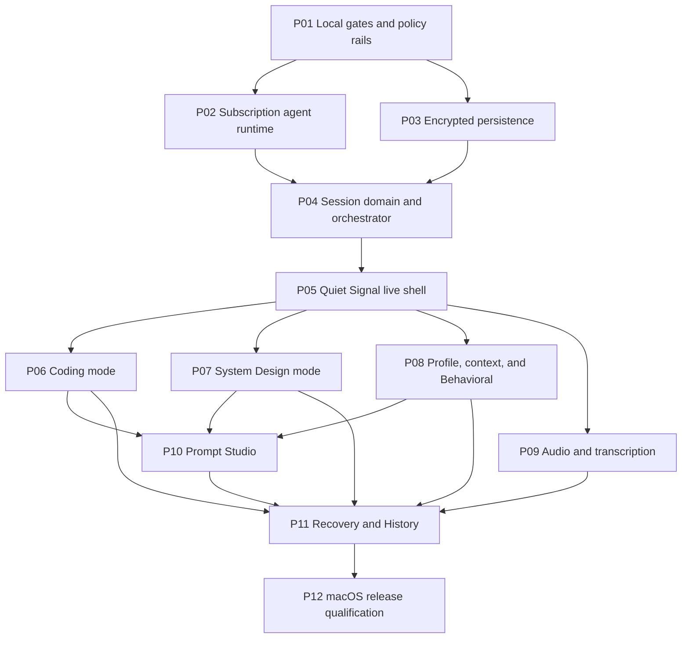

# InterviewCopilot phase-execution packet

Packet revision: **P00-R1**

Planning base: `main@9dcb4b2d39607273a8528a24657cdb4f5bfc3412`

Canonical planning branch: `phase/P00-execution-packet`

Product specification: [`design.md`](../../design.md)

Launch platform: **macOS only**

Execution phases: **12 product PRs, P01–P12**

## 1. Authority and non-negotiable boundaries

This packet is the implementation and independent-review contract. If it and
`design.md` differ, stop and amend both in a new planning revision before code
is merged. An implementer may add stronger tests but may not reinterpret,
rename, weaken, delete, or skip a listed gate or any pre-existing test.

- Every phase is one standalone PR. Its branch starts from refreshed upstream
  `main` containing all listed dependencies and no prototype commit.
- The inherited dirty prototype on `feat/subscription-cli-providers` is
  planning evidence only. No phase may merge, cherry-pick, or claim it as
  complete. Code may be reimplemented after review against the phase contract.
- Only Claude Code and Codex subscription-authenticated providers may perform
  answer intelligence. The selected provider/model/response mode is fixed for
  a session. There is no automatic fallback, routing, or downgrade.
- InterviewCopilot remains AGPL-3.0-or-later, has no product entitlements,
  credits, quotas, analytics, device identifiers, or automatic crash upload.
- Capture privacy means documented ordinary capture behavior on explicitly
  qualified configurations. It never means anti-proctoring, process hiding,
  monitoring evasion, telemetry tampering, or universal undetectability.
- `setContentProtection(true)` is a release-critical invariant. It is necessary
  but not sufficient; external Google Meet qualification remains mandatory.
- Windows and Linux runtime, packaging, documentation promises, and capture
  qualification are deferred. Cross-platform abstractions are allowed only
  when they do not enlarge the launch surface.
- Local verification is authoritative. GitHub CI may inform a review but may
  not waive or replace any local gate in this packet.

## 2. Current-state preflight evidence (not the Stage 2 baseline)

These commands were run during P00 planning against a temporary clean worktree
at the planning base. Per controller direction, they are **preflight evidence
only**. The controller captures the formal Stage 2 baseline after packet
approval at the frozen SHA. Raw exits and counts must be recorded again then.

| Command | Raw exit | Result/count |
|---|---:|---|
| `npm ci` | 0 | 855 packages installed; audit reported 50 vulnerabilities (9 low, 10 moderate, 27 high, 4 critical). |
| `npm test` | 0 | Placeholder only: 0 passed, 0 failed, 0 skipped, 0 tests executed. |
| `npm run lint` | 1 | 105 errors, 0 warnings. |
| `npx tsc --noEmit` | 2 | 48 TypeScript errors. |
| `npm run build` | 0 | Renderer, Electron main, and preload production bundles emitted. |
| Dirty-prototype `npm test` | 127 | `vitest: command not found`; prototype dependencies were not installed. |

None of the red or empty results is waived. P01 owns conversion to a real,
mechanically green local gate. Until P01 is green, no dependent phase starts.

### Formal Stage 2 capture commands

Run from a clean checkout of the controller-frozen SHA, in this order. Record
the complete output, raw exit after each command, and test
passed/failed/skipped totals. Do not replace a nonzero result with `|| true`.

```bash
stage2_evidence_dir=$(mktemp -d /tmp/interviewcopilot-stage2.XXXXXX)
stage2_failed=0
run_stage2() {
  stage2_label=$1
  shift
  "$@" 2>&1 | tee "$stage2_evidence_dir/$stage2_label.log"
  stage2_raw_exit=${PIPESTATUS[0]}
  printf '%s raw_exit=%s\n' "$stage2_label" "$stage2_raw_exit"
  if [ "$stage2_raw_exit" -ne 0 ]; then stage2_failed=1; fi
}
node --version
npm --version
run_stage2 install npm ci
run_stage2 test npm test
printf 'test passed=0 failed=0 skipped=0 executed=0 (upstream placeholder)\n'
run_stage2 lint npm run lint
printf 'lint summary=%s\n' "$(rg -o '[0-9]+ problems[^[:cntrl:]]*' "$stage2_evidence_dir/lint.log" | tail -1)"
run_stage2 typecheck npx tsc --noEmit
printf 'typecheck errors=%s\n' "$(rg -c 'error TS' "$stage2_evidence_dir/typecheck.log")"
run_stage2 build npm run build
printf 'aggregate_raw_exit=%s\n' "$stage2_failed"
test "$stage2_failed" -eq 0
```

Expected current upstream status is evidence, not acceptance: install, the
placeholder test, and build are expected to exit 0; lint and strict type-check
are expected to reproduce their nonzero debt. The required green baseline from
P01 onward is: every command exits 0, the test runner executes at least one
test, failed = 0, skipped = 0, and the manifest check proves every inherited
and phase-owned named test ran.

## 3. Repository architecture observed at the planning base

- `electron/main.ts` owns the single `BrowserWindow`, global application state,
  queue/solution/debug view transitions, helper construction, visibility,
  position, dynamic sizing, and the direct content-protection call.
- `electron/ScreenshotHelper.ts` captures the primary display into plaintext
  files below `app.getPath("userData")`; `ProcessingHelper.ts` reads those
  queues and performs legacy HTTP-provider extraction, solution, and debug
  calls, parsing mostly free-form output.
- `electron/ConfigHelper.ts` persists plaintext JSON containing a legacy API
  key, provider/model choices, language, and opacity. `electron/store.ts` is
  unused and contains a hard-coded encryption key.
- `electron/ipcHandlers.ts` and `electron/preload.ts` expose a broad, partly
  legacy IPC surface including credits, subscription portal, API-key, window,
  capture, update, and processing events. Renderer typings are duplicated in
  `src/env.d.ts` and `src/types/electron.d.ts`.
- `src/App.tsx` gates the renderer on configuration, while `Queue`, `Solutions`,
  and `Debug` are transient views. There is no durable session reducer,
  persistent provider conversation, typed response-section stream, audio
  pipeline, profile/context model, encrypted History, or Prompt Studio.
- Root `npm test` is a zero-test placeholder. The only tracked test is the
  untouched CRA sample `renderer/src/App.test.tsx`, in an otherwise separate
  legacy renderer package. It must remain and be executed by the consolidated
  P01 harness.
- Root build passes while strict type-check and lint do not. The existing CI
  continues past lint/type failures and is not a trustworthy acceptance gate.
- Packaging advertises macOS, Windows, and Linux, includes legacy identity,
  protocol, updater, and publish metadata, and has permissive macOS entitlements
  that require deliberate launch-surface reduction.

## 4. Complete prototype disposition

The table maps every tracked or untracked prototype path to a future owner.
“Reuse” means reconsider the idea and tests, not copy an unreviewed diff.

| Prototype evidence | Disposition and owning phase |
|---|---|
| `package.json`, `package-lock.json`, `vitest.config.ts`, `tsconfig.electron.json` | P01 re-creates a consolidated test/lint/type gate and lockfile; the observed Vitest spike is not accepted as-is. |
| `electron/ConfigHelper.ts`, `electron/ConfigHelper.test.ts` | P02 reimplements a versioned subscription-only config migration. Legacy API-key paths in the spike are explicitly rejected. |
| `electron/ai/types.ts`, `cliProcess.ts`, `cliProcess.test.ts` | P02 reuses safety ideas (absolute executables, no shell, abort/timeout/output limits, redaction) inside the persistent driver. |
| `electron/ai/cliProviders.ts`, `cliProviders.test.ts` | P02 replaces one-shot Claude `--no-session-persistence` and Codex `--ephemeral` execution with resumable Claude sessions and Codex app-server threads. |
| `electron/ProcessingHelper.ts` | P02/P04 replace legacy provider branching and regex orchestration; no legacy API-provider branch survives P02. |
| `electron/ipcHandlers.ts`, `electron/preload.ts`, `src/env.d.ts`, `src/types/electron.d.ts` | P02 owns narrow provider/config IPC; P04 owns typed session/event IPC; P05 owns shell/window IPC. Duplicate typings become one generated/shared contract. |
| `electron/captureProtection.ts`, `captureProtection.test.ts` | P01 adopts the centralized invariant and expands lifecycle coverage; P12 owns external qualification. |
| `electron/main.ts`, `electron/ScreenshotHelper.ts` | P05 reimplements hidden launch, prior-visibility restoration, per-display geometry, click-through, and capture lifecycle without weakening protection. |
| `electron/shortcuts.ts`, `shortcuts.test.ts`, `src/utils/platform.ts` | P05 implements the final remappable shortcut map. The spike's Reset-on-`R` and inverted Up/Down behavior are rejected. |
| `src/App.tsx`, `src/_pages/Queue.tsx`, `src/_pages/SubscribedApp.tsx` | P04/P05 replace transient view state and computed-style click-through heuristics with typed session state and explicit interactive regions. |
| `src/components/Settings/SettingsDialog.tsx`, `WelcomeScreen.tsx` | P02 builds provider-only onboarding; later settings panels are added by their owning phases. The prototype is not the final Quiet Signal UI. |
| `src/components/Header/Header.tsx`, `Queue/QueueCommands.tsx`, `Solutions/SolutionCommands.tsx` | P02 removes entitlement/API debris; P05 replaces command rows and exposes visible equivalent actions. |
| `src/constants/languages.ts`, `electron/languages.test.ts`, `LanguageSelector.tsx` | P06 adopts the normalized language catalog and adds first-class language fixtures required by D-023a. |
| `src/_pages/Solutions.tsx`, `src/_pages/Debug.tsx` | P06 replaces regex-parsed views with typed Coding sections, read-only code actions, and versioned Fix cards. Copy-button ideas remain evidence only. |
| `README.md`, `CONTRIBUTING.md`, `stealth-run.sh`, `stealth-run.bat` | P12 rewrites launch docs/scripts for macOS-only qualified claims. The Windows script is retained only until P12 removes launch support through an explicit reviewed change; it is never used as evidence of support. |
| `src/_pages/SubscribedApp.tsx` sizing removal and `Queue.tsx` width change | P05 owns automatic compact sizing and expanded-only manual resize with display-clamping tests. |
| `package.json` `productName` addition | P01 owns canonical InterviewCopilot identity; P12 validates final bundle metadata. |

No prototype path is “done.” Prototype files stay uncommitted on the planning
worktree and are excluded from the P00 commit.

## 5. Execution graph, waves, and intended bases



The graph is acyclic. Dependency-ready deterministic order is:
`P01 → P02 → P03 → P04 → P05 → P06 → P07 → P08 → P09 → P10 → P11 → P12`.
P02 and P03 may execute in parallel. P06, P07, P08, and P09 may execute in
parallel after P05; the listed order is the merge-order tie breaker.

| Wave | Phase branches | Intended base |
|---|---|---|
| 1 | `phase/P01-local-gates` | Exact planning base plus merged P00 documentation, if available. |
| 2 | `phase/P02-subscription-runtime`, `phase/P03-encrypted-persistence` | Refreshed `main` containing P01. |
| 3 | `phase/P04-session-orchestrator` | Refreshed `main` containing P02 and P03. |
| 4 | `phase/P05-live-shell` | Refreshed `main` containing P04. |
| 5 | `phase/P06-coding`, `phase/P07-system-design`, `phase/P08-behavioral`, `phase/P09-audio` | Refreshed `main` containing P05. |
| 6 | `phase/P10-prompt-studio` | Refreshed `main` containing P06, P07, and P08. |
| 7 | `phase/P11-history-recovery` | Refreshed `main` containing P06–P10. |
| 8 | `phase/P12-macos-qualification` | Refreshed `main` containing P11 and every prior phase. |

Parallel branches must be rebased onto the actual dependency merge before
review. A phase cannot use another open phase branch as its base.

## 6. Immutable local-gate contract

P01 creates and documents these scripts. From P01 onward every phase runs them
in the listed order from a clean checkout. `verify:test-manifest` fails if a
tracked test disappeared, was renamed without a packet revision, contains
`.skip`/`.todo`/`xit`/`xdescribe`, or did not execute. Test commands must print
passed, failed, and skipped totals plus their raw exit code.

```bash
npm ci                                      # expected exit 0
npm run verify:policy                       # expected exit 0
npm run lint                                # expected exit 0
npm run typecheck                           # expected exit 0
npm run test:legacy -- --reporter=verbose   # expected exit 0; failed 0; skipped 0
npm run test:unit -- --reporter=verbose     # expected exit 0; failed 0; skipped 0
npm run verify:test-manifest                # expected exit 0
npm run build                               # expected exit 0
```

Each phase adds one domain test script and runs it between `test:unit` and the
manifest check. Exact commands and minimum named-test counts appear below.
No implementer may edit the gate script and feature behavior in the same phase
after P01; a required gate change needs a separate P00 packet revision.

## 7. Phase contracts

### P01 — Green local gates and policy rails

**Objective/outcome.** Replace the zero-test/continue-on-error baseline with a
real, reproducible local quality gate and encode the license, privacy,
capture-protection, and product-identity invariants before feature work.

**Dependencies and intended base.** No product dependency. Base directly on
the authoritative planning commit (or refreshed `main` containing only P00
docs). Branch `phase/P01-local-gates`.

**Scope.** Consolidate Vitest (including the unchanged tracked CRA sample),
correct ESLint parsing/ignores rather than suppressing findings, fix all current
strict TypeScript and lint failures without changing behavior, create the raw
exit/count reporter and immutable test manifest, centralize capture protection,
set canonical InterviewCopilot metadata, add policy scans, and document local
gates. **Out of scope:** new session/provider/UI behavior, deleting the legacy
renderer, dependency-vulnerability upgrades unrelated to making gates work,
and external capture claims.

**Implementation requirements.** Use Node 20; keep lockfile deterministic;
make root tests execute `renderer/src/App.test.tsx` unchanged; permit no skip or
todo test forms; report raw exit plus passed/failed/skipped counts; fix all 105
lint and 48 type errors rather than excluding product code; make every window
creation/reveal path call one `applyCaptureProtection` helper; add no false
content-protection path; scan dependencies/source for analytics and automatic
crash upload entry points; retain AGPL-3.0-or-later.

**Expected files/systems.** `package*.json`, ESLint/TypeScript/Vitest configs,
`scripts/verification/**`, `tests/policy/**`, typed fixes in existing Electron
and renderer files, `electron/captureProtection.ts`, build metadata, README and
CONTRIBUTING gate sections, and `.github/workflows/ci.yml` only to mirror (not
replace) the local commands.

**Compatibility, migration, rollback.** No persisted-data migration. Runtime
behavior must remain identical except canonical display metadata and repeated
content-protection application. Roll back the PR as one unit; never roll back
only the protection helper or test manifest.

**Security/failure modes.** A parser ignore can hide source; a test glob can
silently execute zero tests; a reporter can mask the child exit; typed cleanup
can change behavior; capture protection can be applied after first paint. Tests
must make each failure observable and fail closed.

**Acceptance criteria and named new tests.** All are mechanically required.

| Criterion | Named test |
|---|---|
| P01-AC1: `npm test` executes at least one test and reports failed=0, skipped=0; the tracked CRA sample executes unchanged. | `tests/policy/gateContract.test.ts — executes the inherited CRA test and rejects a zero-test run` |
| P01-AC2: lint, strict type-check, unit tests, and build each return raw exit 0 on a clean checkout. | `tests/policy/gateContract.test.ts — propagates every child gate exit code` |
| P01-AC3: removal, rename, non-execution, `.skip`, `.todo`, `xit`, or `xdescribe` for any manifest test makes verification exit nonzero. | `tests/policy/testManifest.test.ts — rejects missing renamed skipped and unexecuted tests` |
| P01-AC4: every BrowserWindow creation and reveal path invokes `applyCaptureProtection`, which calls `setContentProtection(true)` and never false. | `electron/captureProtection.test.ts — protects creation and reveal lifecycle paths` |
| P01-AC5: package metadata and visible identity use InterviewCopilot and retain `AGPL-3.0-or-later`. | `tests/policy/productPolicy.test.ts — enforces canonical identity and AGPL metadata` |
| P01-AC6: shipped source has no analytics SDK, device fingerprint, automatic crash-upload initialization, or environment-based secret logging. | `tests/policy/productPolicy.test.ts — rejects telemetry crash upload and secret logging entry points` |
| P01-AC7: the verification reporter prints command, raw exit, and test passed/failed/skipped fields without converting nonzero to success. | `tests/policy/verificationReporter.test.ts — preserves raw failures and count fields` |

**Clean-checkout setup.** Every command must exit 0.

```bash
p01_verify_dir=$(mktemp -d /tmp/interviewcopilot-P01.XXXXXX)
git clone --no-checkout https://github.com/j4wg/interview-coder-withoupaywall-opensource "$p01_verify_dir/repo"
git -C "$p01_verify_dir/repo" fetch https://github.com/timomak/interview-coder-withoupaywall-opensource phase/P01-local-gates
git -C "$p01_verify_dir/repo" switch --detach FETCH_HEAD
cd "$p01_verify_dir/repo"
test -z "$(git status --porcelain)"
node -e 'if (Number(process.versions.node.split(".")[0]) !== 20) process.exit(1)'
```

**Verification commands, in order.** The phase suite must report at least 7
P01 named tests passed, 0 failed, 0 skipped; the full suite may have more.

```bash
npm ci
npm run verify:policy
npm run lint
npm run typecheck
npm run test:legacy -- --reporter=verbose
npm run test:unit -- --reporter=verbose
npm run test:p01 -- --reporter=verbose
npm run verify:test-manifest
npm run build
```

Expected raw exit for every command is 0. **Regression suite:** all inherited
tests, capture/screenshot behavior tests, full root unit suite, strict type
check, lint, and production build. No baseline error is grandfathered.

**Docs.** Document Node 20 clean setup, authoritative local commands, raw count
artifact format, AGPL/privacy policy, and the non-claim that unit protection
proves capture privacy.

**Completion evidence (enumerated).** (1) commit SHA and base SHA; (2) clean
status; (3) dependency install log; (4) one raw-exit/count report per gate;
(5) manifest diff proving the inherited test remains; (6) capture lifecycle
test output; (7) build artifact list; (8) reviewer sign-off that no lint/type
rule or source glob was weakened.

**Risk/complexity.** High risk, medium complexity: broad typed cleanup can hide
behavioral changes. Keep mechanical fixes small and independently reviewable
inside the single PR.

**Self-contained implementation prompt.**

> Implement P01 from P00-R1 on `phase/P01-local-gates`, based only on upstream
> `main@9dcb4b2d…` plus merged planning docs. Do not import the dirty prototype.
> Make local lint, strict type-check, real unit tests (including the unchanged
> tracked CRA sample), manifest enforcement, and build green. Centralize and
> lifecycle-test `setContentProtection(true)`, enforce InterviewCopilot/AGPL/no-
> telemetry policy, print raw exits and test counts, add exactly the tests named
> in P01, run the commands in order, and attach every enumerated artifact. Do
> not add product features or waive existing failures.

**Self-contained review prompt.**

> Review P01 independently against P00-R1, not the author’s summary. From the
> clean PR checkout run every P01 command, confirm the inherited CRA test ran,
> inspect all config/glob/ignore changes for hidden coverage loss, compare typed
> cleanup for behavior changes, and prove every window lifecycle applies true
> content protection. Reject the PR for any missing raw count, skipped test,
> weakened rule, product feature, telemetry path, or nonzero local gate.

**Remediation prompt template.**

> Remediate P01 only. Evidence: `{failing command/raw exit/counts or review
> finding}`. Root cause: `{confirmed cause}`. Change the smallest P01-owned
> files, add/strengthen `{named regression test}`, preserve every inherited
> gate and capture invariant, rerun the complete P01 sequence from `npm ci`,
> and return new raw evidence plus the before/after commit SHAs.

### P02 — Subscription-only persistent agent runtime

**Objective/outcome.** Provide one hardened, provider-neutral, persistent and
resumable answer runtime for Claude Code and Codex subscriptions, with explicit
provider/model/Fast-or-Reasoning selection, provider-only onboarding, and all
legacy API/paywall paths removed.

**Dependencies and intended base.** P01 merged. Branch
`phase/P02-subscription-runtime` from refreshed `main` containing P01.

**Scope.** Versioned configuration migration; installation/auth diagnostics;
Claude long-lived structured session adapter; Codex app-server thread adapter;
normalized stream, usage, compaction, stop, resume, and error events; process
safety; provider settings/onboarding; removal of OpenAI/Anthropic/Gemini answer
SDK paths, API keys, Supabase, credits, plans, quotas, and subscription portal.
**Out of scope:** interview domain orchestration, mode schemas, storage
encryption, renderer answer layouts, cloud transcription, and cross-provider
fallback.

**Implementation requirements.** Pin and validate supported CLI protocol
versions; resolve only absolute executables; use `spawn` with `shell:false`;
strip answer-provider secret overrides; cap output, timeout, abort gracefully,
then force-kill; sanitize stderr; never expose auth tokens/account identifiers;
keep one Claude session ID or Codex thread ID resumable across process/app
restart; map provider events to one discriminated union; never launch the
unselected provider after session selection; map Fast/Reasoning only to native
supported controls and mark unsupported combinations unavailable.

**Expected files/systems.** `electron/providers/**`, shared provider event and
IPC types, `electron/config/**`, settings/onboarding UI, preload/IPC narrowing,
provider fixtures/fake executables, package dependencies, and removal of legacy
provider/entitlement modules and strings.

**Compatibility, migration, rollback.** P02 exclusively owns migration
`M-01`: legacy `config.json` to versioned subscription config. Preserve
language/opacity; remove and never rewrite legacy API keys/models/credits; take
an owner-only backup with no key material before atomic replacement; repeated
migration is idempotent. Rollback restores the backup only after explicit user
choice because the old format contains disallowed secrets.

**Security/failure modes.** PATH substitution, argument injection, inherited
API keys changing billing, malformed stream events, output floods, zombie
children, provider version drift, token leakage, accidental tool access,
automatic fallback, and applying settings mid-session. Fake-executable tests
cover all without a live subscription.

**Acceptance criteria and named new tests.**

| Criterion | Named test |
|---|---|
| P02-AC1: only `claude-code` and `codex` answer-provider IDs are accepted; legacy providers/API-key/credit/entitlement IPC and dependencies are absent. | `electron/providers/providerBoundary.test.ts — rejects legacy providers and entitlement surfaces` |
| P02-AC2: two turns and an app restart resume the same Claude session and Codex thread respectively. | `electron/providers/persistence.contract.test.ts — resumes one conversation for both adapters` |
| P02-AC3: selected provider failure emits a typed recoverable error and never starts the other provider. | `electron/providers/noFallback.contract.test.ts — never invokes the unselected provider` |
| P02-AC4: provider, model, and response mode snapshot once; unsupported effort/model combinations cannot start and no silent substitution occurs. | `electron/providers/selectionSnapshot.test.ts — locks explicit provider model and effort` |
| P02-AC5: normalized streams preserve text/typed payload, usage and compaction signals, stop, completion, and sanitized provider errors. | `electron/providers/eventNormalization.contract.test.ts — normalizes streaming and compaction events` |
| P02-AC6: child processes use absolute paths, no shell, scrubbed answer-secret env, bounded output/time, and graceful-then-forceful cancellation. | `electron/providers/processSafety.test.ts — constrains provider child processes` |
| P02-AC7: M-01 preserves language/opacity, removes legacy secrets/credits, writes mode 0600 atomically, and is idempotent. | `electron/config/configMigration.test.ts — migrates legacy settings once without persisting secrets` |
| P02-AC8: first run requires exactly one installed/authenticated provider then lands on Start Interview without requesting capture/audio permission. | `src/features/onboarding/ProviderSetup.test.tsx — completes provider-only onboarding` |

**Clean-checkout setup.** Same expected exit policy as P01.

```bash
p02_verify_dir=$(mktemp -d /tmp/interviewcopilot-P02.XXXXXX)
git clone --no-checkout https://github.com/j4wg/interview-coder-withoupaywall-opensource "$p02_verify_dir/repo"
git -C "$p02_verify_dir/repo" fetch https://github.com/timomak/interview-coder-withoupaywall-opensource phase/P02-subscription-runtime
git -C "$p02_verify_dir/repo" switch --detach FETCH_HEAD
cd "$p02_verify_dir/repo"
test -z "$(git status --porcelain)"
node -e 'if (Number(process.versions.node.split(".")[0]) !== 20) process.exit(1)'
```

**Verification commands, in order.** `test:p02` must report at least 8 named
tests passed, 0 failed, 0 skipped; every command exits 0.

```bash
npm ci
npm run verify:policy
npm run lint
npm run typecheck
npm run test:legacy -- --reporter=verbose
npm run test:unit -- --reporter=verbose
npm run test:p02 -- --reporter=verbose
npm run verify:test-manifest
npm run build
```

**Regression suite.** P01 gates, capture lifecycle, screenshot queues, config
language/opacity behavior, fake provider process tests, and production build.
Live Claude/Codex smoke tests are optional evidence and never replace fakes.

**Docs.** Supported/minimum CLI versions, install/sign-in/reconnect, provider
selection semantics, Fast/Reasoning availability, migration/rollback, process
sandbox/tool restrictions, and explicit no-fallback/no-API-key boundaries.

**Completion evidence.** (1) SHAs/base; (2) clean gate report; (3) fake Claude
two-turn/restart transcript; (4) fake Codex two-turn/restart transcript; (5)
no-fallback process trace; (6) migration before/after with secrets redacted;
(7) dependency and IPC removal scan; (8) UI keyboard/a11y test output;
(9) supported CLI protocol fixture versions.

**Risk/complexity.** Very high/high. CLI protocol/auth behavior is external
and evolving; pin capabilities and fail explicitly on unsupported versions.

**Self-contained implementation prompt.**

> Implement P02 from P00-R1 after P01, on
> `phase/P02-subscription-runtime`. Build a provider-neutral persistent runtime
> for Claude Code and Codex only, using one resumable session/thread, normalized
> streaming/usage/compaction/stop/error events, explicit provider/model/Fast-
> Reasoning snapshots, and no fallback. Migrate legacy config through M-01,
> remove every legacy answer API key/provider/credit/paywall surface, create the
> named fake-executable tests, run the exact P02 gates, and attach the evidence.
> Do not implement interview orchestration or reuse one-shot prototype code.

**Self-contained review prompt.**

> Review P02 against P00-R1 from a clean checkout. Trace both fake providers
> through two turns, stop, compaction, restart, and resume; force every failure
> and prove the other provider never starts. Inspect spawn/env/tool restrictions,
> IPC exposure, migration idempotence/file mode, dependency removals, model/
> effort locking, and provider-only onboarding. Run all P02 commands and reject
> any live-credential requirement, legacy path, secret leak, silent fallback,
> ephemeral conversation, skipped test, or gate failure.

**Remediation prompt template.**

> Remediate P02 only for `{failed criterion/evidence}`. Reproduce with the fake
> provider fixture, state the confirmed runtime or migration cause, change the
> smallest provider/config/onboarding surface, add or strengthen `{P02 named
> test}`, prove no unselected process ran and no secret persisted, rerun all P02
> commands from `npm ci`, and return raw exits/counts plus new SHAs.

### P03 — Encrypted local persistence foundation

**Objective/outcome.** Introduce a versioned, crash-safe, application-encrypted
local store for active recovery, session artifacts, and later History/profile/
template records, with its installation key protected by macOS Keychain.

**Dependencies and intended base.** P01 merged; may run in parallel with P02.
Branch `phase/P03-encrypted-persistence` from refreshed `main` containing P01.

**Scope.** Key lifecycle through Electron `safeStorage`/macOS Keychain,
AES-256-GCM versioned envelopes, atomic writes, record/index interfaces,
encrypted screenshot/blob storage, in-memory search primitives, corruption and
locked-Keychain recovery, secure deletion best effort, and migration of legacy
plaintext screenshot/cache locations. **Out of scope:** session semantics,
History UI/export, dossier/templates, raw-audio retention, and provider state.

**Implementation requirements.** Generate a random per-installation master key;
store only Keychain-protected key material; authenticate record type/version/ID
as AAD; unique nonce per write; never persist plaintext indexes, thumbnails,
screenshots, diagrams, caches, temp buffers, or keys; use owner-only
directories/files and atomic temp+rename; zero temporary buffers where
practical; make corrupted records isolated and non-destructive; store no raw
audio; expose repository interfaces without Electron objects to domain code.

**Expected files/systems.** `electron/storage/**`, key service, encrypted record
and blob repositories, migration/repair command, storage fixtures, IPC-free
domain interfaces, and privacy/storage docs.

**Compatibility, migration, rollback.** P03 exclusively owns `M-02` (legacy
plaintext screenshot/temp/cache files to encrypted blobs followed by verified
plaintext removal) and `M-03` (encrypted store envelope/schema v1). Both use a
journal, resume after interruption, quarantine failures, and are idempotent.
Rollback restores the pre-migration directory only while it remains in the
explicit rollback quarantine; it never writes newly created plaintext.

**Security/failure modes.** Nonce reuse, unauthenticated metadata, plaintext
search indexes/temp files, weak permissions, Keychain locked/unavailable,
partial rename, disk full, corrupt/truncated records, symlink/path traversal,
and migration deleting the only copy. Tests use deterministic fake key storage
but production must require Keychain-backed protection.

**Acceptance criteria and named new tests.**

| Criterion | Named test |
|---|---|
| P03-AC1: a fresh install generates one random key, stores only protected key material, and reopens records after restart. | `electron/storage/keyLifecycle.test.ts — creates protects and reopens one installation key` |
| P03-AC2: record and blob bytes contain none of fixture transcript, prompt, screenshot marker, diagram, profile text, index term, or key. | `electron/storage/plaintextLeak.test.ts — finds no sensitive fixture bytes at rest` |
| P03-AC3: AES-GCM nonces are unique and tampering with ciphertext, AAD, type, version, or ID is detected before plaintext release. | `electron/storage/envelopeCrypto.test.ts — authenticates envelope metadata and rejects tampering` |
| P03-AC4: atomic write under simulated crash/disk-full yields exactly the prior or new valid record, never a partial accepted record. | `electron/storage/atomicity.test.ts — survives interruption and disk exhaustion` |
| P03-AC5: owner-only permissions, canonical paths, and symlink rejection prevent out-of-root reads/writes. | `electron/storage/pathSafety.test.ts — confines encrypted storage and file modes` |
| P03-AC6: M-02 migrates each plaintext artifact once, verifies decryption, removes plaintext, and resumes safely after interruption. | `electron/storage/plaintextMigration.test.ts — journals verifies and resumes legacy artifact migration` |
| P03-AC7: raw audio is rejected by the persistence API and temporary audio fixtures leave no persisted bytes. | `electron/storage/retentionPolicy.test.ts — refuses raw audio persistence` |
| P03-AC8: locked/unavailable Keychain and isolated corrupt records surface typed recovery without resetting or overwriting other data. | `electron/storage/recovery.test.ts — preserves data on key and record failures` |

**Clean-checkout setup.** Every command exits 0.

```bash
p03_verify_dir=$(mktemp -d /tmp/interviewcopilot-P03.XXXXXX)
git clone --no-checkout https://github.com/j4wg/interview-coder-withoupaywall-opensource "$p03_verify_dir/repo"
git -C "$p03_verify_dir/repo" fetch https://github.com/timomak/interview-coder-withoupaywall-opensource phase/P03-encrypted-persistence
git -C "$p03_verify_dir/repo" switch --detach FETCH_HEAD
cd "$p03_verify_dir/repo"
test -z "$(git status --porcelain)"
node -e 'if (Number(process.versions.node.split(".")[0]) !== 20) process.exit(1)'
```

**Verification commands, in order.** `test:p03` reports at least 8 named tests
passed, 0 failed, 0 skipped; every raw exit is 0.

```bash
npm ci
npm run verify:policy
npm run lint
npm run typecheck
npm run test:legacy -- --reporter=verbose
npm run test:unit -- --reporter=verbose
npm run test:p03 -- --reporter=verbose
npm run verify:test-manifest
npm run build
```

**Regression suite.** P01 gates, capture behavior, screenshot creation/deletion,
config persistence, path safety, and build. Run storage tests on a case-
insensitive macOS filesystem in addition to temp-fixture unit tests.

**Docs.** Threat model, Keychain/key recovery, envelope versioning, retention,
M-02/M-03 journal and rollback, corruption repair, and explicit limitations of
best-effort secure deletion on APFS/SSD snapshots.

**Completion evidence.** (1) SHAs/base; (2) complete local-gate report; (3)
hex/string scan of encrypted fixtures; (4) file-mode listing; (5) nonce/tamper
test output; (6) interrupted migration journal before/after; (7) Keychain-
locked recovery output; (8) reviewer threat-model sign-off.

**Risk/complexity.** Very high/high. Cryptography and destructive migration are
one-way doors; use platform primitives and reviewed authenticated encryption,
never custom cryptography.

**Self-contained implementation prompt.**

> Implement P03 from P00-R1 after P01 on
> `phase/P03-encrypted-persistence`. Build the Keychain-backed installation-key
> service, versioned AES-256-GCM record/blob store, atomic writes, encrypted
> in-memory-search source, typed recovery, raw-audio rejection, and journaled
> M-02/M-03 migrations exactly as specified. Add all P03 named tests and threat-
> model docs, run the exact clean gates, and attach enumerated evidence. Do not
> implement session, History, provider, profile, or template behavior.

**Self-contained review prompt.**

> Threat-model and review P03 independently. Run every clean gate, inspect key
> storage, nonce generation, AAD, atomicity, permissions, path canonicalization,
> temp handling, raw-audio rejection, and both migrations under interruption.
> Search fixture storage byte-for-byte for plaintext. Reject home-grown crypto,
> plaintext indexes/caches, destructive unverified deletion, broad reset on one
> corrupt record, skipped tests, or any nonzero gate.

**Remediation prompt template.**

> Remediate P03 only for `{crypto/storage/migration finding}`. Preserve the
> failing fixture and journal as evidence, identify the exact invariant breach,
> make the smallest storage-owned change, add or strengthen `{P03 named test}`,
> prove no plaintext/key remains and interruption is recoverable, rerun all P03
> gates from `npm ci`, and return raw exits/counts plus new SHAs.

### P04 — Interview session domain and orchestrator

**Objective/outcome.** Replace queue/solution/debug global state with a durable,
typed InterviewSession reducer and one orchestrator that owns mode locking,
question branches, artifact provenance, provider context synchronization,
progressive sections, cancel/continue, Reset, and crash snapshots.

**Dependencies and intended base.** P02 and P03 merged. Branch
`phase/P04-session-orchestrator` from refreshed `main` containing both.

**Scope.** Domain types/reducer; typed IPC/event boundary; Start/Reset lifecycle;
provider/model/response snapshot; persistent provider-conversation binding;
input artifacts and pending-selection semantics; screenshot-over-transcript
authority; context status/detail; typed response-section streaming; request IDs,
cancellation and Continue unfinished; Coding question-branch primitive; encrypted
active-session snapshots. **Out of scope:** final shell visuals, mode renderers,
capture implementations, transcript engine, History UI/export, and templates.

**Implementation requirements.** Reducer is deterministic and exhaustively
typed; all state changes are events; initial provider turn seeds applicable
context and later turns send deltas only; Coding excludes profile/opportunity;
submitted artifacts cannot be duplicated; excluded artifacts remain local and
pending until discard/submit; Reset cancels capture/provider work, discards the
native conversation, seals an archive-ready snapshot, clears active state, and
preserves preferences/reusable records; partial output remains after cancel;
Continue unfinished reuses request identity and only missing section IDs.

**Expected files/systems.** `src/domain/interview/**`,
`electron/orchestrator/**`, shared IPC/event schemas, reducer/selectors, provider
driver integration, encrypted active-session repository adapter, fake clock/ID/
provider fixtures, and replacement of global `view/problemInfo/hasDebugged`.

**Compatibility, migration, rollback.** P04 exclusively owns `M-04`, encrypted
InterviewSession schema v1. Existing plaintext queues are imported only through
P03 M-02 as unattached artifacts; they are never silently treated as a live
session. Schema upgrades are forward-version rejected and rollback retains the
encrypted v1 record without lossy conversion.

**Security/failure modes.** Duplicate evidence on retry, stale/out-of-order
stream events, cross-session event bleed, Coding personal-context leak, provider
compaction misreported as data loss, Reset racing with writes, cancellation
destroying native session, partial response replacing complete content, and
malformed IPC. Reducer/property tests and fake provider traces cover them.

**Acceptance criteria and named new tests.**

| Criterion | Named test |
|---|---|
| P04-AC1: Start snapshots one mode/provider/model/response/language/context set; attempts to change them before Reset do not mutate the session. | `src/domain/interview/sessionLifecycle.test.ts — locks start snapshot until reset` |
| P04-AC2: reducer accepts only valid lifecycle transitions and ignores/rejects stale, duplicate, cross-session, and out-of-order events deterministically. | `src/domain/interview/sessionReducer.property.test.ts — preserves invariants under event permutations` |
| P04-AC3: the first turn seeds all applicable context; subsequent turns send only new deltas; Coding includes no dossier/opportunity bytes. | `electron/orchestrator/contextPolicy.test.ts — seeds once sends deltas and excludes coding personal context` |
| P04-AC4: new finalized transcript/screenshots are preselected; remove excludes without deleting; accepted artifacts are never resent; empty submission is rejected. | `electron/orchestrator/pendingArtifacts.test.ts — stages removes submits and deduplicates evidence` |
| P04-AC5: screenshot wins conflicting transcript requirements, while transcript is primary with no screenshot. | `electron/orchestrator/evidenceAuthority.test.ts — applies screenshot authority rule` |
| P04-AC6: context status transitions exactly New context → Updating → Full context or Context issue; compaction keeps Full context and appears only in detail. | `src/domain/interview/contextStatus.test.ts — derives honest synchronization and compaction state` |
| P04-AC7: stable typed sections publish progressively without reorder or completed-section replacement. | `electron/orchestrator/progressiveSections.test.ts — streams stable independently final sections` |
| P04-AC8: Cancel preserves completed/partial output and native conversation; Continue unfinished requests only incomplete IDs with the same request identity. | `electron/orchestrator/cancelContinue.test.ts — resumes unfinished sections without duplicate evidence` |
| P04-AC9: Reset cancels work, seals an encrypted archive-ready record, discards provider conversation, clears active artifacts, and preserves settings/reusable data. | `electron/orchestrator/resetSemantics.test.ts — performs the sole terminal lifecycle transition` |
| P04-AC10: restart offers Resume or Reset from the last valid encrypted snapshot and never auto-resumes capture. | `electron/orchestrator/crashRecovery.test.ts — restores session state with capture off` |

**Clean-checkout setup.** Every command exits 0.

```bash
p04_verify_dir=$(mktemp -d /tmp/interviewcopilot-P04.XXXXXX)
git clone --no-checkout https://github.com/j4wg/interview-coder-withoupaywall-opensource "$p04_verify_dir/repo"
git -C "$p04_verify_dir/repo" fetch https://github.com/timomak/interview-coder-withoupaywall-opensource phase/P04-session-orchestrator
git -C "$p04_verify_dir/repo" switch --detach FETCH_HEAD
cd "$p04_verify_dir/repo"
test -z "$(git status --porcelain)"
node -e 'if (Number(process.versions.node.split(".")[0]) !== 20) process.exit(1)'
```

**Verification commands, in order.** `test:p04` reports at least 10 named
tests passed, 0 failed, 0 skipped; every raw exit is 0.

```bash
npm ci
npm run verify:policy
npm run lint
npm run typecheck
npm run test:legacy -- --reporter=verbose
npm run test:unit -- --reporter=verbose
npm run test:p04 -- --reporter=verbose
npm run verify:test-manifest
npm run build
```

**Regression suite.** P01–P03 complete suites, provider fake contracts,
encrypted storage migration/recovery, capture lifecycle, screenshot queue
compatibility, and production build.

**Docs.** State/event diagrams, schema/event catalog, context inclusion table,
request idempotency, status semantics, Reset/cancel/recovery behavior, and M-04
version/rollback.

**Completion evidence.** (1) SHAs/base; (2) full gates/counts; (3) reducer
property seed/corpus; (4) first-turn/delta traces for each mode; (5) explicit
Coding exclusion byte scan; (6) cancel/continue trace; (7) Reset before/after
record; (8) crash/relaunch transcript; (9) schema fixture.

**Risk/complexity.** Very high/very high. This is the central consistency
boundary; no renderer or provider may keep a second authoritative session.

**Self-contained implementation prompt.**

> Implement P04 from P00-R1 after P02/P03 on
> `phase/P04-session-orchestrator`. Replace global transient state with the
> deterministic InterviewSession reducer, typed event/IPC contract, one
> persistent-conversation orchestrator, context/delta policy, pending artifacts,
> screenshot authority, progressive sections, cancel/continue, Reset, encrypted
> snapshot/recovery, and M-04 exactly as specified. Add the ten named tests, run
> all P04 gates, attach evidence, and do not build final shell/mode/audio/History
> UI or import prototype orchestration.

**Self-contained review prompt.**

> Review P04 as the sole session authority. Run all gates and property tests;
> trace every event, first-turn seed, delta, pending-artifact transition,
> compaction signal, cancel/continue, Reset race, and crash restart. Search a
> Coding trace for dossier/opportunity bytes. Reject duplicate state stores,
> Markdown-as-domain-state, artifact resends, section reorder, silent invalid
> transitions, capture auto-resume, skipped tests, or nonzero gates.

**Remediation prompt template.**

> Remediate P04 only for `{state/orchestration criterion}` using the smallest
> reducer/orchestrator/schema change. Add the exact failing event sequence to
> `{P04 named test}`, prove idempotency and no cross-session/personal-context
> leak, rerun every P04 command from `npm ci`, and return raw counts, traces,
> migration compatibility, and new SHAs.

### P05 — Quiet Signal live shell, window, and capture controls

**Objective/outcome.** Deliver the pressure-optimized macOS shell: hidden,
compact bar, compact answer, expanded workspace, explicit interactive regions,
input tray, remappable shortcuts, display-aware geometry, and accessible Quiet
Signal primitives while preserving capture protection.

**Dependencies and intended base.** P04 merged. Branch `phase/P05-live-shell`
from refreshed `main` containing P04.

**Scope.** Semantic tokens; shared HUD primitives; pre-session three-mode
selector; Start/live command rail; compact composer; answer/workspace states;
input tray; HotKeys editor/conflicts/reset; fixed shortcut map; visible action
equivalents; explicit drag/interactive/click-through regions; automatic compact
sizing, expanded-only resizing, per-display position/size/clamping/snap;
visibility and capture actions; full-primary-display screenshots; reduced
motion/density/text presets. **Out of scope:** mode content, audio implementation,
History, Prompt Studio, Meet verified status, and manual qualification.

**Implementation requirements.** Launch zero visible pixels; hiding never
changes session; explicit `data-interactive` regions control passthrough (no
computed-color heuristic); Content View pill is the only drag root and excludes
interactive descendants; apply capture protection before display and after any
reconfiguration; screenshot hides/restores exactly prior visibility; capture
only current OS primary display; use final shortcuts from design (Record `R`,
Reset Backspace, Debug `D`); register atomically and expose conflicts before
saving; no required text under 12px; no hover-only action; system fonts only.

**Expected files/systems.** Electron window/display/capture/shortcut services,
shell IPC, `src/features/shell/**`, design tokens/Tailwind mapping, shared HUD
components, Settings General/HotKeys, UI/window tests, and removal of old
command rows/dynamic size observers.

**Compatibility, migration, rollback.** Version preference keys for density,
text size, shortcuts, and per-display geometry within P02 config migration
framework; P05 owns their additive `M-05a` migration. Invalid/conflicting
legacy values fall back to documented defaults without mutating active session.
Rollback ignores unknown additive keys. No session-schema migration.

**Security/failure modes.** Transparent overlay intercepts clicks; interactive
surface becomes click-through; shortcut collision partially registers; window
lands off-screen after display change; capture reveals previously hidden app;
protection applied late; browser-tab sharing falsely inferred; drag controls
steal button input; zoom loses controls. Unit/UI/Electron integration tests
cover ordinary behavior but make no external capture claim.

**Acceptance criteria and named new tests.**

| Criterion | Named test |
|---|---|
| P05-AC1: normal launch has no visible pixels; visibility toggles hidden↔pre-session/previous HUD without changing session or capture state. | `electron/window/windowVisibility.test.ts — launches hidden and restores exact HUD state` |
| P05-AC2: every visible window lifecycle applies content protection before show; no path sets it false. | `electron/window/captureProtection.integration.test.ts — protects before every show and reconfiguration` |
| P05-AC3: pre-session shows all three modes and Start; active bar permanently exposes Record, Screenshot, Chat, Submit, context, HotKeys and More→Reset with visible keyboard equivalents. | `src/features/shell/CommandRail.test.tsx — renders exact pre-session and active controls` |
| P05-AC4: default shortcuts and remapping match design, conflicts reject atomically, Reset all restores defaults, and every action has an accessible visible control. | `electron/shortcuts/shortcutRegistry.test.ts — registers remaps and rolls back conflicts atomically` |
| P05-AC5: transparent areas pass pointer events; explicit visible/interactive regions receive them; drag never starts on interactive descendants. | `src/features/shell/pointerRegions.test.tsx — separates passthrough drag and controls` |
| P05-AC6: compact states auto-size; only expanded state resizes; positions/sizes persist per display and clamp fully into changed work areas. | `electron/window/displayGeometry.test.ts — restores snaps and clamps each window state` |
| P05-AC7: screenshot captures only the current primary full display, stages one artifact, and restores visible or hidden prior state exactly. | `electron/capture/primaryDisplayCapture.test.ts — captures primary display and preserves visibility` |
| P05-AC8: compact composer Enter adds newline, Control+Shift+Enter submits, empty submission does not call provider, and close restores prior state/focus. | `src/features/shell/CompactComposer.test.tsx — implements universal submit and focus return` |
| P05-AC9: Quiet Signal uses the specified neutral/signal/mode tokens, global signal-green primary actions, density/text presets, focus order, AA contrast, 12px minimum, non-color status, reduced motion, no alternate appearance theme, and no sound/haptic/TTS path. | `src/features/shell/accessibility.test.tsx — enforces Quiet Signal accessibility and silence invariants` |
| P05-AC10: section arrow shortcuts collapse/expand/navigate/scroll without moving the window; window arrows move without scrolling content. | `src/features/shell/navigationShortcuts.test.tsx — separates window and answer navigation` |

**Clean-checkout setup.** Every command exits 0.

```bash
p05_verify_dir=$(mktemp -d /tmp/interviewcopilot-P05.XXXXXX)
git clone --no-checkout https://github.com/j4wg/interview-coder-withoupaywall-opensource "$p05_verify_dir/repo"
git -C "$p05_verify_dir/repo" fetch https://github.com/timomak/interview-coder-withoupaywall-opensource phase/P05-live-shell
git -C "$p05_verify_dir/repo" switch --detach FETCH_HEAD
cd "$p05_verify_dir/repo"
test -z "$(git status --porcelain)"
node -e 'if (Number(process.versions.node.split(".")[0]) !== 20) process.exit(1)'
```

**Verification commands, in order.** `test:p05` reports at least 10 named
tests passed, 0 failed, 0 skipped; every raw exit is 0.

```bash
npm ci
npm run verify:policy
npm run lint
npm run typecheck
npm run test:legacy -- --reporter=verbose
npm run test:unit -- --reporter=verbose
npm run test:p05 -- --reporter=verbose
npm run verify:test-manifest
npm run build
npm run test:electron-shell
```

`test:electron-shell` exits 0 on macOS and records window bounds, protection
application, screenshot-display ID, and pointer-region results. **Regression
suite:** all P01–P04 tests, provider/storage/session contracts, capture queues,
preload IPC allowlist, accessibility, and production build.

**Docs.** Window-state and focus diagrams, shortcut reference, display recovery,
permission-repair behavior, screenshot scope, interaction-region authoring,
accessibility presets, and explicit statement that tests do not qualify Meet.

**Completion evidence.** (1) SHAs/base; (2) all raw gates/counts; (3) Electron
shell artifact; (4) screenshots of four states at both densities/text extremes;
(5) keyboard-only recording; (6) two-display disconnect/clamp recording;
(7) hidden/visible screenshot state trace; (8) accessibility report; (9)
protection call-order trace.

**Risk/complexity.** Very high/high. Electron transparent-window input and
display behavior is platform-sensitive and directly touches privacy regression.

**Self-contained implementation prompt.**

> Implement P05 from P00-R1 after P04 on `phase/P05-live-shell`. Build the
> exact Quiet Signal hidden/compact/answer/expanded shell, command rail,
> composer, input tray, explicit click-through/drag regions, final remappable
> shortcuts, display-aware geometry, primary-display screenshot behavior,
> tokens and accessibility presets. Preserve protection before every show and
> prior visibility across capture. Add the ten named tests, run all P05 gates
> including macOS Electron shell, and attach evidence. Do not add mode answers,
> audio, History, Prompt Studio, or unqualified capture claims.

**Self-contained review prompt.**

> Review P05 on macOS from a clean checkout. Operate every visible control and
> shortcut keyboard-only; inspect click-through/drag regions, focus restoration,
> geometry across display changes, compact sizing, screenshot scope/visibility,
> and content-protection call order. Run all P05 gates and accessibility checks.
> Reject computed-style hit testing, hidden-only actions, wrong Reset/Record
> bindings, off-screen states, capture-state mutation on hide, external privacy
> claims, skipped tests, or nonzero gates.

**Remediation prompt template.**

> Remediate P05 only for `{shell/window/capture criterion}`. Attach the exact
> display/window/input reproduction, fix the smallest P05-owned service or
> primitive, add/strengthen `{P05 named test}`, recheck protection and prior
> visibility, rerun every P05 command including `test:electron-shell`, and
> return raw counts, artifact paths, and new SHAs.

### P06 — Coding mode and primary-display debugging

**Objective/outcome.** Deliver a typed, progressively streamed Coding workspace
with explicit intent, language quality tiers, concise-first answer, read-only
code, question branches, and targeted screenshot debugging.

**Dependencies and intended base.** P05 merged. Branch `phase/P06-coding` from
refreshed `main` containing P05.

**Scope.** Coding schema/prompt/orchestrator policy; Answer/Plan/Code/Explain
renderer; Analyze/Generate Code/Debug/Follow-up intent; New Question branch;
`Control+Shift+D` Fix current code; versioned Fix cards; language catalog,
syntax rendering, fixtures, and first-class quality matrix; Copy/Regenerate/
Debug/Explain. **Out of scope:** code editing/execution/terminal/test runner,
profile/opportunity context, other modes, and diagram export.

**Implementation requirements.** A request cannot start without explicit
intent; Solve publishes 2–4 approach bullets, one trade-off, and time/space
complexity before code; stable Code section streams independently; selected
language snapshots at Start; Python means Python 3; six first-class families
receive parser/prompt/debug fixtures; Debug shortcut captures/submits only its
new primary-display screenshot, preserves staged artifacts and solution, and
never falls back; New Question clears problem-local UI while retaining
interview transcript/chronology.

**Expected files/systems.** `src/features/coding/**`, Coding typed schemas,
orchestrator policy, language registry/highlighting, prompt fixtures, first-
class corpus, renderer/components, and screenshot debug integration.

**Compatibility, migration, rollback.** P06 owns additive `M-05b` normalization
of legacy `python`→`python3` and `go`/`golang` aliases in global preferences;
active sessions never mutate. Rollback keeps canonical strings readable.
No session data rewrite; archived unknown Coding fields remain preserved.

**Security/failure modes.** Personal-context leak, intent guessing, incomplete
or unsafe code fence parsing, language drift mid-session, Debug consuming staged
evidence, fabricated fix, full regeneration, code execution/tool access, branch
cross-contamination, and copy action copying prose.

**Acceptance criteria and named new tests.**

| Criterion | Named test |
|---|---|
| P06-AC1: Analyze/Generate Code/Debug/Follow-up is required and maps to a distinct validated typed response; absent/unknown intent makes zero provider calls. | `src/features/coding/codingIntent.test.ts — requires and validates explicit intent` |
| P06-AC2: Solve first publishes 2–4 approach bullets, one trade-off, and both complexities; Code streams independently without displacing Answer. | `src/features/coding/progressiveCodingAnswer.test.tsx — renders concise answer before stable code` |
| P06-AC3: provider request and trace contain no dossier/opportunity bytes or tools capable of editing/executing code. | `electron/orchestrator/codingIsolation.test.ts — excludes personal context and execution tools` |
| P06-AC4: language snapshots once; M-05b normalizes aliases; Python 3 and all first-class/best-effort options render correctly. | `src/features/coding/languageSnapshot.test.ts — normalizes and locks the complete language catalog` |
| P06-AC5: each first-class language passes representative solve, syntax parse, and debugging schema fixtures; best-effort languages are visibly labeled. | `tests/fixtures/coding/firstClassQuality.contract.test.ts — validates six language families` |
| P06-AC6: Code is selectable/read-only and only Copy, Regenerate, Debug, Explain are exposed; no edit/run/terminal/test action exists. | `src/features/coding/CodePanel.test.tsx — exposes only approved read-only actions` |
| P06-AC7: New Question creates a clean problem branch while preserving interview transcript, prior branches, chronology, and History payload. | `electron/orchestrator/codingBranch.test.ts — isolates new question within one interview` |
| P06-AC8: Fix current code submits only the new screenshot, preserves staged artifacts/current solution, and returns a versioned targeted Fix card. | `src/features/coding/fixCurrentCode.test.ts — performs isolated targeted screenshot debug` |
| P06-AC9: when no issue is supported, Fix says so and requests better evidence; it never invents a patch or falls back/crosses mode. | `electron/orchestrator/codingDebugFailure.test.ts — fails honestly without regeneration or fallback` |

**Clean-checkout setup.** Every command exits 0.

```bash
p06_verify_dir=$(mktemp -d /tmp/interviewcopilot-P06.XXXXXX)
git clone --no-checkout https://github.com/j4wg/interview-coder-withoupaywall-opensource "$p06_verify_dir/repo"
git -C "$p06_verify_dir/repo" fetch https://github.com/timomak/interview-coder-withoupaywall-opensource phase/P06-coding
git -C "$p06_verify_dir/repo" switch --detach FETCH_HEAD
cd "$p06_verify_dir/repo"
test -z "$(git status --porcelain)"
node -e 'if (Number(process.versions.node.split(".")[0]) !== 20) process.exit(1)'
```

**Verification commands, in order.** `test:p06` reports at least 9 named tests
passed, 0 failed, 0 skipped; every raw exit is 0.

```bash
npm ci
npm run verify:policy
npm run lint
npm run typecheck
npm run test:legacy -- --reporter=verbose
npm run test:unit -- --reporter=verbose
npm run test:p06 -- --reporter=verbose
npm run verify:test-manifest
npm run test:coding-fixtures
npm run build
```

`test:coding-fixtures` exits 0 and reports all six first-class families passed,
0 failed, 0 skipped. **Regression suite:** P01–P05, provider/session no-fallback,
Coding personal-context exclusion, shell shortcuts/capture/protection, storage,
and production build.

**Docs.** Coding schemas/intents, language tiers and fixture policy, question
branch semantics, Debug screenshot behavior, read-only boundary, M-05b, and
manual test matrix.

**Completion evidence.** (1) SHAs/base; (2) raw gates/counts; (3) six-language
fixture report; (4) progressive event/UI trace; (5) request byte scan proving
personal-context absence; (6) New Question before/after state; (7) isolated
Debug request trace and Fix card; (8) keyboard/a11y capture.

**Risk/complexity.** High/high. Structured output and multi-language quality can
regress silently; fixture contracts are merge-blocking.

**Self-contained implementation prompt.**

> Implement P06 from P00-R1 after P05 on `phase/P06-coding`. Add the exact
> typed Coding intents/schema/renderer, concise-first progressive answer,
> language snapshot and six-family fixtures, read-only actions, New Question,
> and isolated `Control+Shift+D` versioned Fix flow. Enforce no personal context,
> tools, execution, fallback, or staged-artifact consumption. Own M-05b, add all
> nine named tests, run the exact gates/fixture matrix, and attach evidence.

**Self-contained review prompt.**

> Review P06 from clean checkout with fake provider fixtures. Validate every
> intent/schema, stream order, all six language families, Python 3, read-only
> surface, New Question isolation, and both successful/unsupported Fix flows.
> Inspect requests for personal data, extra artifacts, tools, and fallback.
> Run all P06 commands; reject guessed intent, language drift, code execution,
> full regeneration on Debug, skipped fixtures/tests, or nonzero gates.

**Remediation prompt template.**

> Remediate P06 only for `{intent/language/branch/debug criterion}`. Add the
> failing problem/language/event trace to `{P06 named test or first-class
> fixture}`, make the smallest Coding-owned change, prove isolation/no fallback,
> rerun all P06 commands and the six-family matrix, and return raw counts,
> request/response traces, and new SHAs.

### P07 — System Design mode and structured architecture

**Objective/outcome.** Deliver the fixed, progressively streamed System Design
workflow with material estimates, vendor-neutral structured diagrams, dynamic
follow-up impact analysis, and no editing or standalone diagram export.

**Dependencies and intended base.** P05 merged. Branch
`phase/P07-system-design` from refreshed `main` containing P05.

**Scope.** Typed Clarify/Estimate/Architecture/Data & APIs/Deep Dives & Trade-
offs schema and renderer; 2–4 material calculations; structured node/edge
diagram with inspect/zoom/pan/regenerate; vendor-neutral component vocabulary;
all-sections immediate generation; assumptions; agent-directed follow-up and
What changed. **Out of scope:** whiteboarding/editing, cloud-provider logo
catalogs, standalone diagram copy/export, Prompt Studio, and profile editor
(P08 later supplies context through the P04 interface).

**Implementation requirements.** Fixed section order cannot be model-defined;
all section shells exist on submit and publish independently; Clarify questions
never gate later sections; estimates show units and assumptions; diagram data
validates IDs/edges/component types and has deterministic accessible text;
provider products may appear only as secondary examples; follow-up computes an
impact set, preserves byte-identical unaffected sections, and summarizes every
material change; no diagram serialization action appears in live UI.

**Expected files/systems.** `src/features/system-design/**`, typed schemas and
validators, diagram layout/renderer, accessible representation, prompt/response
fixtures, orchestrator policy, update-diff engine, and mode tests.

**Compatibility, migration, rollback.** No new persisted root schema; P04
ResponseSection and session extension fields are additive and preserved by
unknown-field round-trip. Rollback displays archived structured diagram as
read-only JSON-unavailable placeholder rather than dropping it.

**Security/failure modes.** Malformed graph/edge injection, unsafe labels/URLs,
layout denial-of-service, decorative calculations, silent assumption, vendor
lock-in, provider-controlled order, follow-up rewriting unaffected work,
standalone export leakage, and inaccessible canvas-only content.

**Acceptance criteria and named new tests.**

| Criterion | Named test |
|---|---|
| P07-AC1: exactly five sections render in fixed order and publish independently without Clarify gating later sections. | `src/features/system-design/sectionContract.test.tsx — renders fixed progressive design sequence` |
| P07-AC2: Estimate contains 2–4 material unit-bearing calculations with explicit assumptions; Deepen estimates adds only requested detail. | `tests/fixtures/system-design/materialEstimates.contract.test.ts — validates bounded material calculations` |
| P07-AC3: Architecture accepts only approved vendor-neutral node types/valid edges and sanitizes labels/details. | `src/features/system-design/architectureSchema.test.ts — validates safe vendor-neutral graphs` |
| P07-AC4: diagram supports inspect, zoom, pan, regenerate and accessible text, but no move/rename/add/remove/reconnect/copy/export action. | `src/features/system-design/ArchitectureView.test.tsx — exposes only approved read-only interactions` |
| P07-AC5: unresolved requirements appear as assumptions while a complete design still generates. | `electron/orchestrator/systemDesignAssumptions.test.ts — answers best effort without clarification gate` |
| P07-AC6: follow-up changes only impacted sections, preserves unaffected bytes, and returns a complete What changed summary. | `electron/orchestrator/systemDesignFollowup.test.ts — applies dependency-scoped revisions` |
| P07-AC7: provider-specific services appear only in component detail examples, never node type/label or icon dependency. | `tests/fixtures/system-design/vendorNeutrality.contract.test.ts — keeps architecture vocabulary neutral` |
| P07-AC8: whole-session storage round-trips graph data, but the live Architecture view exposes no standalone export/copy. | `src/features/system-design/diagramRetention.test.ts — archives without live export surface` |

**Clean-checkout setup.** Every command exits 0.

```bash
p07_verify_dir=$(mktemp -d /tmp/interviewcopilot-P07.XXXXXX)
git clone --no-checkout https://github.com/j4wg/interview-coder-withoupaywall-opensource "$p07_verify_dir/repo"
git -C "$p07_verify_dir/repo" fetch https://github.com/timomak/interview-coder-withoupaywall-opensource phase/P07-system-design
git -C "$p07_verify_dir/repo" switch --detach FETCH_HEAD
cd "$p07_verify_dir/repo"
test -z "$(git status --porcelain)"
node -e 'if (Number(process.versions.node.split(".")[0]) !== 20) process.exit(1)'
```

**Verification commands, in order.** `test:p07` reports at least 8 named tests
passed, 0 failed, 0 skipped; every raw exit is 0.

```bash
npm ci
npm run verify:policy
npm run lint
npm run typecheck
npm run test:legacy -- --reporter=verbose
npm run test:unit -- --reporter=verbose
npm run test:p07 -- --reporter=verbose
npm run verify:test-manifest
npm run test:system-design-fixtures
npm run build
```

Fixture command exits 0 with all design/vendor/follow-up cases passed, failed 0,
skipped 0. **Regression suite:** P01–P05, provider/session/storage, shell section
navigation, accessibility, capture protection, and build.

**Docs.** Response/graph schemas, allowed node types, estimate policy,
assumption semantics, follow-up impact algorithm, accessibility text, and live
no-export boundary.

**Completion evidence.** (1) SHAs/base; (2) raw gates/counts; (3) progressive
five-section trace; (4) estimate fixture report; (5) graph validation corpus;
(6) before/after follow-up diff proving unaffected hashes; (7) keyboard/screen-
reader diagram recording; (8) absence-of-export DOM/API scan.

**Risk/complexity.** High/high. Graph validation/layout and scoped regeneration
must not become a second untyped document model.

**Self-contained implementation prompt.**

> Implement P07 from P00-R1 after P05 on `phase/P07-system-design`. Add the
> fixed typed five-section progressive workflow, bounded material estimates,
> safe vendor-neutral structured diagram, read-only accessible interactions,
> assumption handling, dependency-scoped follow-up and What changed summary.
> Add all eight named tests/fixtures, run exact gates, attach evidence, and do
> not add diagram editing/export, vendor node types, Prompt Studio, or profile UI.

**Self-contained review prompt.**

> Review P07 from clean checkout using malformed and representative fixtures.
> Prove fixed order/no gate, estimate bounds/units, graph sanitization and
> accessibility, vendor neutrality, approved interactions only, archived graph
> round-trip, and hash-identical unaffected follow-up sections. Run every P07
> gate; reject raw Markdown state, diagram export/editing, unsafe graph content,
> decorative arithmetic, skipped tests, or nonzero exits.

**Remediation prompt template.**

> Remediate P07 only for `{schema/estimate/diagram/follow-up criterion}`. Add the
> failing graph or event to `{P07 named fixture}`, change the smallest System
> Design-owned validator/renderer/policy, prove unaffected hashes and no export,
> rerun all P07 gates/fixtures, and return raw counts, diffs, and new SHAs.

### P08 — Candidate profile, opportunity context, and Behavioral mode

**Objective/outcome.** Deliver encrypted reusable candidate/opportunity context
and a factual, provenance-aware Behavioral mode with concise talking points,
STAR/Evidence/Follow-ups, optional same-facts Full Answer, and explicit synthetic
story control.

**Dependencies and intended base.** P05 merged. Branch `phase/P08-behavioral`
from refreshed `main` containing P05.

**Scope.** Encrypted canonical candidate Markdown dossier; guided profile chat;
manual edit and resume/Markdown import/export; multiple named opportunity
contexts with one active selection; provenance; synthetic setting/default;
Behavioral schema/renderer/story selection; context delivery to Behavioral and
System Design interface; explicit Coding exclusion. **Out of scope:** PDF/DOCX
resume parsing, custom core modes, Practice scoring/feedback, and History UI.

**Implementation requirements.** Validate and sanitize Markdown imports;
encrypt content/indexes; retain provenance per claim/story; verified/user-edited
stories cannot gain unsupported events/technologies/scope/metrics; absent metric
stays qualitative; synthetic is off by default, opt-in only, saved immediately
as `synthetic-draft`, visibly labeled, and reused consistently; talking points
and Full Answer derive from one fact object; opportunity selection snapshots at
Start and later edits apply next session; System Design receives applicable
context while Coding receives none.

**Expected files/systems.** `src/features/profile/**`,
`src/features/behavioral/**`, encrypted repositories/adapters, Markdown parser
and diff review, profile-agent policy, typed story/provenance schemas, settings
panels, Behavioral fixtures and renderer.

**Compatibility, migration, rollback.** P08 exclusively owns `M-06`: encrypted
candidate dossier/opportunity schema v1 and active-selection preference. Imports
create a reviewed draft, never overwrite silently; migration is idempotent and
keeps original encrypted revision. Rollback preserves Markdown export and
unknown provenance fields.

**Security/failure modes.** Prompt injection in resume/Markdown, path/HTML/link
injection, personal context leaking into Coding/logs, invented real-story facts
or metrics, synthetic unlabeled/promotion, cross-opportunity contamination,
Full Answer fact drift, import overwrite, and plaintext search/index/cache.

**Acceptance criteria and named new tests.**

| Criterion | Named test |
|---|---|
| P08-AC1: dossier guided chat/manual edit/import produce a reviewable canonical Markdown draft with required sections and retained provenance. | `src/features/profile/candidateDossier.test.ts — builds reviews and edits canonical Markdown` |
| P08-AC2: dossier/opportunity content and search terms have no plaintext bytes at rest; export occurs only to an explicit destination. | `electron/storage/profileEncryption.test.ts — encrypts reusable personal context and indexes` |
| P08-AC3: multiple named opportunities persist exactly one active selection; Start snapshots it and active-session edits do not change the snapshot. | `src/features/profile/opportunitySnapshot.test.ts — isolates named opportunities across sessions` |
| P08-AC4: Behavioral request includes dossier and snapshotted opportunity, System Design gets applicable context, and Coding contains neither. | `electron/orchestrator/personalContextRouting.test.ts — routes personal context only to approved modes` |
| P08-AC5: synthetic is off by default; no matching real story returns an honest absence without provider-invented facts. | `electron/orchestrator/behavioralFactuality.test.ts — refuses unsupported real stories and metrics` |
| P08-AC6: opt-in synthetic story saves as `synthetic-draft`, visibly labels every view/metric, and later reuse has identical facts. | `src/features/behavioral/syntheticStory.test.ts — labels persists and reuses synthetic evidence` |
| P08-AC7: Answer/STAR/Evidence/Follow-ups share one typed fact object; Full Answer introduces no new fact or metric. | `src/features/behavioral/factParity.test.ts — preserves claims across concise and full formats` |
| P08-AC8: verified/user-edited stories use only dossier-backed claims and remain qualitative when metrics are absent. | `tests/fixtures/behavioral/verifiedClaims.contract.test.ts — prevents unsupported precision` |
| P08-AC9: imported Markdown sanitizes executable HTML/unsafe links/instructions and cannot override protected product/schema invariants. | `src/features/profile/markdownSafety.test.ts — treats imported content as untrusted evidence` |
| P08-AC10: no Practice score, post-answer feedback, or coaching-review surface is present. | `src/features/behavioral/liveOnlyBoundary.test.tsx — excludes deferred Practice behavior` |

**Clean-checkout setup.** Every command exits 0.

```bash
p08_verify_dir=$(mktemp -d /tmp/interviewcopilot-P08.XXXXXX)
git clone --no-checkout https://github.com/j4wg/interview-coder-withoupaywall-opensource "$p08_verify_dir/repo"
git -C "$p08_verify_dir/repo" fetch https://github.com/timomak/interview-coder-withoupaywall-opensource phase/P08-behavioral
git -C "$p08_verify_dir/repo" switch --detach FETCH_HEAD
cd "$p08_verify_dir/repo"
test -z "$(git status --porcelain)"
node -e 'if (Number(process.versions.node.split(".")[0]) !== 20) process.exit(1)'
```

**Verification commands, in order.** `test:p08` reports at least 10 named
tests passed, 0 failed, 0 skipped; every raw exit is 0.

```bash
npm ci
npm run verify:policy
npm run lint
npm run typecheck
npm run test:legacy -- --reporter=verbose
npm run test:unit -- --reporter=verbose
npm run test:p08 -- --reporter=verbose
npm run verify:test-manifest
npm run test:behavioral-fixtures
npm run build
```

Fixture command exits 0 with verified/synthetic/import cases passed, 0 failed,
0 skipped. **Regression suite:** P01–P06 plus P07 if already merged, storage
plaintext scans, session context policy, Coding isolation, shell/accessibility,
provider no-fallback, and build.

**Docs.** Dossier and opportunity Markdown/schema/provenance, import threat
model, synthetic policy, context-routing matrix, M-06, export behavior, and
Practice exclusion.

**Completion evidence.** (1) SHAs/base; (2) gates/counts; (3) encrypted byte
scan; (4) sanitized import/diff; (5) three-mode request context scans; (6)
verified and synthetic fixture report; (7) concise/full fact-object diff;
(8) multi-opportunity snapshot trace; (9) keyboard/a11y recording.

**Risk/complexity.** Very high/high. Personal data confidentiality and factual
integrity are product trust boundaries.

**Self-contained implementation prompt.**

> Implement P08 from P00-R1 after P05 on `phase/P08-behavioral`. Build the
> encrypted canonical candidate dossier, guided/manual reviewed editing,
> sanitized Markdown import/export, multiple snapshotted opportunities,
> provenance, opt-in labeled persistent synthetic stories, and typed Behavioral
> views with same-facts Full Answer. Route context only to Behavioral/System
> Design, never Coding. Own M-06, add ten named tests/fixtures, run exact gates,
> attach evidence, and add no Practice or plaintext personal index.

**Self-contained review prompt.**

> Review P08 from clean checkout as both privacy and factuality boundary. Search
> storage/logs/Coding requests for fixture personal bytes; attack Markdown;
> compare concise/full facts; test absent metrics, synthetic off/on/reuse,
> multi-opportunity snapshotting, and System Design routing. Run all P08 gates.
> Reject unlabeled synthetic content, unsupported precision, active-session
> context mutation, plaintext indexes, Practice UI, skipped tests, or nonzero
> exits.

**Remediation prompt template.**

> Remediate P08 only for `{privacy/provenance/factuality/context criterion}`.
> Preserve the failing dossier/import/trace fixture, make the smallest profile
> or Behavioral-owned fix, strengthen `{P08 named test}`, repeat plaintext and
> three-mode scans, rerun every P08 command/fixture, and return raw counts,
> fact/context diffs, and new SHAs.

### P09 — macOS audio capture, transcription, and question detection

**Objective/outcome.** Add explicit, source-separated microphone/system-audio
capture, local-first transcription, speaker attribution/correction, provider-
assisted question detection, and typed pending transcript artifacts without
automatic answering or raw-audio retention.

**Dependencies and intended base.** P05 merged. Branch `phase/P09-audio` from
refreshed `main` containing P05.

**Scope.** macOS native capture helper (ScreenCaptureKit/AVAudioEngine or their
supported successor); independent sources and master Record; contextual
permissions; pause/resume; elapsed/waveform/status; bundled or checksum-pinned
`whisper.cpp` local transcription; explicit optional Apple Speech service cloud
fallback; segment finalization, source labels, multi-speaker diarization through
the selected subscription agent, uncertainty/correction, question candidate,
and session integration. **Out of scope:** Windows/Linux, automatic answer,
archived raw audio, TTS, sounds/haptics, and other cloud transcription vendors.

**Implementation requirements.** Both sources off every session; master Record
starts/resumes or pauses both deterministically while per-source controls remain
independent; hide/collapse does nothing to capture; temporary buffers are mode
0600, bounded, deleted immediately after finalization/error/Reset, and rejected
by storage; local transcription is default/offline; Apple cloud transcription
requires explicit opt-in each configured setting, visible Remote status, and
never becomes an answer provider; permission denial disables only that source
and retries only on explicit action; source defaults Interviewer/You; uncertain
labels visible/editable; provider-assisted diarization/question detection uses
the existing session conversation with finalized transcript text only, never
raw audio or a second hidden conversation; detected question never invokes a
provider answer.

**Expected files/systems.** macOS Swift/native audio helper and build config,
`electron/audio/**`, local transcription sidecar/model manifest/checksums,
Apple Speech adapter, audio IPC/events, Audio Settings, shell controls/waveform,
transcript/question UI, fixtures, and permission integration tests.

**Compatibility, migration, rollback.** P09 exclusively owns `M-07`: audio
settings and typed transcript-segment schema v1. Migration defaults both sources
off and cloud fallback disabled; no prior setting can enable capture. Rollback
ignores encrypted transcripts it cannot render and never restores raw buffers.

**Security/failure modes.** Capture without action, remote fallback without
consent, microphone/system mix-up, hidden-state pause, raw buffer leak, oversized
audio denial-of-service, model checksum/license failure, native helper crash,
permission loops, speaker hallucination, correction not reaching context,
detected question triggering answer, and audio content in logs/diagnostics.

**Acceptance criteria and named new tests.**

| Criterion | Named test |
|---|---|
| P09-AC1: every new/resumed session starts both sources off; no device opens before explicit Record/source action. | `electron/audio/explicitActivation.test.ts — never captures before session-scoped user action` |
| P09-AC2: master Record and independent source controls follow exact deterministic pause/resume semantics; hide/collapse leaves state unchanged. | `electron/audio/sourceStateMachine.test.ts — controls two sources without session side effects` |
| P09-AC3: denial/error disables only the affected source, provides Open System Settings/Retry, and never repeats a permission prompt without action. | `electron/audio/permissionRecovery.test.ts — scopes denial and explicit retry` |
| P09-AC4: local offline fixture transcription is default; model binary/data match pinned checksum/license; no network request occurs. | `electron/audio/localTranscription.contract.test.ts — transcribes offline with pinned local engine` |
| P09-AC5: Apple Speech remote path runs only after explicit enable, visibly reports Remote, and cannot call answer APIs or silently replace local failure. | `electron/audio/cloudFallbackConsent.test.ts — requires explicit Apple transcription consent` |
| P09-AC6: temporary raw buffers are bounded, owner-only, removed on success/failure/cancel/Reset/crash cleanup, absent from encrypted archive and logs. | `electron/audio/rawAudioRetention.test.ts — leaves no retained or logged audio bytes` |
| P09-AC7: source labels default system→Interviewer/mic→You; uncertain diarization is marked and correction updates session and archive payload. | `src/features/audio/speakerAttribution.test.ts — labels marks and corrects transcript provenance` |
| P09-AC8: partial/final segment states and all eight visible audio/question/preparing/ready/error states are non-color and waveform has text equivalent. | `src/features/audio/audioStatusAccessibility.test.tsx — renders complete accessible audio state model` |
| P09-AC9: question detection produces an editable pending candidate and zero answer-provider calls until explicit Solve/Design/Coach/Submit. | `electron/audio/questionDetection.test.ts — never auto-answers detected speech` |
| P09-AC10: system-audio and microphone fixture channels remain distinct through capture, transcription, timestamps, and pending-artifact selection. | `electron/audio/channelSeparation.integration.test.ts — preserves two-channel provenance end to end` |
| P09-AC11: diarization/question detection sends finalized text only through the one selected persistent session conversation; it creates no second conversation and submits no raw audio. | `electron/audio/modelOperationRouting.test.ts — keeps audio-derived reasoning in one text-only session conversation` |

**Clean-checkout setup.** Requires macOS; every command exits 0.

```bash
p09_verify_dir=$(mktemp -d /tmp/interviewcopilot-P09.XXXXXX)
git clone --no-checkout https://github.com/j4wg/interview-coder-withoupaywall-opensource "$p09_verify_dir/repo"
git -C "$p09_verify_dir/repo" fetch https://github.com/timomak/interview-coder-withoupaywall-opensource phase/P09-audio
git -C "$p09_verify_dir/repo" switch --detach FETCH_HEAD
cd "$p09_verify_dir/repo"
test "$(uname -s)" = "Darwin"
test -z "$(git status --porcelain)"
node -e 'if (Number(process.versions.node.split(".")[0]) !== 20) process.exit(1)'
```

**Verification commands, in order.** `test:p09` reports at least 11 named
tests passed, 0 failed, 0 skipped; every raw exit is 0.

```bash
npm ci
npm run verify:policy
npm run lint
npm run typecheck
npm run test:legacy -- --reporter=verbose
npm run test:unit -- --reporter=verbose
npm run test:p09 -- --reporter=verbose
npm run verify:test-manifest
npm run test:audio-native
npm run test:audio-retention
npm run build
```

Native/retention commands exit 0 and print passed/failed/skipped counts; fixture
audio contains no interview/user content. **Regression suite:** P01–P05,
provider no-fallback, session pending artifacts/Reset/recovery, encrypted storage
raw-audio rejection, shell visibility/shortcuts/accessibility, and build.

**Docs.** Audio architecture, local model source/license/checksum/size, Apple
remote disclosure, permission matrix/repair, source/master state table,
retention/crash cleanup, attribution/correction, and no-auto-answer boundary.

**Completion evidence.** (1) SHAs/base; (2) raw gate/count reports; (3) native
helper tests on supported macOS architectures; (4) offline network-denial trace;
(5) Apple fallback consent/network trace; (6) temp/archive/log byte scan;
(7) two-channel timestamp/provenance artifact; (8) permission-denial recording;
(9) question detection trace showing zero answer calls; (10) model SBOM/license.

**Risk/complexity.** Very high/very high. Native audio, permissions, model
packaging, privacy, and transcription latency are launch-critical.

**Self-contained implementation prompt.**

> Implement P09 from P00-R1 after P05 on `phase/P09-audio`, macOS only. Build
> explicit two-source native capture, deterministic master/per-source controls,
> contextual permission recovery, pinned offline whisper.cpp transcription,
> explicit Apple Speech remote fallback, typed segments/attribution/correction,
> accessible status, pending question detection, M-07, and zero raw-audio
> retention/auto-answer. Add eleven named tests plus native/retention suites, run
> every exact gate, attach evidence, and add no other provider/platform/sound.

**Self-contained review prompt.**

> Review P09 on supported macOS from clean checkout with network blocked and
> permissions granted/denied. Trace device-open timing, every source/master
> transition, hide/collapse, local checksum/offline behavior, explicit Apple
> remote consent, temp/archive/log bytes, channel provenance, correction, and
> question detection provider-call count. Run all P09 gates. Reject silent
> capture/fallback, retained audio, permission loops, auto-answer, skipped tests,
> unsupported platform work, or nonzero exits.

**Remediation prompt template.**

> Remediate P09 only for `{capture/transcription/privacy criterion}`. Preserve
> the exact macOS/version/permission/audio fixture trace, fix the smallest
> audio-owned native/adapter/state path, strengthen `{P09 named test}`, repeat
> offline/remote-consent and byte-retention scans, rerun all P09 commands, and
> return raw counts, artifacts, and new SHAs.

### P10 — Prompt Studio and protected template variants

**Objective/outcome.** Add synchronized guided-chat and manual CRUD for user
template variants inside the three core modes, with protected typed schemas and
auditable dynamic instruction-conflict resolution.

**Dependencies and intended base.** P06, P07, and P08 merged. Branch
`phase/P10-prompt-studio` from refreshed `main` containing those phases.

**Scope.** Built-in template read/duplicate/restore; user create/read/duplicate/
edit/rename/delete; specialized template-building chat with reviewable diff;
mode-bound selection; encrypted storage; instruction composition and recorded
conflict resolution by relevance/specificity/recency/provenance/applicability;
protected invariants/schema. **Out of scope:** arbitrary renderer/schema,
custom named mode, tool/plugin marketplace, sharing/sync, and template access to
raw credentials/personal data outside mode policy.

**Implementation requirements.** Chat and Manage edit one representation;
built-ins immutable; deletion confirmation deterministic; template content is
untrusted data, cannot override screenshot authority, mode lock, factual/
synthetic policy, provider selection, no fallback, tools, or response schema;
effective resolution is recorded in encrypted session state without hidden
prompt content in logs; selection snapshots at Start; Coding template cannot
request profile context; all changes show semantic diff before save.

**Expected files/systems.** `src/features/prompts/**`, template schema/repository,
prompt-composition service, guided agent policy, diff UI, Settings selection,
mode integration, conflict fixtures, and template security tests.

**Compatibility, migration, rollback.** P10 exclusively owns `M-08`: encrypted
template schema v1 and per-mode active-template selection. Invalid/unknown
records quarantine without changing built-ins; rollback falls back to built-in
while retaining encrypted user records for later compatible reopen.

**Security/failure modes.** Prompt injection overriding product invariants,
template causing personal-context leak/tool enablement/fallback, hidden chat
save, built-in mutation, mode/schema mismatch, stored XSS/Markdown injection,
conflict resolution nondeterminism, and plaintext prompt indexes/logs.

**Acceptance criteria and named new tests.**

| Criterion | Named test |
|---|---|
| P10-AC1: Chat and Manage create/edit the same encrypted typed record and require a reviewable diff before save. | `src/features/prompts/synchronizedStudio.test.tsx — synchronizes guided and manual editing through reviewed diffs` |
| P10-AC2: built-ins are readable/duplicable/restorable but cannot be edited/deleted; user templates support complete CRUD. | `src/features/prompts/templateCrud.test.ts — protects built-ins and completes user CRUD` |
| P10-AC3: every template is bound to Coding/System Design/Behavioral and validates against that mode schema; no arbitrary/custom named mode is creatable. | `src/features/prompts/modeBoundary.test.ts — limits templates to three protected core modes` |
| P10-AC4: malicious instructions cannot override protected invariants, tools, provider/model/effort, no-fallback, context routing, or response schema. | `electron/orchestrator/templateSecurity.test.ts — rejects invariant and capability escalation` |
| P10-AC5: semantic conflicts resolve by the specified factors, produce deterministic effective instructions, and record an inspectable resolution without content logs. | `electron/orchestrator/instructionResolution.test.ts — resolves and records conflicts deterministically` |
| P10-AC6: active template snapshots at Start; editing/selection changes apply only to the next session. | `src/features/prompts/templateSnapshot.test.ts — locks template revision for active session` |
| P10-AC7: M-08 encrypts records/indexes and quarantines malformed/newer versions while preserving built-ins and other templates. | `electron/storage/templateMigration.test.ts — migrates encrypts and isolates invalid templates` |
| P10-AC8: user content is safely rendered and cannot execute HTML/URLs/scripts or enter diagnostics automatically. | `src/features/prompts/templateContentSafety.test.tsx — renders untrusted instructions inertly` |

**Clean-checkout setup.** Every command exits 0.

```bash
p10_verify_dir=$(mktemp -d /tmp/interviewcopilot-P10.XXXXXX)
git clone --no-checkout https://github.com/j4wg/interview-coder-withoupaywall-opensource "$p10_verify_dir/repo"
git -C "$p10_verify_dir/repo" fetch https://github.com/timomak/interview-coder-withoupaywall-opensource phase/P10-prompt-studio
git -C "$p10_verify_dir/repo" switch --detach FETCH_HEAD
cd "$p10_verify_dir/repo"
test -z "$(git status --porcelain)"
node -e 'if (Number(process.versions.node.split(".")[0]) !== 20) process.exit(1)'
```

**Verification commands, in order.** `test:p10` reports at least 8 named tests
passed, 0 failed, 0 skipped; every raw exit is 0.

```bash
npm ci
npm run verify:policy
npm run lint
npm run typecheck
npm run test:legacy -- --reporter=verbose
npm run test:unit -- --reporter=verbose
npm run test:p10 -- --reporter=verbose
npm run verify:test-manifest
npm run test:prompt-adversarial
npm run build
```

Adversarial command exits 0 with every escalation fixture passed, 0 failed, 0
skipped. **Regression suite:** P01–P08 (and P09 when merged), all mode schemas,
provider/session no-fallback and context isolation, encrypted storage, shell,
accessibility, and build.

**Docs.** Template schema/CRUD, built-in protection, Chat/Manage diff workflow,
instruction-resolution factors/record, protected invariants, M-08, and explicit
custom-mode deferral.

**Completion evidence.** (1) SHAs/base; (2) gates/counts; (3) Chat/Manage same-
record trace and diff; (4) CRUD/built-in matrix; (5) adversarial fixture report;
(6) three-mode schema validation; (7) active-session snapshot trace; (8)
encrypted/plaintext scan; (9) keyboard/a11y recording.

**Risk/complexity.** High/high. User instructions are an adversarial input and
must never become a capability or schema escape hatch.

**Self-contained implementation prompt.**

> Implement P10 from P00-R1 after P06/P07/P08 on
> `phase/P10-prompt-studio`. Build synchronized reviewed-diff Chat/Manage,
> immutable built-ins, complete encrypted user CRUD, core-mode-only schemas,
> deterministic recorded instruction resolution, Start snapshotting, protected
> invariant/capability enforcement, and M-08. Add eight named tests and the
> adversarial suite, run all exact gates, attach evidence, and add no arbitrary
> schema/custom mode/sharing/plugin capability.

**Self-contained review prompt.**

> Review P10 from clean checkout as an untrusted-instruction boundary. Attack
> every invariant/provider/context/tool/schema path, verify deterministic
> conflict records, same representation/diff requirement, built-in immutability,
> CRUD, mode binding, active snapshot, encrypted bytes, and inert rendering.
> Run every P10 gate/adversarial fixture; reject any capability escalation,
> hidden save/logging, custom mode, skipped test, or nonzero exit.

**Remediation prompt template.**

> Remediate P10 only for `{CRUD/schema/conflict/security criterion}`. Add the
> exact malicious or state-transition input to `{P10 named/adversarial test}`,
> make the smallest Prompt Studio/composition fix, prove protected invariants
> and encrypted storage, rerun all P10 commands, and return raw counts,
> effective-instruction diff, and new SHAs.

### P11 — Crash recovery, searchable History, export, and deletion

**Objective/outcome.** Complete the encrypted session lifecycle with explicit
Resume/Reset after crash and Settings-only permanent History supporting search,
open, delete one/all, and individual Markdown/JSON export without raw audio.

**Dependencies and intended base.** P06–P10 merged. Branch
`phase/P11-history-recovery` from refreshed `main` containing every dependency.

**Scope.** Relaunch decision UI; archive projection; encrypted in-memory search
source; Settings → History list/open; delete one/all; single-session Markdown
bundle and structured JSON export; screenshot assets; provider/model/mode/
context snapshots; deletion confirmations and recovery. **Out of scope:** tags,
favorites, multi-select, bulk export, cloud sync, automatic expiry/pruning,
archived raw audio, and live-shell History entry.

**Implementation requirements.** Reset always archives then clears; crash
recovery never auto-starts capture/provider turn; History remains indefinitely
until explicit deletion; search indexes are encrypted or derived in memory;
open is read-only and does not resume provider; exports decrypt only selected
session to user-chosen destination, validate canonical paths, use deterministic
schema/version, and disclose plaintext; Markdown assets are bounded/sanitized;
delete is journaled and cannot affect reusable profile/opportunity/templates.

**Expected files/systems.** `src/features/history/**`, recovery decision UI,
archive projector/repository/index, export/delete services, Settings navigation,
schema fixtures, path safety and round-trip tests.

**Compatibility, migration, rollback.** P11 exclusively owns `M-09`: encrypted
History index/projection v1 derived from P04 session records. It is rebuildable
from encrypted records, versioned, and never authoritative. Rollback drops only
the derived encrypted index; session records remain intact. Export schemas carry
version and preserve unknown fields.

**Security/failure modes.** Plaintext index/cache, path traversal/symlink export,
export without disclosure, delete-all hitting profiles, partial export/delete,
opening archive as live session, raw audio or secrets in export, unbounded image
decompression, search leaking terms, and retention/pruning without action.

**Acceptance criteria and named new tests.**

| Criterion | Named test |
|---|---|
| P11-AC1: crash relaunch offers Resume or Reset, restores last valid session with capture off, and Reset archives exactly once. | `src/features/history/crashDecision.test.tsx — offers explicit safe recovery without duplicate archive` |
| P11-AC2: Reset archive contains required mode/timestamps/transcript/questions/constraints/answers/code/diagram/follow-ups/provider snapshot/screenshots and no raw audio. | `electron/history/archiveProjection.test.ts — projects complete session and excludes audio` |
| P11-AC3: History appears only under Settings and supports search/open/delete one/delete all with indefinite retention and no auto-prune. | `src/features/history/HistorySettings.test.tsx — exposes exact Settings-only controls and retention` |
| P11-AC4: search finds required fields while fixture search terms/indexes/caches have no plaintext bytes at rest. | `electron/history/encryptedSearch.test.ts — searches in memory without plaintext index` |
| P11-AC5: Markdown bundle and JSON export round-trip one session, include bounded screenshot assets, omit secrets/raw audio, and require plaintext disclosure/destination. | `electron/history/exportRoundTrip.test.ts — exports one safe versioned session with consent` |
| P11-AC6: export rejects traversal/symlink/overwrite without confirmation and interruption leaves no partial accepted bundle. | `electron/history/exportPathSafety.test.ts — confines and atomically writes explicit exports` |
| P11-AC7: delete one/all is confirmed, journaled, resumable, and never deletes active session/preferences/profile/opportunity/templates. | `electron/history/deletionIsolation.test.ts — deletes only selected archived sessions` |
| P11-AC8: opening an archived session is read-only and creates no provider process/thread, capture, pending artifact, or active-session mutation. | `electron/history/readOnlyArchive.test.ts — inspects History without resuming live systems` |

**Clean-checkout setup.** Every command exits 0.

```bash
p11_verify_dir=$(mktemp -d /tmp/interviewcopilot-P11.XXXXXX)
git clone --no-checkout https://github.com/j4wg/interview-coder-withoupaywall-opensource "$p11_verify_dir/repo"
git -C "$p11_verify_dir/repo" fetch https://github.com/timomak/interview-coder-withoupaywall-opensource phase/P11-history-recovery
git -C "$p11_verify_dir/repo" switch --detach FETCH_HEAD
cd "$p11_verify_dir/repo"
test -z "$(git status --porcelain)"
node -e 'if (Number(process.versions.node.split(".")[0]) !== 20) process.exit(1)'
```

**Verification commands, in order.** `test:p11` reports at least 8 named tests
passed, 0 failed, 0 skipped; every raw exit is 0.

```bash
npm ci
npm run verify:policy
npm run lint
npm run typecheck
npm run test:legacy -- --reporter=verbose
npm run test:unit -- --reporter=verbose
npm run test:p11 -- --reporter=verbose
npm run verify:test-manifest
npm run test:history-roundtrip
npm run test:plaintext-scan
npm run build
```

Round-trip/plaintext commands exit 0 with all fixtures passed, failed 0,
skipped 0. **Regression suite:** every P01–P10 test, all three modes, audio raw-
retention, provider/session recovery, storage migrations, prompt/profile data
isolation, shell/accessibility, and build.

**Docs.** Recovery decision, archived field/retention table, search design,
Markdown/JSON schemas, plaintext export disclosure, delete semantics, M-09,
and explicit deferred library features.

**Completion evidence.** (1) SHAs/base; (2) gates/counts; (3) crash Resume/Reset
trace; (4) archive field/no-audio report; (5) plaintext scan; (6) JSON and
Markdown round-trip hashes; (7) traversal/interruption results; (8) delete
isolation journal; (9) read-only provider/capture zero-call trace.

**Risk/complexity.** Very high/high. History concentrates the most sensitive
content and destructive user controls.

**Self-contained implementation prompt.**

> Implement P11 from P00-R1 after P06–P10 on
> `phase/P11-history-recovery`. Add explicit crash Resume/Reset, complete
> encrypted archive projection, Settings-only in-memory search/open/delete one/
> all, safe consented individual Markdown/JSON export, read-only archive open,
> indefinite retention, M-09, and strict no-audio/secret/plaintext-index rules.
> Add eight named tests/round-trip/scans, run every exact gate, and attach all
> evidence. Add no tags/favorites/bulk/cloud/pruning/live History surface.

**Self-contained review prompt.**

> Review P11 from clean checkout with corrupt, large, interrupted, traversal,
> and multi-session fixtures. Prove explicit recovery/capture-off, complete/no-
> audio projection, Settings-only indefinite History, no plaintext search bytes,
> safe round-trip exports/disclosure, isolated journaled deletion, and zero live
> side effects on archive open. Run every P11 gate. Reject data loss/leak,
> auto-prune, broad delete, live resume, skipped tests, or nonzero exits.

**Remediation prompt template.**

> Remediate P11 only for `{recovery/archive/search/export/delete criterion}`.
> Preserve the failing encrypted fixture/journal, make the smallest History-
> owned change, strengthen `{P11 named test}`, repeat round-trip/plaintext/data-
> isolation checks, rerun all P11 commands, and return raw counts, hashes,
> journals, and new SHAs.

### P12 — macOS release hardening and Google Meet qualification

**Objective/outcome.** Produce a macOS-only release candidate whose packaging,
permissions, diagnostics, documentation, guided verification, and exact Google
Meet entire-display/specific-window qualification support honest capture-
privacy claims and no broader evasion claim.

**Dependencies and intended base.** P11 and every earlier phase merged. Branch
`phase/P12-macos-qualification` from refreshed `main` containing P01–P11.

**Scope.** macOS package/identity/protocol/updater/entitlement audit; remove
Windows/Linux launch packaging/support claims; local redacted diagnostics with
preview/manual export only; end-to-end permission/provider recovery; Privacy &
Capture settings and guided Meet test; versioned verification record and stale
rules; deterministic moving marker; qualification harness/artifact validator;
final README/CONTRIBUTING/privacy/security/release docs; notarized arm64/x64
release artifacts; final SBOM/vulnerability disposition.

**Out of scope.** Browser-tab qualification, macOS native capture claims unless
separately passed, Zoom/Teams/Discord/other apps, Windows/Linux, generic Test My
Setup, anti-proctoring/process hiding/monitoring evasion, universal
undetectability, analytics/crash upload, and automatic result inference from a
local preview.

**Implementation requirements.** At RC cut, freeze exact InterviewCopilot
commit/version, the latest Apple-supported stable macOS patch available on each
claimed arm64/x64 test machine, current stable Chrome, Meet version, display
mode, and architecture; qualify each supported tuple separately;
entire-display and specific-window require confirmation from remote Meet view or
second device and retained high-contrast moving-marker artifacts; one fail makes
the tuple unsupported; browser-tab remains unverified; verification state is
Not verified/Verified/Failed/Retest required and invalidates after capture-
relevant app changes or major OS/browser change; diagnostic export previews
redaction and never auto-transmits; docs use only D-005g wording and matrix.

**Expected files/systems.** macOS build config/entitlements/icons/protocol/update
metadata, `electron/diagnostics/**`, Privacy & Capture UI, verification
repository/harness/scripts, release matrix/artifacts schema, README/
CONTRIBUTING/SECURITY/privacy/release docs, SBOM, and removal/deferment of non-
macOS launch scripts/config.

**Compatibility, migration, rollback.** P12 exclusively owns `M-10`: encrypted
capture-verification record v1. Older/missing record becomes Not verified;
capture-relevant version changes produce Retest required; rollback never carries
Verified forward to a different build/OS/browser tuple. No qualification record
is synced or auto-uploaded.

**Security/failure modes.** Claim exceeds evidence; local preview false pass;
marker absent/static; stale status survives version change; unsupported tuple
shown verified; capture protection regression; overly broad entitlements;
unsafe updater/publish target; diagnostics contain user content/credentials;
generic test implies certification; signing/notarization mismatch; ordinary
qualification language drifts into evasion advice.

**Acceptance criteria and named new tests/procedures.**

| Criterion | Named test/procedure |
|---|---|
| P12-AC1: package config emits only macOS arm64/x64 launch artifacts with canonical identity, minimum entitlements, valid signing/notarization, AGPL metadata, and no Windows/Linux support claim. | `tests/release/macosPackagePolicy.test.ts — validates macOS-only signed package metadata` |
| P12-AC2: every BrowserWindow in the packaged app enables content protection before first visible frame and after lifecycle reconfiguration. | `tests/release/packagedCaptureProtection.test.ts — traces protection in the packaged app` |
| P12-AC3: guided Meet flow tests entire-display and specific-window separately with moving marker and requires remote/second-device confirmation; it never offers generic/browser-tab certification. | `src/features/privacy/MeetVerification.test.tsx — guides only qualified scopes with remote confirmation` |
| P12-AC4: verification record contains exact app/commit/macOS/arch/Chrome/Meet/display/scopes/date/result/artifact hashes and state invalidates by specified changes. | `electron/privacy/verificationRecord.test.ts — versions verifies fails and stales exact tuples` |
| P12-AC5: release-build Google Meet entire-display capture contains zero marker pixels while underlying control frames remain visible for every frozen tuple. | `P12-M01 — remote Google Meet entire-display moving-marker qualification` |
| P12-AC6: release-build Google Meet specific-window capture contains zero marker pixels while target-window control frames remain visible for every frozen tuple. | `P12-M02 — remote Google Meet specific-window moving-marker qualification` |
| P12-AC7: any missing/failed scope or artifact produces Failed/Not verified and makes release qualification command nonzero; local preview can never produce pass. | `scripts/qualification/meet-artifact-validator.test.ts — fails incomplete false or local-only evidence` |
| P12-AC8: diagnostics exclude transcript/audio/screenshots/prompts/responses/profile/opportunity/credentials/tokens/device IDs, preview before manual export, and perform zero network upload. | `electron/diagnostics/diagnosticPrivacy.test.ts — previews redacted local-only diagnostic export` |
| P12-AC9: provider/microphone/system-audio/screen-capture denial disables only affected action and explicit repair/retry preserves the session. | `tests/release/scopedRecovery.e2e.test.ts — preserves session through every permission/provider failure` |
| P12-AC10: shipped copy/docs contain only qualified D-005g language and no 99%, undetectable, bypass, anti-cheat, process-hiding, monitoring-evasion, or unsupported-app/platform claim. | `tests/release/claimPolicy.test.ts — rejects unqualified privacy and platform language` |
| P12-AC11: no product plan/credit/quota/entitlement, analytics/device fingerprint, or automatic crash upload exists in package/source/network trace. | `tests/release/openSourcePrivacyPolicy.test.ts — enforces free local-only product policy` |
| P12-AC12: Practice, custom named modes, browser-tab certification, generic Test My Setup, Zoom/Teams, Windows, and Linux remain absent/deferred. | `tests/release/deferredScope.test.ts — keeps deferred surfaces out of launch` |
| P12-AC13: representative Coding/System Design/Behavioral fixtures and surfaced copy prioritize Senior/Staff+ ambiguity reduction, trade-offs, production/operational judgment, leadership, and organizational impact in a Live-first flow. | `tests/release/staffLivePositioning.contract.test.ts — validates Staff plus judgment across the live loop` |
| P12-AC14: onboarding and Start contain no responsibility notice, usage-boundary acknowledgement, consent gate, or recurring confirmation. | `tests/release/noUsageGate.test.ts — preserves the neutral frictionless tool boundary` |

**Clean-checkout setup.** Requires supported macOS, Chrome, Meet test account,
remote observer/second device, signing/notarization credentials, and both
architecture runners. Every command exits 0.

```bash
p12_verify_dir=$(mktemp -d /tmp/interviewcopilot-P12.XXXXXX)
git clone --no-checkout https://github.com/j4wg/interview-coder-withoupaywall-opensource "$p12_verify_dir/repo"
git -C "$p12_verify_dir/repo" fetch https://github.com/timomak/interview-coder-withoupaywall-opensource phase/P12-macos-qualification
git -C "$p12_verify_dir/repo" switch --detach FETCH_HEAD
cd "$p12_verify_dir/repo"
test "$(uname -s)" = "Darwin"
test -z "$(git status --porcelain)"
node -e 'if (Number(process.versions.node.split(".")[0]) !== 20) process.exit(1)'
```

**Verification commands, in order.** `test:p12` reports at least 14 named
automated/manual manifest entries passed, 0 failed, 0 skipped; all raw exits 0.

```bash
npm ci
npm run verify:policy
npm run lint
npm run typecheck
npm run test:legacy -- --reporter=verbose
npm run test:unit -- --reporter=verbose
npm run test:p12 -- --reporter=verbose
npm run verify:test-manifest
npm run test:e2e-macos
npm run build
npm run package:mac
npm run verify:mac-package
npm run verify:diagnostics
npm run qualify:meet -- --matrix docs/qualification/macos-google-meet.json --artifacts .artifacts/qualification
npm run verify:release
```

`qualify:meet` exits 0 only after P12-M01 and P12-M02 records/artifacts exist for
every frozen tuple and validator finds marker pixels=0 with valid control frames.
All test scripts print passed/failed/skipped totals. **Regression suite:** the
entire P01–P11 suite, native audio, all mode fixtures, migrations, storage
plaintext scans, shell/capture integration, package smoke tests, and release
claim/deferred-scope scans.

**Docs.** Exact supported tuple matrix/date, guided verification, stale rules,
D-005g headline/qualifier, limitations/non-security-boundary, permissions,
provider/audio/storage/privacy, diagnostics, AGPL/source offer, macOS install/
uninstall/update, release evidence, SBOM/vulnerability disposition, and explicit
Windows/Linux/app/scope deferrals.

**Completion evidence.** (1) SHAs/base/version; (2) every raw gate/count report;
(3) signed/notarized arm64/x64 hashes and package-policy report; (4) entitlements/
SBOM/vulnerability disposition; (5) protection trace; (6) exact matrix; (7)
P12-M01/M02 remote recordings, control frames, marker analysis and hashes per
tuple; (8) verification-state/stale trace; (9) diagnostic preview/network-zero
trace; (10) scoped recovery E2E; (11) claim/deferred scan; (12) reviewer sign-
off that evidence supports every public claim.

**Risk/complexity.** Release-blocking/very high. External capture behavior and
signing infrastructure cannot be inferred from unit tests.

**Self-contained implementation prompt.**

> Implement P12 from P00-R1 after P01–P11 on
> `phase/P12-macos-qualification`. Freeze the exact macOS/Chrome/Meet/build/
> architecture matrix, harden macOS-only package/entitlements/identity, add
> local-only redacted diagnostic preview/export, scoped failure recovery,
> guided remote-confirmed Meet verification and M-10, rewrite docs to qualified
> D-005g claims, and remove/defer every unsupported platform/scope/evasion claim.
> Produce signed/notarized arm64/x64 artifacts, execute P12-M01/M02 on the
> release build, run every exact gate including artifact validation, and attach
> all evidence, including the Staff+/Live-first and no-usage-gate contracts. A
> failed or incomplete tuple blocks release; never infer pass.

**Self-contained review prompt.**

> Independently review P12 on the exact frozen matrix. Rebuild/package from the
> clean SHA, inspect signing/notarization/entitlements/SBOM, trace protection
> before first frame, rerun all automated gates, personally verify remote Meet
> artifacts/control frames/hashes for both scopes/architectures, force stale/
> failed records, inspect diagnostic network/content traces, and scan every
> shipped string. Reject missing tuple evidence, local-only confirmation,
> broadened claim, unsupported platform/app/scope, telemetry/entitlement, skipped
> test, vulnerability without disposition, or any nonzero gate.

**Remediation prompt template.**

> Remediate P12 only for `{package/qualification/privacy/release criterion}` on
> exact tuple `{app SHA/version, macOS, arch, Chrome, Meet, display, scope}`.
> Preserve failed artifacts, identify whether code/config/environment caused it,
> make the smallest P12-owned change, invalidate prior verification, strengthen
> `{P12 named test/validator}`, rebuild and rerun the complete P12 sequence and
> both remote qualifications for every affected tuple, then return raw counts,
> artifact hashes, matrix revision, and new SHAs.

## 8. Requirement ownership matrix

Every resolved, superseded, or deferred decision in `design.md` appears exactly
once below. “Owner” means the phase whose acceptance criteria prove the final
requirement; dependencies may provide lower-level capability but do not share
ownership.

| Owning phase | Design requirements owned |
|---|---|
| P01 | D-002 (canonical identity); D-053 (AGPL open-source model). |
| P02 | D-042a, D-042b, D-042c, D-042d (subscription providers, no fallback, model, effort); D-051 (provider-only onboarding); D-054 (no product entitlements). |
| P03 | D-009d (Keychain-backed application encryption at rest). |
| P04 | D-006a, D-006b (Start/Reset lifecycle); D-007 (mode lock); D-008 (complete local and persistent provider context); D-021 (screenshot authority); D-043a, D-043b, D-043c, D-043d, D-043e (persistent context, compaction, status, composer, pending evidence); D-044a, D-044b (progressive/no fixed deadline); D-045a, D-045b (cancel/continue and best effort). |
| P05 | D-011a, D-011b, D-011c, D-011d, D-011e, D-011f (hidden shell/visibility/shortcuts/composer/submit/HotKeys); D-012a, D-012b, D-012c (drag/geometry/navigation); D-013, D-014, D-015 (mode selector/rail/collapse); D-020a, D-020b (full primary-display screenshot); D-046/Theme-001, D-047, D-048a, D-048b, D-049, D-050 (Quiet Signal/accessibility/silence). |
| P06 | D-022 (concise Coding first); D-023a, D-023b (language tiers/snapshot); D-024, D-024b (explicit intent/targeted Fix); D-025 (New Question); D-026 (read-only code). |
| P07 | D-027 (structured diagram); D-028a, D-028b (fixed sequence/material estimates); D-029 (complete design with assumptions); D-030a, D-030b (vendor neutral/no standalone export); D-031 (dynamic follow-up). |
| P08 | D-032a, D-032b (dossier/synthetic control); D-033 (talking points/full answer); D-034 (factual metric policy); D-035a, D-035b (opportunity contexts); D-036 (Practice feedback deferred); D-037 (personal-context routing). |
| P09 | D-016 (local transcription/explicit cloud fallback); D-017, D-017b, D-017c, D-017d, D-017e (continuous explicit two-source capture and Record binding); D-018 (detected question waits); D-019 (attribution/correction); D-041 (local capability boundary). |
| P10 | D-038 (Prompt Studio); D-039a (core-mode variants); D-039b (custom modes deferred); D-040 (dynamic conflict resolution within invariants). |
| P11 | D-009a, D-009b, D-009c, D-009e (recovery/History/archive contents/retention/search/delete/export). |
| P12 | D-001 (Live-first); D-003 (Senior/Staff+ defaults); D-004 (positioning); D-005a (superseded absolute claim); D-005b (no responsibility/consent gate); D-005c, D-005d, D-005e, D-005f, D-005g, D-005h (qualified macOS/Meet scope, guided verification, wording, no generic verifier); D-010 (Practice deferred); D-052 (scoped failure recovery); D-055 (no analytics/automatic crash upload and manual redacted diagnostics). |

No requirement is intentionally unowned. A later design revision that adds or
changes a decision must update this matrix and the owning phase criteria before
implementation.

## 9. Migration ownership and rollback registry

Exactly one phase owns each persisted schema/data change. Other phases may use
the migrated interface but may not write an alternate migration.

| Migration | Sole owner | Data change | Required rollback/recovery evidence |
|---|---|---|---|
| M-01 | P02 | Legacy API/provider/model/credit config → versioned subscription-only config. | Redacted backup, mode 0600, atomic/idempotent migration; explicit-only legacy restore. |
| M-02 | P03 | Plaintext screenshot/temp/cache artifacts → authenticated encrypted blobs. | Journal, decrypt-before-delete proof, interruption resume, quarantine. |
| M-03 | P03 | Encrypted store envelope/schema v1 and protected installation key. | Prior/new valid record atomicity, Keychain recovery, version rejection. |
| M-04 | P04 | InterviewSession/ResponseSection/active-recovery schema v1. | Encrypted fixture round-trip, forward-version rejection, no lossy downgrade. |
| M-05a | P05 | Density/text/shortcut/per-display geometry preferences. | Invalid-value defaults; old builds ignore additive keys. |
| M-05b | P06 | Language aliases (`python`→`python3`, Go aliases) to canonical preference. | Idempotent normalization; active session unchanged. |
| M-06 | P08 | Candidate dossier/opportunity/provenance/active-selection schema v1. | Reviewed draft/import, encrypted original revision, Markdown export escape hatch. |
| M-07 | P09 | Audio preferences and transcript-segment schema v1. | Both sources/cloud off by default; no raw-audio rollback. |
| M-08 | P10 | Encrypted user-template and per-mode selection schema v1. | Quarantine invalid/newer user records; built-in fallback; preserve ciphertext. |
| M-09 | P11 | Rebuildable encrypted History projection/index v1 and export schema v1. | Drop/rebuild derived index without touching session records; versioned export. |
| M-10 | P12 | Encrypted exact-tuple capture-verification record v1. | Missing/old/mismatched tuple becomes Not verified or Retest required, never carried forward. |

## 10. Execution-time decisions, prerequisites, and genuine blockers

No unresolved product decision blocks P00 or P01. The following values are
deliberately time-bound and must be frozen by their owner without changing the
product contract:

1. **P02 CLI protocol versions.** Freeze the minimum tested Claude Code and
   Codex app-server versions at P02 branch cut, store protocol fixtures, and
   fail explicitly outside the supported capability set. This is version
   selection, not permission to change provider semantics.
2. **P09 local model artifact.** Freeze a redistributable whisper.cpp binary and
   model revision, license, architecture hashes, download/bundle decision, and
   performance evidence before merge. Apple Speech is the sole launch remote
   fallback and remains explicit/off by default.
3. **P12 qualification tuple.** At RC cut, record the exact current-stable macOS
   patch, Chrome/Meet versions, display configuration, app commit/version, and
   arm64/x64 hardware. Do not claim a version or architecture that was not run.
4. **External P12 prerequisites.** Apple signing/notarization credentials and a
   remote Meet observer/second device are required. Their absence is not a P00
   blocker, but it is a genuine release blocker: P12 cannot pass or the product
   claim ship without them.
5. **CI reliability.** CI is non-authoritative. An outage does not block a phase
   whose complete local evidence passes, but required repository review policy
   still applies; never falsify or bypass a required hosted check.

There is currently no blocker to opening the P00 draft PR. Future phases must
report an unmet prerequisite instead of weakening a criterion.

## 11. Why twelve phases is the minimum cohesive set

P01 must precede product work because the baseline has no real tests. P02 and
P03 isolate the two highest-risk one-way doors—external agent protocols and
encrypted persistence. P04 then establishes a single session authority before
P05 builds its shell. The three answer modes and native audio are independent,
large review surfaces and therefore remain separate P06–P09 PRs. Prompt Studio
must wait for all protected mode schemas; History must wait for every archived
artifact type; release qualification must run on the final release build.
Combining any adjacent pair would mix separate security/rollback domains or
produce an unreviewably broad PR. Splitting further would create partial schema,
renderer, or migration micro-phases that cannot meet an independently useful
acceptance outcome.

## 12. Phase admission and completion protocol

Before implementation begins, the controller records the dependency commit
SHAs and the formal Stage 2 baseline at the frozen SHA. For each phase:

1. Confirm all dependencies are merged into upstream `main` and record the
   intended base SHA.
2. Create only the canonical phase branch/worktree; verify clean status.
3. Execute the self-contained implementation prompt without prototype commits.
4. Produce every named test and completion artifact; run commands in order.
5. Have an independent reviewer execute the self-contained review prompt from a
   fresh clean checkout and challenge the solution at the owning boundary.
6. For any failure, use the phase remediation template; rerun the complete
   sequence from `npm ci`, not only the failed test.
7. Merge only with all local raw exits 0, failed=0, skipped=0, manifest complete,
   acceptance criteria checked, migrations/rollback evidenced, and no unresolved
   actionable review feedback.

An implementation PR description must list packet revision, phase ID, base and
head SHAs, dependencies, scope/non-goals, migration owner, command outputs/counts,
completion-artifact links/hashes, risks, and any external prerequisite. “CI
green,” a screenshot, or the author’s assurance alone is never completion
evidence.
